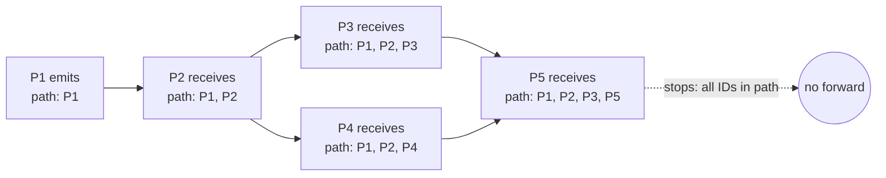

# Timeout-Free Failure Detector

> **One-sentence summary.** A failure detector that counts heartbeats and propagates the path each heartbeat has traveled, so it can judge liveness without ever consulting a clock — even when the direct link between two processes is broken.

## How It Works

Most failure detectors lean on timeouts: if an acknowledgment does not arrive within `T` milliseconds, the peer is declared dead. That assumption only holds in partially synchronous systems where message-delay bounds are known. The Heartbeat algorithm from Aguilera, Chen, and Toueg [AGUILERA97] removes that assumption entirely. It operates under a purely **asynchronous** model, which means it makes no assumptions about clock drift, message latency, or scheduling delays. Correctness instead relies on a weaker property: **fair paths**. Two correct processes must be connected by at least one path of fair links, where a fair link guarantees that a message sent infinitely often is also received infinitely often. Direct connectivity is not required.

Each process maintains a counter vector — one slot per known process — and periodically emits heartbeat messages to its neighbors. Every heartbeat carries the **path** it has traveled: the ordered list of process IDs that have already forwarded it, plus a unique message ID to avoid re-broadcasting duplicates. When a process `Pᵢ` receives a heartbeat, it:

1. Increments its local counter for every process already in the path (they are demonstrably participating in propagation).
2. Appends its own ID to the path.
3. Forwards the message to each neighbor whose ID is **not** in the path.
4. Stops propagating once every known process ID appears in the path — at that point the heartbeat has reached the entire network and further forwarding is wasteful.

The counter vector forms a **global, normalized view** of propagation rates across the cluster. By comparing counters across peers, the application layer decides which processes look stalled. Crucially, because every heartbeat travels many routes, a process whose direct link to `P1` is broken can still see its counter grow via some alternate path through the mesh. The detector therefore degrades gracefully under partial link failures rather than declaring healthy nodes dead the moment one edge drops.

## When to Use

- **Asynchronous environments with unpredictable latency.** Wide-area replication, mobile edge clusters, or over-subscribed cloud tenants where picking a timeout is a guessing game.
- **Meshes with flaky individual links.** When pair-wise connectivity is unreliable but the graph as a whole stays connected, path aggregation keeps detection accurate.
- **Research or correctness-critical systems** where you need a detector whose safety does not depend on synchrony assumptions that may be violated under load.

## Trade-offs

| Aspect | Advantage | Disadvantage |
|--------|-----------|--------------|
| System model | Works under fully asynchronous assumptions — no clock or latency bounds needed | Requires every process to know the full membership list up front |
| Link tolerance | Survives faulty direct links by routing heartbeats through alternate paths | Message volume grows with mesh density; every hop appends to the path |
| Decision signal | Counter vector gives a global, normalized propagation view | Interpreting counters is hard — the threshold separating "alive" from "dead" is application-specific |
| Accuracy | Low false-negatives in a well-connected graph | False-positives spike if the threshold is too aggressive for current network conditions |

## Real-World Examples

- **Research prototypes and textbook implementations**: The Heartbeat algorithm is primarily a theoretical construct studied in distributed-systems literature; it rarely ships as a standalone production detector.
- **Gossip-based detectors (Cassandra, Akka Cluster)**: Production systems pick up the *counter-propagation* idea but combine it with timestamps and timeouts (see [[05-gossip-failure-detection]]) rather than remaining strictly timeout-free, because operators need interpretable thresholds.
- **Akka's deadline detector**: A deliberate counterpoint — it embraces timeouts for simplicity, trading asynchronous purity for tuneable precision.

## Common Pitfalls

- **Picking a counter threshold by guesswork.** The algorithm hands you a counter vector but not a decision rule. If your threshold is too low you flap on healthy nodes; too high and you miss real crashes. Plan to calibrate empirically against your network.
- **Assuming it scales for free.** Every heartbeat is forwarded along paths that grow with the mesh, and each message carries the accumulated path list. In large, densely-connected clusters the bandwidth cost adds up fast.
- **Forgetting the membership prerequisite.** The algorithm requires each process to know *all* other processes so it can tell when to stop propagating. It does not play well with dynamic, churning memberships — use SWIM-style protocols there instead.
- **Treating it as a plug-in replacement for timeout detectors.** Because the output is a counter vector rather than a boolean, you cannot wire it into existing monitoring that expects binary `UP` / `DOWN` signals without an interpretation layer.

## See Also

- [[01-failure-detector-fundamentals]] — the accuracy/efficiency and safety/liveness trade-offs this algorithm navigates
- [[03-swim-outsourced-heartbeats]] — an alternative that tolerates link failures via indirect probes instead of full-path propagation
- [[05-gossip-failure-detection]] — uses heartbeat counters similarly but spreads them via random gossip rather than deterministic path forwarding
