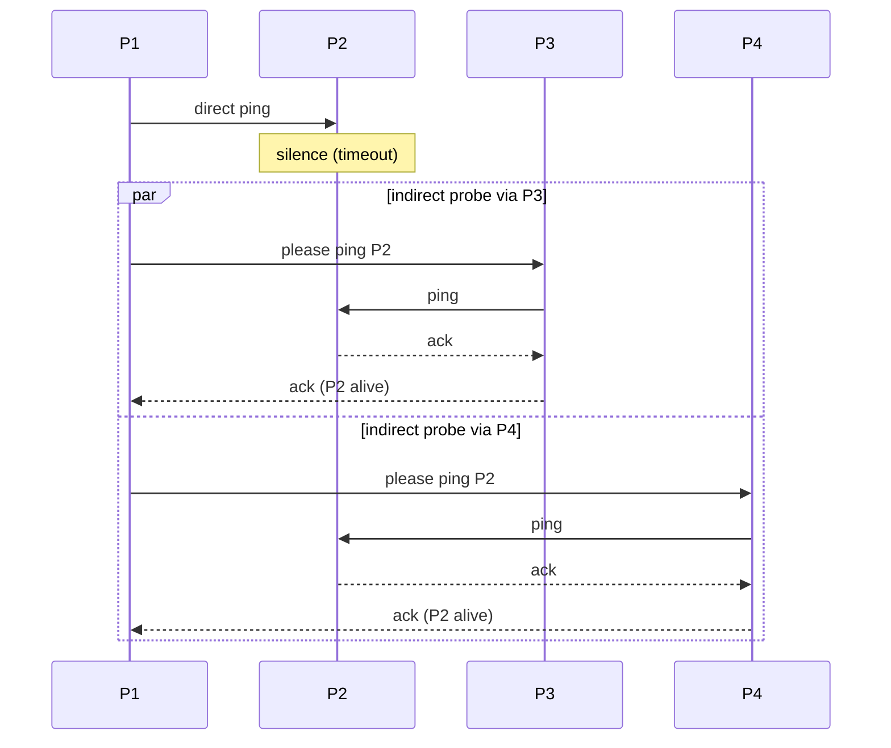

# SWIM Outsourced Heartbeats

> **One-sentence summary.** SWIM asks random peers to double-check a silent process before declaring it dead, catching link-only failures with a handful of extra probes instead of a full-network broadcast.

## How It Works

The Scalable Weakly Consistent Infection-style Process Group Membership Protocol (SWIM) attacks one specific weakness of naive ping/ack failure detection: a single missed acknowledgment cannot distinguish "the target is dead" from "the single link between me and the target is flaky." Rather than escalating to a broadcast — which is expensive and does not scale — SWIM escalates to a small, random committee of peers.

Each process only needs to know a subset of the cluster. When process `P1` wants to check `P2`, it first sends a direct ping. If `P2` acknowledges, the round ends. If the ack does not arrive inside the timeout window, `P1` does not mark `P2` as failed; instead, it picks `k` random members (for example `P3` and `P4`) and asks each of them to ping `P2` on its behalf. Those indirect probes are dispatched in parallel. If any peer gets a reply from `P2`, it forwards an ack back to `P1`, and `P1` learns that `P2` is alive but that its direct link is degraded. Only if every indirect probe also times out does `P1` promote `P2` to suspected.

This structure trades one round-trip of latency for dramatically higher accuracy. Because the indirect probes fan out through independent network paths and different NICs, they provide multiple vantage points on the same target without asking every process in the cluster to weigh in.

## When to Use

- **Large clusters where broadcast is too expensive.** SWIM keeps per-round message count roughly constant per node regardless of cluster size, so it scales into the thousands.
- **Networks with known flaky links or NIC-level partitions.** If spurious false positives cost you (rebalances, leader elections, re-replication), the extra vantage points are cheap insurance.
- **Service membership layers.** Any gossip-based membership protocol that needs a reliable "is this peer alive?" signal — service discovery, cluster managers, or distributed caches — is a natural fit.

## Trade-offs

| Aspect | Advantage | Disadvantage |
|--------|-----------|--------------|
| False-positive rate | Link-only failures are filtered out by the indirect probe committee | Still vulnerable if the selected peers happen to share a partition with `P1` |
| Bandwidth | O(k) messages per suspicious node instead of O(N) for broadcast | Each indirect probe adds extra traffic that a pure ping would avoid |
| Latency to decide | Parallel probes converge quickly | Two RTTs (direct, then indirect) before a suspicion is raised |
| Membership knowledge | Only a subset of peers is needed | Selection quality depends on an up-to-date peer list from gossip |
| Implementation | Simple on top of an existing ping/ack loop | Requires routing probe requests and forwarding acks, plus tunable `k` |

## Real-World Examples

- **HashiCorp memberlist / serf**: The canonical modern SWIM implementation. It powers the membership layer of Consul and Nomad, using indirect probes to stabilize membership across WAN gossip pools.
- **Consul**: Uses serf for failure detection across agents. Indirect probes keep false positives low even as operators scale out to thousands of nodes.
- **Cassandra-family systems**: Historically pair a phi-accrual detector with SWIM-style gossip ideas, using peer perspectives to reduce the chance that a transient link problem triggers unnecessary streaming.

## Common Pitfalls

- **Too small a `k`.** If you only ask one peer to indirectly probe, you have merely added a hop rather than multiple vantage points. Typical deployments use `k = 3`.
- **Correlated peer selection.** If `P3` and `P4` live on the same rack or share the same top-of-rack switch as `P1`, their "view" of `P2` is not independent. Bias peer selection toward topological diversity when possible.
- **Timeout tuning ignores the second round.** The total time-to-decide is direct-timeout plus indirect-timeout. Operators sometimes tune only the direct timeout and are surprised by slow failure detection under load.
- **Confusing suspicion with death.** SWIM still needs a dissemination mechanism (usually gossip piggybacked on the same probes) to spread the suspicion; a single process deciding `P2` is dead does not make it so cluster-wide.
- **Forgetting that `P2` might still be alive to everyone else.** A successful indirect ack is a strong signal; acting unilaterally on a direct timeout without the indirect round throws away SWIM's main benefit.

## See Also

- [[01-failure-detector-fundamentals]] — the accuracy/efficiency trade-off SWIM is explicitly engineered around
- [[02-timeout-free-failure-detector]] — another approach to surviving faulty direct links, via multi-hop heartbeat paths instead of on-demand indirect probes
- [[05-gossip-failure-detection]] — the dissemination layer typically paired with SWIM to spread suspicion through the cluster
