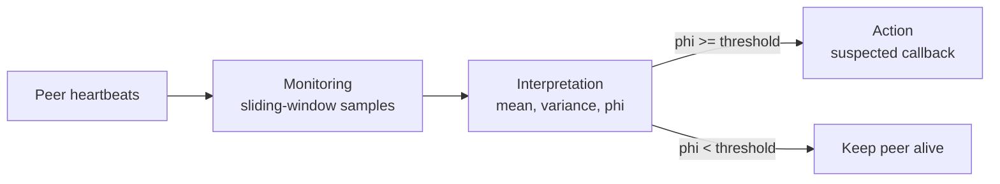

# Phi-Accrual Failure Detector

> **One-sentence summary.** A phi-accrual detector replaces the binary "up/down" verdict with a continuous suspicion score that adapts to recent network behavior, so momentary slowness no longer looks like a crash.

## How It Works

Classic heartbeat detectors flip to "down" the instant a timeout expires. That threshold is brittle: set it tight and slow networks trigger false positives; set it loose and real crashes linger undetected. The phi-accrual detector keeps a sliding window of the most recent heartbeat arrival times and treats those samples as draws from a normal distribution. From the window, it estimates the running mean and variance of inter-arrival intervals, then asks a different question each time it is polled: **given how heartbeats have been arriving lately, how surprising is it that none has arrived in the last `t_now - t_last` seconds?**

That surprise is the suspicion level `phi`. Expressed in prose: `phi = -log10(P_later(t_now - t_last))`, where `P_later(d)` is the probability that the next heartbeat would arrive at or after delay `d` under the fitted distribution. When heartbeats are flowing normally, `P_later` is close to 1 and `phi` stays near zero. As the silence grows past the mean plus several standard deviations, `P_later` shrinks toward zero and `phi` climbs. A configurable threshold (commonly 8 or 12) trips the verdict. Because mean and variance are re-estimated from the window, a flaky period widens the distribution and `phi` grows more slowly for the same delay — the detector automatically tolerates more latency when the network itself is running hot.

Architecturally, the detector factors into three subsystems: **Monitoring** collects liveness samples, **Interpretation** fits the distribution and computes `phi`, and **Action** fires a callback when `phi` crosses the threshold.

## When to Use

- **Clusters with variable latency**: WAN-spanning or multi-tenant deployments where heartbeat RTT drifts across the day benefit from adaptive sensitivity.
- **Gossip or peer-to-peer topologies**: each node locally decides about its peers, and you want those decisions to degrade gracefully under load spikes rather than producing correlated false positives.
- **Downstream consumers need a score, not a flag**: routing, read-repair, or hinted-handoff logic can weight decisions by `phi` instead of a hard boolean — for example, avoiding a node at `phi = 5` before fully evicting it at `phi = 8`.

## Trade-offs

| Aspect | Advantage | Disadvantage |
|--------|-----------|--------------|
| Suspicion signal | Continuous `phi` exposes graded uncertainty | Consumers must interpret a number, not a boolean |
| Network adaptivity | Window auto-tunes to current conditions | A long slow period can mask a real crash because variance is already wide |
| Distributional model | Normal assumption is cheap and usually good enough | Bimodal or heavy-tailed arrivals (GC pauses, retries) violate the model |
| Configuration | Only a threshold and window size to tune | Correct threshold is workload-specific; too low = flapping, too high = slow detection |
| Locality | Each node decides independently about peers | No cross-node corroboration; pair with gossip or SWIM for a group view |

## Real-World Examples

- **Cassandra**: uses a phi-accrual detector per node to score peers in the gossip ring. The `phi_convict_threshold` (default around 8) lets operators trade detection speed against false positives for their network.
- **Akka Cluster**: ships a phi-accrual detector as the default, with a deadline (fixed-timeout) detector available as a simpler alternative when operators prefer predictable cutoffs over adaptivity.
- **Hadoop HDFS and ZooKeeper ecosystems**: have historically leaned on fixed timeouts; phi-accrual is attractive for similar systems whenever tail latency is unpredictable.

## Common Pitfalls

- **Window too small**: the variance estimate becomes jumpy and `phi` oscillates, causing flapping. Typical windows hold hundreds of samples.
- **Treating `phi` as absolute**: a threshold of 8 is not universal. Calibrate it against real heartbeat traces from the target environment.
- **Ignoring non-Gaussian reality**: if heartbeats are dominated by periodic GC stalls or scheduled retries, the normal assumption is wrong — consider pre-filtering outliers or combining with [[03-swim-outsourced-heartbeats]] for corroboration.
- **Silent adaptation during outages**: if the network degrades gradually, the widening distribution can hide a partial failure. Pair with an upper bound on tolerated delay, or a group-level detector such as [[05-gossip-failure-detection]].
- **Forgetting the Action subsystem**: computing `phi` is cheap; the expensive part is what happens on suspicion (eviction, rerouting, hinted handoff). Make sure that callback is idempotent and reversible, because `phi` can dip back below the threshold.

## See Also

- [[01-failure-detector-fundamentals]] — the accuracy-vs-efficiency framing that phi-accrual tunes continuously
- [[03-swim-outsourced-heartbeats]] — complementary approach that corroborates a suspicion from multiple vantage points
- [[05-gossip-failure-detection]] — group-level aggregation that pairs well with phi-accrual's per-node score
