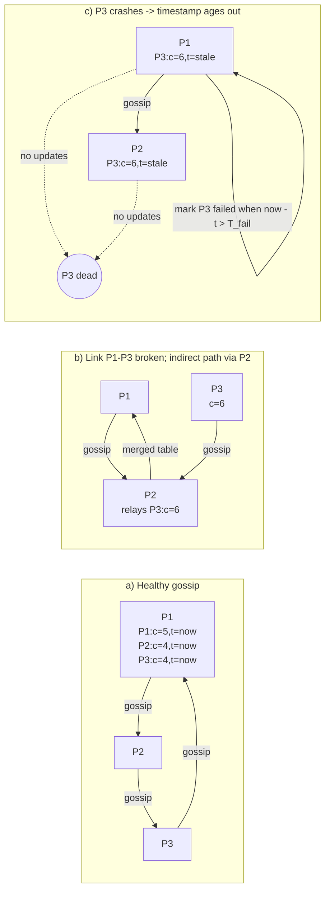

# Gossip-Based Failure Detection

> **One-sentence summary.** Every node periodically swaps a heartbeat-counter table with a random peer, so a failure judged by the aggregate cluster view emerges naturally from epidemic spreading.

## How It Works

Each member maintains a table with one row per other member, holding that peer's latest **heartbeat counter** plus the **local timestamp** at which the counter last changed. On every tick a node does two things: (1) increment its own counter, and (2) send the entire table to one randomly chosen neighbor. The receiver merges by element-wise max: for every peer it keeps the larger counter, and whenever the incoming counter is strictly larger it resets that row's local timestamp to "now." Counters therefore travel only forward, like Lamport clocks, while timestamps reflect when freshness last arrived locally.

Detection is a purely local decision made against the merged table. A separate sweep scans rows and marks any peer whose timestamp hasn't advanced in more than `T_fail` seconds as failed. Because the table is replenished from many independent gossip partners, a node is flagged only when *no* path in the cluster has been delivering updates about it — a crash looks identical whether the process died, its NIC burned out, or it became a singleton on the wrong side of a partition. A link outage between two specific peers does not cause a false positive because the victim's counter keeps propagating through a third hop.

Worst-case bandwidth per node is bounded. Each member sends exactly one table per gossip interval, so per-node traffic grows **at most linearly** in cluster size (table length × fanout of 1), independent of load. That predictability is what makes gossip attractive at hundreds-to-thousands of nodes where all-to-all pings would explode quadratically.

## When to Use

- **Large, dynamic membership** — clusters of dozens to thousands of peers where no node should have to ping every other node directly.
- **Partition-tolerant monitoring** — environments with flaky cross-rack or cross-AZ links, where the ability to learn about a node via a third path is critical.
- **Decentralized datastores** — systems that already use gossip for membership, schema, or routing state (Cassandra-style rings) can piggyback failure detection onto the same channel for free.

## Trade-offs

| Aspect | Advantage | Disadvantage |
|--------|-----------|--------------|
| Bandwidth | Bounded, at most linear per node regardless of cluster activity | Still O(N) table size per message; tables balloon in very large clusters |
| Partition tolerance | Indirect paths keep counters flowing through intermediate peers | A genuinely isolated subgroup still mutually declares the rest failed |
| Detection latency | Robust against noisy single links; decision is cluster-aggregated | Slower than a direct ping — several gossip rounds of O(log N) spread time |
| Threshold tuning | Simple parameter (`T_fail`) with clear semantics | Too tight → false positives from network jitter; too loose → slow detection |
| Integration | Binary — up or down decision is easy to consume | Lacks the continuous suspicion signal of [[04-phi-accrual-failure-detector]] |

## Real-World Examples

- **Apache Cassandra**: The gossiper subsystem exchanges heartbeat versions and application state every second with up to three random peers; failure detection runs as a phi-accrual detector on top of the same heartbeat stream.
- **Riak**: Uses a ring-based gossip protocol to spread node status and claimed partitions; unreachable nodes age out of the cluster view.
- **HashiCorp Serf / Consul**: Combines gossip-propagated state with the SWIM probe protocol (see [[03-swim-outsourced-heartbeats]]) — suspicion is gossip-disseminated once any peer detects it.
- **Amazon Dynamo-lineage systems**: The original Dynamo paper describes gossip-based failure detection for exactly this reason: tolerating transient link failures across a large fleet without a coordinator.

## Common Pitfalls

- **Too-tight timeouts**: Picking `T_fail` close to one gossip interval guarantees false positives during transient congestion; in practice operators pick multiples (8x–20x) of the gossip period to absorb jitter.
- **Clock drift confusion**: The *counter* is logical and needs no synchronized clocks, but the *timestamp* is wall-clock local. Migrating gossip tables between machines or using them across NTP-unsynced nodes invites mistakes; keep the freshness decision local.
- **Tables that never shrink**: Dead or decommissioned nodes left in the table waste bandwidth forever. Production systems pair gossip detection with explicit *tombstone* or *reap* rules so rows eventually drop.
- **Mistaking gossip spread for instant consensus**: Information takes O(log N) rounds to saturate. A node that just rebooted is not immediately known as alive; application-level retries must tolerate that lag.
- **Single gossip peer per round**: A fanout of one is cheap but slow; sick networks may call for a higher fanout, at the cost of bandwidth.

## See Also

- [[01-failure-detector-fundamentals]] — heartbeats and the completeness/accuracy properties gossip detection trades against.
- [[02-timeout-free-failure-detector]] — another algorithm that relies on counter propagation rather than local clocks.
- [[03-swim-outsourced-heartbeats]] — a complementary pattern that mixes direct probes with gossip-disseminated suspicion, widely deployed alongside plain gossip heartbeating.
