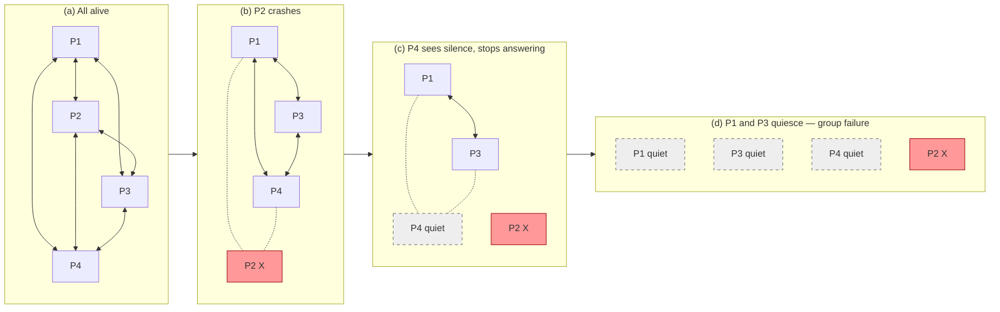

# FUSE Reversing Failure Detection

> **One-sentence summary.** FUSE flips the usual detection model on its head: instead of broadcasting "X died", members stop answering pings, and the resulting silence cascades through the group until every participant knows something is wrong.

## How It Works

Most failure detectors described earlier in *Database Internals* push positive information around the cluster — heartbeats, gossip tables, indirect probes. FUSE (Failure Notification Service), proposed by Dunagan et al., inverts this idea. It arranges processes into **groups** and uses the **absence** of communication as the propagation medium. A single process failure is deliberately escalated to a **group failure**: once any member cannot reach any other member, the whole group eventually notices.

The rule each member follows is tiny: periodically ping every other group member, and only respond to incoming pings as long as your own outbound pings are still being answered. The moment a process fails to get a response from anyone — crash, network partition, or a dead link — it stops answering its own incoming pings too. That silence is observed by its neighbors, who in turn go silent, and the wave ripples until the entire group has quiesced.

Because silence travels through whatever links remain, FUSE works under any disconnect pattern. There is no central coordinator, no vote, and no need for the failure signal to physically traverse the broken link — which is precisely the problem that kills broadcast-based approaches during a partition.

## When to Use

- **All-or-nothing coordination domains.** A replica group, a distributed lock, or a write quorum where partial awareness is worse than everyone backing off together.
- **Large file or content distribution jobs.** If any chunk-server falls off, you would rather abort the whole transfer cleanly than let stragglers proceed on stale assumptions.
- **Partition-prone networks.** Wide-area deployments or flaky cluster interconnects where positive broadcast ("X is dead") cannot be delivered reliably but silence can propagate through any surviving path.

## Trade-offs

| Aspect | Advantage | Disadvantage |
|---|---|---|
| Propagation mechanism | Quiescence needs no working link to the failed node; silence flows through any remaining edge | Slower than a successful broadcast — every hop waits for a full ping timeout |
| Message cost | No extra "failure" message type; you already send pings | All-to-all pings within a group scale as O(n^2) and bound group size |
| Partition tolerance | Guaranteed eventual group-wide awareness under any disconnect pattern | A trivial one-link fault can escalate to a full group abort |
| Semantics | Strong "all or none" guarantee, ideal for safety-critical coordination | Applications that tolerate partial progress pay for safety they do not need |
| Implementation | Trivially simple — stop answering when you cannot reach anyone | Harder to diagnose in production: a dead group gives you no explicit cause |

## Real-World Examples

- **Microsoft Research FUSE.** The original use case: distributed coordinators and cluster services that want conservative, symmetric failure awareness without relying on reachable broadcast.
- **Consensus and replica groups.** Systems that prefer to stall an entire quorum rather than allow a subset to proceed on a stale view — the quiescence model naturally implements this "freeze together" policy.
- **Large-scale file distribution (BitTorrent-like cluster bulk transfers).** Transfers involving many peers where any missing participant invalidates the overall job; FUSE lets the job unwind cleanly without a coordinator.
- **Distributed locking services.** Groups holding a shared lease can use quiescence to guarantee that once any holder becomes uncertain, all holders release — preserving safety even under asymmetric partitions.

## Common Pitfalls

- **Treating FUSE as a general failure detector.** It deliberately amplifies one failure into a group outage. If your application can cope with partial failure (e.g., [[05-gossip-failure-detection]] style aggregated views), FUSE will over-react and hurt availability.
- **Ignoring group sizing.** Because every member pings every other, groups must stay small. Packing a whole cluster into one FUSE group gives quadratic traffic and huge blast radius when anything hiccups.
- **Missing an app-level propagation policy.** The book calls out that applications can define their own propagation rules — if you do not, a single flaky NIC can repeatedly tear down a healthy group. Combine FUSE with hysteresis, suspicion thresholds, or phi-style scoring.
- **Assuming detection latency is bounded by crash time.** Latency is dominated by how long each downstream observer waits before declaring its upstream silent; tune ping intervals and timeouts explicitly.
- **Confusing quiescence with clean shutdown.** A FUSE-silent node may still be holding resources, leases, or dirty state. Pair detection with an explicit recovery protocol.

## See Also

- [[01-failure-detector-fundamentals]] — the accuracy/completeness vocabulary FUSE trades against
- [[05-gossip-failure-detection]] — the opposite philosophy: spread positive information instead of using silence
- [[03-swim-outsourced-heartbeats]] — another partition-aware detector, but one that narrows rather than amplifies failures
