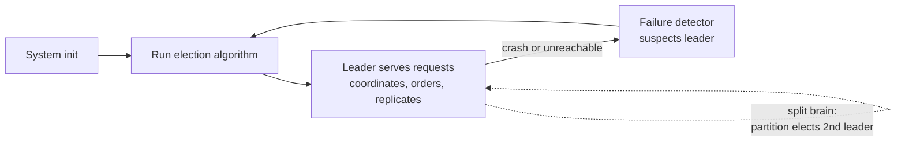

# Leader Election Fundamentals

> **One-sentence summary.** A leader (or coordinator) process drives a distributed algorithm from a single well-known node so peers do not have to negotiate every step themselves, trading the luxury of centralized decisions against the twin hazards of split brain and leader-as-bottleneck.

## How It Works

In a peer-to-peer algorithm every decision round involves talking to every other participant. If each of *N* processes must confirm with the other *N−1* before progressing, message cost grows quadratically and latency is gated by the slowest link — painful in geographically distributed clusters. A **leader** collapses that mesh: one process holds the authoritative state, receives requests, orders them, and disseminates results. Communication becomes mostly star-shaped (O(N) per round) instead of fully meshed (O(N²)), and decisions are made once by the leader rather than re-negotiated everywhere.

Leadership is a role, not an identity — processes are uniform, and any of them can be elected. A leader keeps its role until it crashes or becomes unreachable, at which point some surviving peer triggers a new election. A correct election algorithm must be **deterministic**: exactly one leader must emerge and every participant must agree on who it is, because unlike a lock holder the leader is publicly known and other nodes route work to it.

Two properties tension the design:

- **Liveness** — "eventually some leader exists." The system must not sit in an election state forever; if the current leader dies, a replacement must be elected in bounded time.
- **Safety** — "at most one leader at a time." If two processes simultaneously believe they are the leader, they serve conflicting writes and order messages inconsistently. This failure mode is called **split brain** and it is what most of the classic election algorithms cannot by themselves prevent.

Elections are triggered in exactly two situations: **system initialization** (there has never been a leader) and **leader failure** (the incumbent has crashed or stopped responding). Detecting the second case requires a failure detector — see [[01-failure-detector-fundamentals]] — because "crashed" and "slow" are indistinguishable in an asynchronous network, and an over-eager detector can start an election while the old leader is still alive, directly causing split brain.

## Leader Election vs Distributed Locking

At first glance leader election looks like distributed locking — exclusive access to something shared — but the two differ in three crisp ways that the book makes explicit:

| Dimension | Distributed Lock | Leader Election |
|---|---|---|
| **Holder identity** | Irrelevant — callers only care that progress happens | Essential — every peer must know who the leader *is* so it can address it |
| **Preference for a holder** | Forbidden — preferring one process starves others, violating liveness | Allowed and even desirable — a stable, long-lived leader reduces churn |
| **Desired tenure** | Short — release quickly so others get a turn | Long — re-elections are expensive, so hold the role until failure |

In short: locks want fairness and rotation; leaders want stability and visibility.

## When to Use

- **Totally ordered broadcast.** Route all writes through the leader so it assigns a single sequence number — the basis of state machine replication.
- **Global coordination events.** Initialization, schema changes, cluster rebalancing, and reconfiguration benefit from one node unilaterally driving the transition instead of gossiping consensus.
- **Reducing coordination messages.** When a workload is chatty and latency-sensitive, paying a rare election cost buys a much cheaper steady state.
- **As scaffolding inside consensus.** Multi-Paxos, Raft, and ZAB all elect a leader internally to cut message counts between replicas (see [[06-leader-election-and-consensus]]).

## Trade-offs

| Aspect | Advantage | Disadvantage |
|---|---|---|
| **Coordination cost** | Star-shaped messaging replaces full-mesh negotiation | Leader becomes a single point of load and a single point of failure |
| **Liveness vs safety** | Willingness to re-elect keeps the system progressing | Aggressive re-election during partitions produces split brain |
| **Stable long-lived leader** | Amortizes election cost; simplifies client routing | A stuck-but-not-dead leader (GC pause, slow disk) drags the whole cluster |
| **Global leader vs sharded leaders** | One leader is simple to reason about | Throughput caps at one node's capacity; partitioning helps but multiplies failure domains |

The bottleneck problem has a standard fix: **partition the data and elect a leader per shard**. Google's Spanner, for example, runs Paxos groups per tablet range, each with its own leader, so write throughput scales horizontally even though every individual shard still has one coordinator.

## Real-World Examples

- **Google Spanner.** Per-shard (per-Paxos-group) leaders coordinate writes for their range only. This is the canonical answer to "the leader is a bottleneck" — there is no single system-wide leader at all.
- **Apache Kafka controller.** Exactly one broker in the cluster is the *controller*, responsible for partition leadership assignment and cluster metadata. Pre-KRaft Kafka elected the controller via ZooKeeper; modern Kafka elects it via its own Raft quorum.
- **ZooKeeper ensemble leader.** A ZooKeeper ensemble elects one server as its leader via ZAB (ZooKeeper Atomic Broadcast); followers forward writes to it and the leader orders them, replicating via a quorum.
- **etcd / Consul (Raft).** The Raft leader handles every write and renews its term through heartbeats; a follower whose heartbeats time out starts a new election with a bumped term number.

## Common Pitfalls

- **Assuming classical algorithms are safe.** The Bully, Ring, Invitation, and Candidate/Ordinary algorithms introduced later in this chapter all provide liveness but not safety under network partitions. Treating them as consensus is a category error — real production systems back them with quorum-based consensus.
- **Detecting leader failure too eagerly.** A jittery failure detector that starts elections during brief network blips creates overlapping leadership epochs. Pair election with a tuned detector and require the old leader to step down on minority-side partitions.
- **Ignoring the bottleneck until it bites.** "One leader" is fine at 1k RPS and catastrophic at 1M RPS. Design for per-shard leadership early if growth is plausible, because retrofitting partition leaders is a migration, not a config flag.
- **Using leader election where a lock would do.** If identity does not matter and fairness does, you want a lease-based distributed lock, not an election — otherwise a preferred process starves the others.
- **Letting a slow leader hold on.** Liveness of the *system* demands the leader not just be alive but timely. Many designs add a heartbeat and a renewable lease so a stalled leader loses tenure even without crashing.

## See Also

- [[02-bully-algorithm]] — the simplest rank-based election, and the template for the chapter's safety problems
- [[03-candidate-ordinary-optimization]] — shrinks the eligible leader set and staggers election starts to cut messages
- [[04-invitation-algorithm]] — deliberately allows multiple leaders and merges their groups
- [[05-ring-algorithm]] — passes a token around a logical ring to collect the winner
- [[06-leader-election-and-consensus]] — why split brain forces us to layer election on top of consensus (Multi-Paxos, Raft, ZAB)
- [[01-failure-detector-fundamentals]] — the detector that decides *when* an election should be triggered
