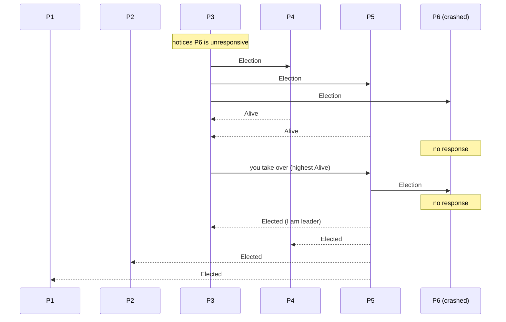
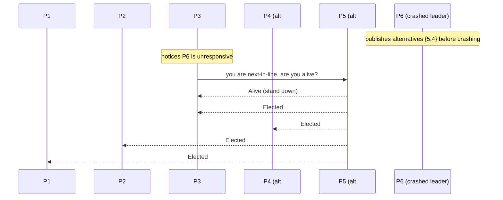

# Bully Algorithm and Next-In-Line Failover

> **One-sentence summary.** The bully algorithm elects the highest-ranked live process as leader through a three-step Election / Alive / Elected exchange, and the next-in-line variant shortcuts the election by letting the previous leader pre-publish a ranked failover list.

## How It Works

Every process is given a unique, comparable **rank**. The rule is blunt: the highest-ranked live process should be the leader. The algorithm earns its name from that behavior — a stronger node always wins, and a freshly-recovered top-ranked node will unseat whoever is currently leading. Election is triggered when a process either sees no leader at all (startup) or notices the incumbent has stopped responding. We follow the **modified** bully algorithm [KORDAFSHARI05], which compresses the original into three clear steps.

Suppose six processes have ranks `1..6`, the current leader is `6`, and `6` crashes. Process `3` is first to notice the failed leader and opens a new election:

1. **Election.** `3` sends an `Election` message to every process with a **higher** rank than itself — here, `4`, `5`, and `6`.
2. **Alive.** Any higher-ranked live process replies with `Alive`, telling `3` to stand down. `4` and `5` reply; `6` is dead and silent. `3` now picks the highest responder (`5`) and hands the election off.
3. **Elected.** `5` repeats the same procedure toward any higher-ranked peers it knows of. If none respond, it declares itself the winner and broadcasts `Elected` to every lower-ranked process.

**Message cost.** Best case, the *highest surviving* process starts: it sends no `Election` messages (nobody is above it) and only broadcasts `Elected` to `N-1` peers — **O(N)**. Worst case, the *lowest-ranked* process starts; each higher-ranked peer may in turn start its own round, cascading into **O(N²)** messages before the monarchy settles.

## Next-In-Line Failover

The three-round exchange is wasteful when failures are common and rank ordering is stable. The next-in-line variant [GHOLIPOUR09] amortizes that work: the reigning leader **pre-publishes an ordered failover list** — e.g., `leader 6` with alternatives `{5, 4}`. When a process detects the leader has died, it does **not** run a full election. It contacts the top-ranked alternative from the list; if that alternative is alive, it immediately takes over and broadcasts `Elected`. If not, the detector walks the list downward.

If the detecting process is itself at the top of the list, it skips the probe and announces itself directly. The trade-off is recency: the failover list is only as fresh as the last time the leader pushed it, so a stale list degrades back into a normal bully election.

## When to Use

- **Small-to-medium clusters on a LAN** where rank ordering is meaningful and O(N²) messages remain cheap.
- **Systems that tolerate brief split-brain windows** or can rely on a higher-level fence (quorum, epoch) — bully alone does **not** guarantee at-most-one leader.
- **Designated-master deployments** like a primary DB with a curated list of warm standbys, where next-in-line lets a hot standby take over in one round trip.

## Trade-offs

| Aspect | Advantage | Disadvantage |
|--------|-----------|--------------|
| Simplicity | Trivial to implement — three message types, rank comparison | Rank is arbitrary; assigning it fairly across a real fleet is its own problem |
| Message cost | O(N) best case when top survivor initiates | O(N²) worst case when lowest-ranked node initiates |
| Safety | Deterministic winner when the network is healthy | Split-brain under partitions — each subnet elects its own highest-rank leader |
| Rank preference | Long-lived, predictable leadership when top node is stable | Flapping top-rank node causes reelection storms; mitigate by baking host-quality metrics into the rank |
| Failover | Next-in-line variant elides full election when alternatives are fresh | Stale alternatives list forces a fallback to the full three-step round |

## Real-World Examples

- **Early distributed OS and DB literature** — the original bully algorithm is from García-Molina's 1982 paper [MOLINA82] on electing coordinators in unreliable distributed systems, and is still the canonical teaching example.
- **Honest caveat on production use.** The chapter does not cite direct production adopters. Modern systems (Kafka KRaft, etcd, ZooKeeper, CockroachDB) avoid pure bully in favor of consensus-embedded election inside **Raft** or **ZAB** — see [[06-leader-election-and-consensus]]. Those protocols bundle election with quorum-based safety, closing the split-brain hole bully leaves open.
- **Legacy MongoDB replica sets (pre-PV1)** used a priority-based election with bully-like semantics before being replaced by a Raft-derived protocol in Protocol Version 1 — the shape of bully most engineers encounter in the wild.

## Common Pitfalls

- **Split-brain under partitions.** If the network splits, each side elects its own highest-rank survivor and both leaders accept writes. The algorithm has no built-in quorum — you must layer a majority check on top.
- **Reelection thrash from an unstable top-ranked node.** A flapping high-rank node proposes itself, wins, crashes, recovers, wins again, and the cluster never stabilizes. Fix: fold host-quality metrics (uptime, load, recent crash count) into the rank so an unstable node's effective rank drops.
- **Message blow-up on large clusters.** The O(N²) worst case hurts past a few dozen nodes. Use [[03-candidate-ordinary-optimization]] to restrict elections to a small candidate set, or switch topology to [[05-ring-algorithm]].
- **Treating leader election as distributed locking.** Rank preference is a feature for leadership (long-lived holders desirable) but a bug for locking (nonpreferred processes starve). See [[01-leader-election-fundamentals]].
- **Stale failover lists.** If the leader crashes before republishing alternatives, next-in-line may target a dead node. Refresh the list on every membership change or accept the fallback cost.

## See Also

- [[01-leader-election-fundamentals]] — liveness/safety trade-offs and why leader election differs from distributed locking
- [[03-candidate-ordinary-optimization]] — shrinks the electable set and uses a per-process delay `δ` to collapse simultaneous elections
- [[05-ring-algorithm]] — an alternative topology that bounds per-step messages via ring forwarding instead of broadcasting
- [[06-leader-election-and-consensus]] — how Raft, Multi-Paxos, and ZAB fuse election with quorum to close bully's split-brain hole
