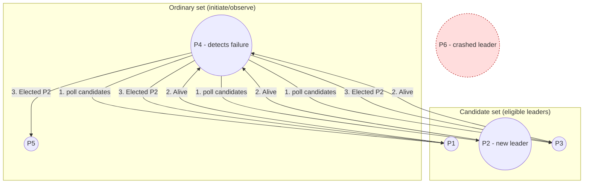

# Candidate/Ordinary Optimization

> **One-sentence summary.** Partition the cluster into a small pool of leader-eligible *candidate* nodes and a larger pool of *ordinary* nodes that only initiate or observe elections, then use a per-process delay `δ` to stagger who starts an election so simultaneous rounds collapse into one.

## How It Works

The bully algorithm treats every process as both a potential voter and a potential leader. That symmetry is convenient but wasteful: every time anyone notices the leader is gone, the full O(N) cascade of `Election` / `Alive` / `Elected` messages runs, and any process high enough in the ranking can bully its way in. The candidate/ordinary optimization collapses this in two directions at once. First, it fixes a subset of the cluster — the *candidate set* — as the only processes that may ever hold leadership. Everyone else is *ordinary*: ordinary nodes can detect a failed leader and kick off an election, but they only poll candidates and tally the result, never nominate themselves. Second, it addresses the reverse problem of the bully algorithm: when many ordinary nodes notice the failure at once, they would all start independent elections. A per-process tiebreaker delay `δ` — deliberately chosen to vary significantly across nodes and to exceed the network round-trip time — lets one process's election reach the others before they start their own.

Walking through the chapter's worked example with processes numbered `1..6` and process `6` as the crashed leader: ordinary process `4` notices `6` has stopped responding. Rather than bullying upward through `5` and `6` as it would under the plain bully algorithm, `4` sends a probe to every member of the candidate set in parallel. The live candidates (say `1`, `2`, `3`) respond "alive." Process `4` picks the highest-ranked responder, `2`, and broadcasts `Elected(2)` to the rest of the cluster. The election finishes in two round-trips regardless of how deep the rank ladder goes, and the search space for the leader is `|candidates|`, not `N`.

The tiebreaker `δ` is what keeps concurrent failure detections from turning into concurrent elections. Suppose ordinary nodes `4` and `5` both notice `6`'s silence at nearly the same instant. Each waits `δ_self` before actually sending the candidate poll. Because the `δ` values are chosen to differ by more than one RTT, whichever node has the smaller `δ` fires first; its `Elected(2)` announcement reaches the slower node while the slower node is still waiting, and that node simply adopts `2` instead of starting its own redundant round.



The `δ` computation is intentionally simple — just enough jitter to serialize starts while still being deterministic per node:

```text
# Priority drives who gets to start first.
# Higher priority (smaller rank on the priority axis) -> smaller delta.
def compute_delta(node_id, priority, rtt_ms):
    base   = 2 * rtt_ms                         # strictly larger than one round-trip
    jitter = (hash(node_id) % 1000)             # varies significantly across nodes
    return base + priority * rtt_ms + jitter    # ms to wait before initiating
```

## When to Use

- **Heterogeneous clusters where only a subset is provisioned for leader duties.** Dedicated metadata or control-plane nodes sit in the candidate set; stateless workers stay ordinary.
- **Large deployments where election chatter is the pain point.** Reducing leader probes from O(N) to O(candidates) keeps failover cheap at scale.
- **Clusters with known "stability tiers."** If a handful of machines are on better networks or UPS-backed racks, naming exactly those as candidates avoids reelection thrash against flaky hosts.

## Trade-offs

| Aspect | Advantage | Disadvantage |
|--------|-----------|--------------|
| Message count | Ordinary nodes poll only `|candidates|` peers instead of bullying the full rank ladder | Extra machinery — the algorithm is more to implement and operate than plain bully |
| Concurrency control | `δ` staggering folds simultaneous elections into one | `δ` must be tuned per deployment; too small and you get duplicate elections, too large and failover slows down |
| Leadership pool | A small, well-known set of eligible leaders simplifies reasoning and monitoring | If *all* candidates die, ordinary nodes cannot promote themselves — no leader is possible |
| Search space | Election always converges to the best-ranked live candidate in one probe round | Priority is frozen at configuration time; a better-provisioned ordinary node cannot be promoted dynamically |
| Safety | No worse than bully — still deterministic given a stable candidate set | Still vulnerable to split brain under partitions: two partitions, each with at least one candidate, can each elect a leader |

## Real-World Examples

These are analogies in spirit, not direct citations from *Database Internals*; they illustrate the "dedicated leader-eligible tier" pattern in production systems.

- **HDFS NameNodes (analogy)**: Only the configured NameNode(s) can act as the filesystem master. DataNodes are, in effect, ordinary: they detect and react to NameNode failover but never compete for the role themselves.
- **Elasticsearch master-eligible nodes (analogy)**: Operators explicitly flag a subset of nodes as `node.roles: [master]`. Only those can win an election; data nodes participate in cluster state updates but cannot be elected master.
- **MongoDB replica set arbiters and priorities (analogy)**: Setting `priority: 0` excludes a member from being elected primary, producing a de facto candidate/ordinary split; non-zero priorities control who initiates sooner, echoing the `δ` idea.

## Common Pitfalls

- **All candidates down means no leader.** A small candidate set is a single point of failure multiplied. Size the candidate set for the worst-case correlated outage (rack, AZ, deploy blast radius), not the steady state.
- **`δ` smaller than RTT.** If the tiebreaker delay is not strictly greater than a message round-trip, two ordinary nodes can fire overlapping elections before either announcement propagates — exactly the condition `δ` was meant to prevent.
- **Identical `δ` across nodes.** "Varying significantly" matters: a constant `δ` reintroduces simultaneous starts. Include a per-node hash or configured offset so the distribution is actually spread out.
- **Mistaking this for split-brain protection.** Candidate/ordinary shrinks the election, but two partitions each containing at least one candidate will still elect independent leaders. You need quorum for safety (see [[06-leader-election-and-consensus]]).
- **Promoting ordinary nodes by hand during incidents.** Operators sometimes "temporarily" reclassify an ordinary node as a candidate under pressure. Do this through config reload across the whole cluster, never on one node, or you will fork the membership view.

## See Also

- [[01-leader-election-fundamentals]] — the liveness/safety framing that motivates trimming election cost
- [[02-bully-algorithm]] — the parent algorithm this optimization specializes; candidate/ordinary inherits its split-brain vulnerability
- [[06-leader-election-and-consensus]] — why even a clean candidate/ordinary scheme still needs a quorum-based consensus layer to be safe under partitions
