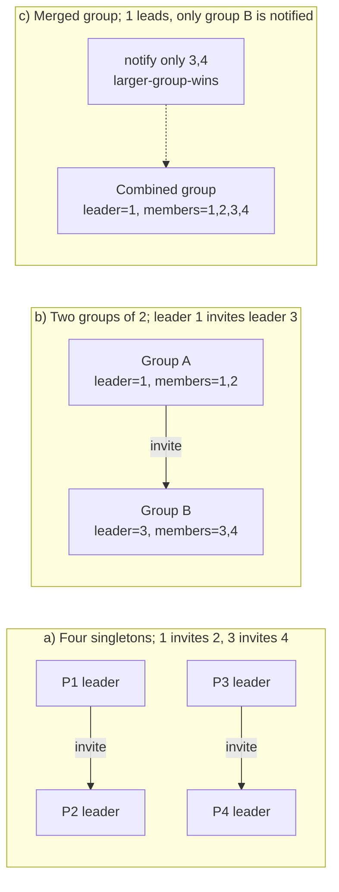

# Invitation Algorithm

> **One-sentence summary.** Every process starts as the leader of a singleton group and grows its group by inviting peers or merging with other groups, deliberately allowing multiple concurrent leaders so that failures and partitions can heal without a from-scratch reelection.

## How It Works

Every process boots up as the leader of a one-member group — itself. From there, each leader periodically **invites** peers that it does not already share a group with. The response determines the merge step:

- If the invited peer is itself a leader, the two groups merge into one.
- If the invited peer is an ordinary member of some other group, it replies with the **ID of its current leader** so the two leaders can talk directly and merge their groups in one round, rather than dragging every follower through the protocol.

Because any two groups can merge at any time, **multiple concurrent leaders are tolerated by design**. Liveness — "there is always *some* leader for every reachable subset" — is the goal; safety ("at most one leader globally") is explicitly not. Fault handling therefore becomes trivial: if a leader dies, its group fragments into smaller groups (eventually singletons), and the normal invitation/merge cycle stitches the survivors back together. There is no special "reelection" code path to trigger.

Merges use a simple heuristic to minimize gossip: **the leader of the larger group keeps leadership** of the combined group. That way, only the members of the smaller group receive a "your leader changed" notification; the larger group sees no change at all. Ties are broken arbitrarily (e.g. by process ID). This biases the system toward a few big groups absorbing many small ones, which is typically what operators want anyway.

In step (a), four processes boot and each forms a singleton. Two invitations execute in parallel. In (b), each pair has coalesced into a group of two; now leader `1` and leader `3` negotiate directly — no polling of followers. In (c), the larger-group-wins rule picks `1` (in a tie, any deterministic rule suffices), and `3`'s former followers are told the leader is now `1`. The cluster is unified in two merge steps and a handful of messages, and no failure detector, ranking scheme, or election round was required to get there.

## When to Use

- **Systems that tolerate — or even welcome — multiple leaders**: publish/subscribe overlays, group-chat presence servers, and collaborative session coordinators where each group can operate autonomously until they happen to meet.
- **CRDT-based or eventually consistent systems**: if concurrent writes are cheap to reconcile, there is little incentive to pay the safety tax of single-leader consensus.
- **Healing partitions**: network splits simply mean groups operate independently until they can exchange invitations again — a natural fit for edge/mesh deployments where partitions are routine, not emergencies.
- **Scenarios where reelection cost dominates**: if a from-scratch [[02-bully-algorithm]] or [[05-ring-algorithm]] round would storm the network after each blip, invitation-style incremental merging is far cheaper.

## Trade-offs

| Aspect | Advantage | Disadvantage |
|--------|-----------|--------------|
| Safety | — | **No safety guarantee**: multiple leaders coexist by design, unsafe for commit coordination or exclusive resources |
| Liveness | Always makes progress; reachable groups always have a leader | — |
| Failure recovery | A crashed leader just leaves fragments that re-merge naturally — no reelection thunder | Transient churn can leave many small groups that take many rounds to reunify |
| Message cost | Merges touch only the two leaders plus the smaller group's members | Invitations run continuously in the background; they never fully quiesce |
| Partition tolerance | Partitions heal by merging, with no special protocol | During a partition, each side independently accepts writes under its own leader |
| Bias | Larger-group-wins cuts notification traffic | Creates hotspots: the largest group's leader accumulates coordination load |

## Real-World Examples

- **Process-group / virtual-synchrony systems**: Invitation-style merging appears in the academic process-group literature (the family including ISIS and related toolkits), which handle partitions by letting disjoint group views evolve and reconcile.
- **Gossip-based overlays**: Many peer-discovery and overlay-construction protocols follow the same shape — each node seeds a local neighborhood, invites peers, and merges overlapping views. They are rarely labeled "invitation algorithm" in production docs, but the structure is identical.
- **Group-chat and presence systems**: Federated chat networks behave similarly at the room level — each server is the authority for rooms it created, and cross-server joins effectively merge membership views.

Be honest: unlike bully or ring, the invitation algorithm is rarely cited *by name* in modern production systems. Where strict agreement matters, teams reach for [[06-leader-election-and-consensus]] — Raft, Multi-Paxos, or ZAB. Where it doesn't, they reach for gossip and CRDTs directly. The invitation algorithm sits in the middle as the canonical textbook example of trading safety for cheap liveness.

## Common Pitfalls

- **Merge races**: Two leaders invite each other simultaneously. Without a deterministic tiebreak (larger group wins, then higher ID wins), both can believe they're the new combined leader. Always define a total order on the merge decision.
- **Assuming safety**: The algorithm is a liveness primitive. Layering a coordination task that requires "exactly one leader" (committing transactions, holding an exclusive lock) on top will corrupt data during the windows when two groups have not yet met.
- **Biased-growth hotspots**: The larger-group-wins rule means the earliest-formed big group tends to absorb everything, and its leader shoulders disproportionate coordination work. If the leader is also a failure point, you've reintroduced the very bottleneck leader election was supposed to remove.
- **Partitions that never heal**: If the invitation strategy only probes known peers, two partitions that never share a contact will stay split forever. Combine with a gossip-style random-peer dial to guarantee eventual reunification.
- **Notification storms on flapping links**: A link that comes and goes causes groups to merge, split, and re-merge repeatedly. Back off invitations after a recent merge, or the system thrashes on "leader changed" broadcasts.

## See Also

- [[01-leader-election-fundamentals]] — defines the liveness-vs-safety tension that this algorithm resolves firmly on the liveness side.
- [[02-bully-algorithm]] — the opposite philosophy: one leader, chosen by rank, with an explicit reelection every time it fails.
- [[05-ring-algorithm]] — another topology-driven election that, like the invitation algorithm, is split-brain prone but for very different reasons.
- [[06-leader-election-and-consensus]] — what you graduate to when the lack of safety here becomes unacceptable: fuse leader election with consensus and quorum.
