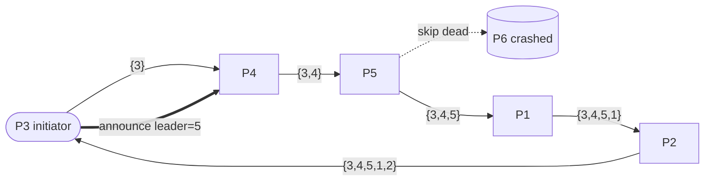

# Ring Algorithm

> **One-sentence summary.** Nodes arranged in a logical ring forward an election token to their successor — skipping dead nodes — until the token comes back carrying the live membership (or a running max), and the initiator then circulates the winner's identity back around the ring.

## How It Works

In the ring algorithm [CHANG79], every process knows the ring topology: its immediate **predecessor** and **successor**, and the order of the remaining nodes. When any process notices that the current leader has stopped responding, it initiates an election by sending a message to its successor and passing it hop-by-hop around the ring. If a successor is unreachable — the crashed leader being the obvious case — the sender **skips** it and tries the next node in ring order until somebody answers.

The circulating message accumulates information as it hops. Each node **appends its own identifier** before forwarding, so by the time the token returns to the initiator it carries the complete *live set* for this round. The initiator picks the **highest-ranked ID** from that set as the new leader and starts a second pass to broadcast the winner so every live process updates its view. This two-pass structure mirrors the path-collection trick used in [[02-timeout-free-failure-detector]]: both protocols piggyback path metadata on a message that walks the graph to reach a global decision without a central coordinator.

A useful variant reduces message bloat. Since `max` is **commutative and associative**, the message does not actually need the full live set — it can carry just the largest ID seen so far. Each hop compares its own ID with the running max and forwards whichever is higher. When the message returns to the initiator, that single number *is* the new leader. The announcement pass is identical. The trade-off is purely informational: you lose the full live-set view (which might be useful for logging or secondary decisions) but save bandwidth proportional to ring size.

## When to Use

- **Small, static clusters with a fixed topology.** If membership rarely changes and every node can cheaply maintain the ring view, the ring algorithm's `O(n)` message cost per election is tolerable and simpler to reason about than rank-based broadcasts.
- **Systems that already have a ring overlay.** Consistent-hashing rings (Chord, Dynamo-style DHTs) and token-ring LANs naturally provide successor pointers, so leader election for a coordinator role fits on top at zero structural cost.
- **Legacy or embedded LAN clusters.** Environments where broadcast storms are undesirable and a single circulating token keeps network load predictable.

## Trade-offs

| Aspect | Set Accumulation | Running Max |
|--------|------------------|-------------|
| Message size | Grows linearly with ring size (list of IDs) | Constant — one ID per hop |
| Information preserved | Full live-node set available at the initiator | Only the winner's ID |
| Debuggability | Initiator logs exactly who participated | Invisible which nodes were alive but not top-ranked |
| Use case fit | Useful when election triggers other membership-dependent work | Pure leader selection, bandwidth-constrained links |
| Complexity | Slightly more bookkeeping per hop | Minimal per-hop logic (single comparison) |

Both variants share the same structural drawbacks: **no safety guarantee** under partitions, and an `O(n)` second pass to announce the winner.

## Real-World Examples

- **Chang–Roberts algorithm (1979).** The canonical reference implementation of the running-max ring election; taught as the textbook baseline for ring-based leader election.
- **Token-ring LANs (IEEE 802.5).** A rough structural analogy — a single token circulates and confers the right to act. It is *not* a leader-election protocol per se, but the hop-forward-skip-dead-neighbor pattern is the same primitive. Flagging this honestly: token rings manage *medium access*, not leadership, so the analogy is about topology and token flow, not semantics.
- **Chord DHT coordinator selection.** Chord rings already carry successor pointers, so some implementations reuse the ring for electing a coordinator for maintenance tasks. Again, treat this as a structural reuse — the DHT's primary job is key lookup, not leader election.

## Common Pitfalls

- **Ring partitioning causes split brain.** If the ring breaks into two or more arcs (say nodes `{1,2,3}` lose contact with `{4,5}`), each arc completes its own traversal and elects its own leader. Neither side is aware of the other, violating the safety property. The ring algorithm — like the [[02-bully-algorithm]] — relies on an external quorum mechanism to prevent this.
- **Successor-skip amplification.** Every crashed node forces its predecessor to scan forward until a live node answers. In a ring where failures correlate (rack outage, bad switch), one initiator may end up timing out against multiple successive nodes, turning a bounded-per-hop protocol into a slow probe-and-skip sweep.
- **Concurrent elections.** If two nodes independently notice the leader's absence, two tokens circulate simultaneously. Implementations must include the initiator's ID in the message and define a tiebreaker (e.g., the higher initiator ID wins, the other token is absorbed) to avoid dueling announcements.
- **Stale successor knowledge.** The ring view is only useful while it matches reality. If nodes join or leave without updating everyone's predecessor/successor pointers, the token can get misrouted or stuck. Pair with a membership protocol that gossips topology changes.

## See Also

- [[01-leader-election-fundamentals]] — the liveness vs safety framing that motivates why ring partitioning is a real problem
- [[02-bully-algorithm]] — a non-topological alternative that broadcasts to higher-ranked nodes instead of forwarding along a ring
- [[04-invitation-algorithm]] — deliberately tolerates multiple leaders rather than trying to converge on one through traversal
- [[06-leader-election-and-consensus]] — why all three basic algorithms (bully, invitation, ring) ultimately need consensus + quorum to recover safety
- [[02-timeout-free-failure-detector]] — the path-accumulation pattern this algorithm borrows for its live-set variant
