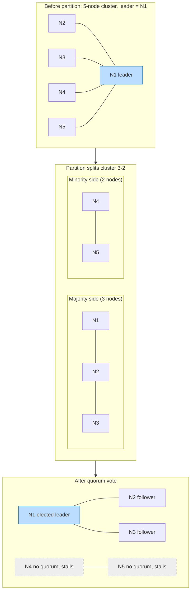

# Split Brain, Stable Leader Election, and Consensus

> **One-sentence summary.** Every basic leader-election algorithm can split-brain under a partition, so real systems bolt election onto failure detection and cluster-majority quorums — and in doing so recognize that electing a leader is just consensus in disguise, which is why Raft, Multi-Paxos, and ZAB embed it inside their own protocols.

## How It Works

All four algorithms covered earlier — [[02-bully-algorithm]], [[03-candidate-ordinary-optimization]], [[04-invitation-algorithm]], and [[05-ring-algorithm]] — share one gap: none of them can tell a crashed peer from an unreachable one. When the network splits, each side elects its own leader. Two leaders serving the same role, unaware of each other, is **split brain**, and it silently corrupts any state those leaders touch independently.

The standard fix is a **cluster-wide majority quorum**: a candidate needs `floor(N/2) + 1` votes before it can act as leader. At most one partition can assemble that majority, so the other side is stuck — exactly the safety we want. This is why Raft deployments use odd cluster sizes (3, 5, 7): an even count buys no extra fault tolerance but introduces ties that stall progress.

The second half of the fix is **stable leader election**. A node's belief that peer X is still leader goes stale the instant a link drops, so election is fused with timeout-based failure detection. The stable-leader-election approach runs in rounds with one leader per round and keeps it in place as long as heartbeats succeed. Election only fires when the detector says the current leader is gone — so the system does not thrash on every hiccup, and each surviving node has a current, quorum-backed answer to "who is the leader right now?"

## Leader Election Is Consensus

The chapter's deeper point: reaching agreement on *who* the leader is IS a consensus instance. If a protocol can reach consensus on the leader's identity, it can reach consensus on anything else by the same mechanism. Production systems therefore do not treat "pick a leader" as a preamble to the real protocol — they fold it in:

- **Raft.** Each leader owns a monotonically increasing *term*. A candidate becomes leader only after a majority votes for its term; any node (including an old leader) that sees a higher term immediately steps down. Randomized election timeouts stop candidates from splitting the vote every round.
- **Multi-Paxos.** Explicitly tolerates *multiple* competing proposers. When two conflicting proposers race, only one survives the second quorum phase, so two leaders can coexist briefly without two values being accepted.
- **ZAB (ZooKeeper Atomic Broadcast).** Leader election is part of the protocol, not a separate layer. Epoch numbers play the role of Raft terms — a new epoch is established by majority vote and dominates any earlier one.

All three accept that transient multiple leaders is a *performance* win: replication proceeds optimistically and safety is recovered by the quorum check that resolves conflicts after the fact. Liveness comes from having a leader at all; safety comes from the quorum, not the election.

## Comparison

| Algorithm | Safety (single leader?) | Liveness | Handles split brain? |
|---|---|---|---|
| Bully | No — each partition elects its own highest-ranked node | Good (fast when top node is stable) | No — no quorum check |
| Candidate/Ordinary | No — same partition failure mode as bully | Good (delay δ collapses simultaneous elections) | No |
| Invitation | No — deliberately allows multiple group leaders | Very good (merge on reconnect, avoids from-scratch reelection) | Not directly — relies on eventual merge |
| Ring | No — partitioned rings elect independently per arc | OK (bounded hop cost) | No |
| Raft | Yes — term + majority vote guarantees at most one active leader per term | Good with randomized timeouts | Yes — minority side cannot form quorum |
| Multi-Paxos | Allows concurrent proposers; resolved by second quorum | Good | Yes — quorum overlap prevents two values from being accepted |
| ZAB | Yes — epoch + majority vote analogous to Raft | Good | Yes — minority partition cannot advance epoch |

## When to Use

- **Strong consistency across replicas.** Anything writing replicated state (metadata services, config stores, distributed locks) should use a quorum-backed elector — Raft or ZAB in practice — not a bare bully/ring variant.
- **You already have a failure detector.** Plug stable leader election on top: the detector says when the leader is suspected dead, the quorum-backed election says who takes over. See [[01-failure-detector-fundamentals]].
- **Throughput over strict single-leader windows.** Multi-Paxos-style designs suit workloads where the write path is hot and rare conflicts are cheap.

## Common Pitfalls

- **Even-numbered clusters.** A 4-node cluster tolerates the same one failure as a 3-node cluster but is more likely to tie. Deploy an odd count of voting members.
- **Trusting stale leader identity.** A belief that peer X is still leader is only as fresh as the last heartbeat. Acting on stale leader knowledge during a partition is how split-brain writes leak through.
- **No fencing tokens.** Even with quorum election, a deposed leader can still be mid-RPC to storage. Without a monotonic fencing token that storage checks, delayed requests from the old leader corrupt state written by the new one.
- **WAN timeouts for election.** Stable leader election needs bounded delays to tell "slow" from "dead". Stretching a Raft cluster across continents inflates every timeout and turns every GC pause into a reelection storm — prefer per-region leaders.
- **Treating election as one-shot.** Leadership is continuously re-validated by the quorum and the detector, not asserted once at boot.

## See Also

- [[01-leader-election-fundamentals]] — why we want a leader, and the safety/liveness frame this article resolves
- [[02-bully-algorithm]] — the canonical rank-based scheme whose safety gap motivates quorum-based elections
- [[04-invitation-algorithm]] — treats multiple leaders as a feature rather than a bug, anticipating the Multi-Paxos style
- [[05-ring-algorithm]] — another split-brain-prone topology that benefits from a quorum overlay
- [[01-failure-detector-fundamentals]] — the accuracy/completeness vocabulary that stable leader election consumes
