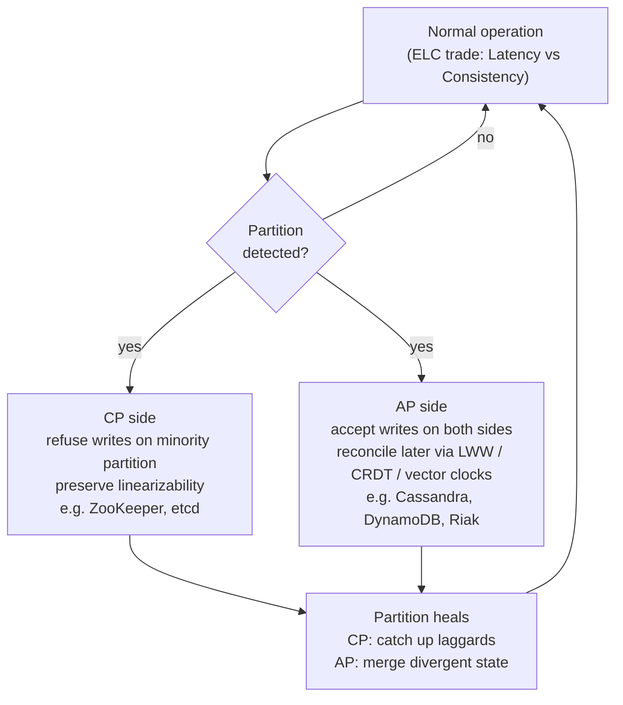

# CAP, PACELEC, and Harvest/Yield

> **One-sentence summary.** CAP is not a pick-two triangle but a forced choice that only applies *during a network partition*; PACELEC extends it to the partition-free case where you must still trade latency for consistency; Harvest and Yield reframe the all-or-nothing trade-off as tunable relative metrics.

## How It Works

CAP is often drawn as a triangle with three independent knobs — Consistency, Availability, Partition tolerance — and practitioners are told to "pick two." This is misleading. In any real network, messages are lost and links flap, so partitions are not something you opt out of; partition tolerance is the environment, not a knob. The *actual* theorem says: when a partition occurs, a node on one side cannot simultaneously (a) respond to every request and (b) guarantee its response reflects the latest globally agreed state. So the real decision is a spectrum between two behaviors *during* a partition — **CP** (refuse to answer if you might be stale) or **AP** (answer anyway, accept staleness).

The precise definitions matter more than the acronym:

- **Consistency (CAP)** means linearizability — every operation appears to take effect at a single instant between its invocation and its response, and all nodes agree on the order. This is not the "C" in ACID, which is about preserving database invariants inside a transaction.
- **Availability (CAP)** means every *non-failing* node returns a non-error response, with no bound on latency. This is not the "five nines" uptime number your SRE team tracks — a CAP-available system can still be painfully slow, and a highly-available database can legitimately return errors from some replicas while staying up overall.
- **Partitions** are network splits where messages are dropped or delayed indefinitely. A node that *crashes* does not create a partition in CAP's sense — it just disappears. You can face CAP's consistency dilemma with every node alive but unable to talk to each other.

**PACELEC** (Abadi 2012) patches the biggest practical gap in CAP. The "PAC" half restates CAP: during a Partition, choose Availability or Consistency. The "ELC" half adds what CAP ignores: **Else — even with no partition — you still trade Latency for Consistency.** Enforcing linearizability requires coordination (a quorum round trip, a consensus log append, a synchronous replication ack), and coordination costs milliseconds. Most databases expose this as configuration: Spanner's strong reads wait on TrueTime; Cassandra's `LOCAL_QUORUM` relaxes to datacenter-local agreement for lower latency. PACELEC makes the trade explicit.

## Harvest and Yield

Fox and Brewer (1999) noticed that CAP's choice is binary only because it defines both properties in their *strongest* forms — full linearizability and a response for every request. Relax the definitions and you get two tunable metrics:

- **Harvest** = *fraction of the answer returned*. If a query should return 100 rows but only 99 are reachable, a partial answer can beat a hard failure. A search engine that returns the 8 of 10 shards it could reach has harvest 0.8.
- **Yield** = *fraction of requests completed successfully*. Unlike uptime, yield counts individual requests: a node that is "up" but overloaded can have a low yield because it times out some queries.

A common technique is to **trade harvest for yield**: keep answering by serving only the available partitions. If a subset of nodes holding some users' records is unreachable, continue serving the other users rather than failing everything. You can also classify requests by criticality — demand full harvest for billing, accept reduced harvest for recommendations.

## Trade-offs

| Aspect | CP | AP | Harvest/Yield relaxation |
|---|---|---|---|
| **Partition response** | Refuse the minority side; linearizability preserved | Accept writes on both sides; reconcile later | Return partial results; keep answering from whatever's reachable |
| **Consistency guarantee** | Linearizable | Eventual (conflicts possible) | Per-request: full, partial, or stale depending on policy |
| **Failure mode** | Unavailable subset of requests | Stale or conflicting reads | Degraded completeness rather than outright failure |
| **When to choose** | Coordination, locking, billing, config stores | High-volume user data, writes from many regions | Read-heavy, aggregate-tolerant workloads (search, feeds, analytics) |
| **Cost of stronger mode** | Latency (PACELEC's ELC side) | Merge logic (CRDTs, vector clocks, LWW) | Request-level policy complexity |

## Real-World Examples

- **ZooKeeper / etcd (CP).** Quorum consensus refuses writes on the minority side of a partition; clients in the stranded partition get errors, not stale state. Used for coordination precisely because CP is the right choice there.
- **Cassandra / DynamoDB (AP with tunable consistency).** Default to writing to any available replica and reconciling via last-write-wins or application merge. Cassandra lets you dial toward CP per-query by raising the read and write quorum so that `R + W > N` — see [[06-tunable-consistency-and-witness-replicas]].
- **Riak (AP with vector clocks).** Accepts concurrent writes on both sides of a partition and returns sibling values to the client, who resolves them — a deliberate choice to expose divergence rather than silently drop writes.
- **Spanner (CP with bounded staleness).** Uses TrueTime and Paxos to give linearizable reads, and exposes a *bounded staleness* read mode that explicitly trades consistency for latency — a clean example of PACELEC's ELC axis.

## Common Pitfalls

- **Treating CAP as "pick two."** Partition tolerance is not optional in a real network; the choice is only between C and A *during* a partition. Diagrams implying a CA system are describing a single-node database.
- **Conflating CAP consistency with ACID consistency.** ACID's C is about invariants (foreign keys, CHECK constraints) surviving a transaction; CAP's C is about real-time ordering across replicas. A system can offer one without the other.
- **Assuming AP means "always inconsistent."** A well-run AP system serves linearizable results whenever replicas are healthy and reachable. AP is a promise about *partition behavior*, not about the happy path.
- **Ignoring the Else side of PACELEC.** Designers pick "AP" and forget they also chose latency-over-consistency during normal operation — which often matters more, because partitions are rare but every request pays the ELC cost.
- **Using CAP to justify a decision without reasoning about partitions.** "We're AP because we need scale" is a non-sequitur. The question is: when the network splits, which side keeps serving, and what happens to writes on the losing side?

## See Also

- [[02-linearizability]] — the consistency model CAP actually refers to, with the register semantics that make "C" precise
- [[06-tunable-consistency-and-witness-replicas]] — the practical mechanism (N/W/R quorums) for sliding along the CP–AP spectrum per query
- [[07-crdts-and-strong-eventual-consistency]] — a way to stay AP during partitions without sacrificing eventual convergence, by making merges algebraically deterministic
