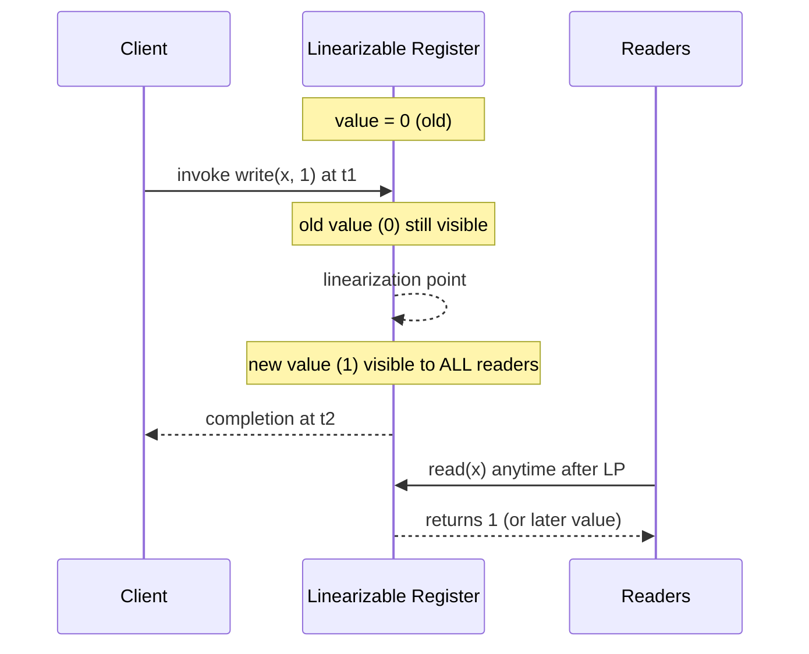

# Linearizability

> **One-sentence summary.** The strongest single-object, single-operation consistency model: every write appears to take effect instantaneously at a single *linearization point* somewhere between its invocation and its completion, so a replicated register behaves exactly like a single machine under a real-time clock.

## How It Works

A distributed database presents clients with the illusion of **shared memory** — an array of **registers** that processes read and write while internode messaging is hidden underneath. Every operation has an **invocation** (t1) when the client issues it and a **completion** (t2) when the client receives a response. Two operations are **sequential** if one completes before the other begins, and **concurrent** if their intervals overlap. Because calls are not instantaneous, concurrent ones may be ordered in several valid ways — which is exactly what a consistency model constrains.

Registers are classified by how they behave under overlap:

- **Safe** — reads concurrent with a write may return *any* value in the register's range (flickering between old and new, or worse).
- **Regular** — a read returns either the last fully completed write or the value of an overlapping in-flight write; there is some notion of order, but it is not uniformly visible across readers.
- **Atomic (linearizable)** — every write has a single instant before which every read returns the old value and after which every read returns the new value.

Atomicity is the jump that makes the register agree with wall-clock reality. The instant where that jump happens is the **linearization point**. Operations still take time, but their *effects* become visible atomically at one point in `[t1, t2]`. Past that point, no reader may see an earlier value — linearizability forbids stale reads and requires reads to be monotonic. This real-time bound is what distinguishes linearizability from weaker siblings like [[03-sequential-consistency]], which requires consistent ordering across processes but not agreement with real time.

### The Canonical Three-Process Example

Consider register `x = ∅`, with `write(x,1)` on P1 concurrent with `write(x,2)` on P2, and three reads on P3 interleaved through the schedule:

- A read overlapping *both* writes may return `∅`, `1`, or `2` — it can linearize before, between, or after either write.
- A read starting after `write(x,1)` completes but while `write(x,2)` is in flight may return only `1` or `2` — `∅` is gone forever.
- A read starting after *both* writes complete must return `2`, and every reader that follows must see `2` or a later value. That "no going back" rule is the whole point.

## Composability

Linearizability is a **local property**: if two objects are independently linearizable, any history combining them is still linearizable. You can reason about each register in isolation — no extra glue. The catch: composition is *per-object*. A transfer that reads object A and writes object B atomically is **not** automatically linearizable just because A and B individually are; multi-object atomicity needs transactions or an external coordinator. Confusing the two is one of the most expensive mistakes in distributed-systems design.

## Implementation Paths

- **Concurrent programming (single machine):** hardware **compare-and-swap (CAS)**. Prepare a new value off to the side, then CAS-swap a pointer — the CPU arbitrates the linearization point.
- **Distributed systems:** **consensus** (Raft, Multi-Paxos, ZAB). The consensus module guarantees each write is applied exactly once, in the same order, on every replica — an atomic broadcast provides the linearization point across nodes.
- **Linearizable RPC:** **RIFL** (Reusable Infrastructure for Linearizability). Clients hold a **lease** (unique ID) and tag each request with a monotonic sequence number. The server stores a **completion object** atomically with the data mutation, so a retried RPC after a crashed ack returns the original result instead of re-applying. Leases expire to garbage-collect dead clients. RIFL also guards against the **ABA problem**, where a value `A` is overwritten by `B` and back to `A`, letting a stale CAS slip through undetected.

## Trade-offs

| Aspect | Advantage | Disadvantage |
|---|---|---|
| **Programmability** | System behaves like a single machine; easiest mental model for correctness | Per-object only — multi-object invariants still need transactions |
| **Latency** | Predictable real-time visibility; no stale-read surprises | Every write pays a consensus round-trip (often cross-AZ) |
| **Throughput** | Pipelining inside the leader helps | Bottlenecked on the coordinator; cross-node cache invalidations dominate |
| **Fault-tolerance** | Failures do not produce stale reads | Requires a live quorum; minority partitions lose both writes *and* linearizable reads |
| **Compositional reasoning** | Linearizable objects compose freely into linearizable systems | Composition does not lift to multi-object operations |

Even modern CPUs skip linearizability for main memory by default — sync instructions stall pipelines and invalidate caches — hinting at the cost of distributing it across a network.

## Real-World Examples

- **etcd / ZooKeeper.** Linearizable key-value stores built on Raft and ZAB respectively — used precisely because distributed locks, leader election, and service discovery need the strong visibility guarantee.
- **Google Spanner.** Combines Paxos-replicated per-shard leaders with TrueTime intervals to offer linearizable (and even externally consistent) reads and writes globally.
- **Cassandra LWT.** Lightweight transactions layer Paxos on top of the otherwise eventually-consistent write path, giving per-key linearizable compare-and-set.
- **DynamoDB.** Strongly consistent single-key reads are linearizable; cross-item transactions require the transactions API.
- **CPU primitives.** `x86 LOCK CMPXCHG`, ARM `LDXR/STXR`, and Java's `AtomicReference.compareAndSet` are the hardware foundations the distributed versions mimic.

## Common Pitfalls

- **Assuming linearizability spans multiple keys.** It does not. A read of key A followed by a read of key B is two linearizable operations, not one atomic snapshot.
- **Saying "strong consistency" without naming the model.** "Strong" collapses linearizable, serializable, sequential, and externally consistent into a single mushy adjective; APIs and incident post-mortems need more precision.
- **Confusing operation-level with transaction-level guarantees.** Linearizability constrains one op. Transactions need serializability, and the two are orthogonal.
- **Naïve distributed counters.** `read; write(value+1)` from two nodes loses increments. Use CAS on a linearizable register, or push the increment through consensus.
- **ABA with CAS.** If the value can cycle, CAS can install a stale update. Pair CAS with monotonic version tags, hazard pointers, or a RIFL-style completion log.
- **Treating quorum reads as linearizable by themselves.** Dynamo-style `R + W > N` guarantees at least one overlap but not ordering — you also need read repair and anti-entropy, or the quorum can return a value that has already been superseded.

## See Also

- [[01-cap-pacelec-and-harvest-yield]] — the theoretical frame explaining why linearizability costs availability under partitions
- [[03-sequential-consistency]] — the next step down: global order without a real-time clock, and why it stops composing
- [[06-tunable-consistency-and-witness-replicas]] — how production systems dial back from linearizability when its cost is unacceptable
