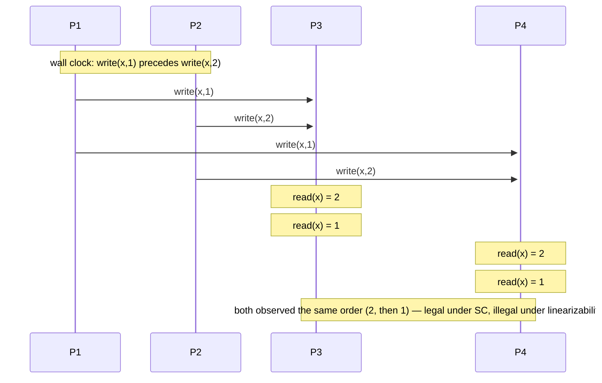

# Sequential Consistency

> **One-sentence summary.** Operations can be arranged into *some* sequential order that preserves each process's own program order, and all processes observe that same order — but the chosen order does not have to match wall-clock time.

## How It Works

Sequential consistency relaxes [[02-linearizability]] along one axis: the real-time bound. Linearizability says every operation appears to happen at some instant inside its `[invocation, completion]` window. SC drops the wall clock entirely. It asks only for a single interleaving — a legal serial history — that (a) preserves each process's **program order** and (b) is **the same interleaving seen by every process**.

Lamport introduced the idea in 1979 for multiprocessor correctness [LAMPORT79]: requests to the same cell are served FIFO, writes to different cells can be ordered arbitrarily, and a read returns either the cell's stored value or the latest pending write in the queue. The two guarantees that fall out:

1. **Program order.** Two writes from the same process can never appear reordered — same-origin writes don't "jump over" one another.
2. **Agreed global order.** All readers observe the same total order over all writes, even when that order is arbitrary with respect to wall time.

The canonical example: `P1` issues `write(x,1)`, then in wall-clock terms `P2` issues `write(x,2)`. Under SC, both `P3` and `P4` are allowed to read `2` first and then `1` — as long as they agree with each other.

Stale reads are explicitly permitted — replicas may apply writes at different wall-clock moments. What SC forbids is *disagreement*: no two observers can disagree on the total order.

## Sequential Consistency vs Linearizability

The comparison causes the most confusion in practice, so it deserves a table.

| Aspect | Linearizability | Sequential Consistency |
|--------|-----------------|------------------------|
| Real-time bound | **Yes** — operations slot into their `[inv, comp]` window | **No** — order is logical, not wall-clock |
| Per-process program order | Yes | Yes |
| All readers agree on one global order | Yes | Yes |
| Stale reads permitted | No — a read after a completed write sees at least that write | Yes — propagation lag is fine if everyone lags the same way |
| **Composable across objects** | **Yes** — a system of linearizable objects is linearizable overall [HERLIHY90] | **No** — two SC objects combined do **not** give an SC system [ATTIYA94] |

The composition row is the sharp one. You cannot verify SC object-by-object and claim the whole system is SC; an operation touching two SC objects can produce histories no single sequential interleaving explains. This is why linearizability (a *local* property) won the practical argument — linearizable subsystems compose safely.

## When to Use

- **Primary/replica databases serving reads off synchronous followers.** Replicas apply the same write stream in the same order, so every reader sees the same history — just lagged. Each client's view is coherent even when cross-client wall-clock recency is not.
- **Ordered broadcast / replicated state machines** where the only invariant clients depend on is "everyone saw the same sequence of commands."
- **Single-object abstractions** you know will never participate in a cross-object invariant (if they do, SC's non-composability bites you).

## Real-World Examples

- **Java `volatile` and `std::atomic` with `memory_order_seq_cst`.** Language-level SC: modern CPUs do not guarantee SC by default, so compilers insert memory barriers (fences) on reorder-happy hardware [DREPPER07].
- **x86 / TSO.** x86's Total Store Order is "almost SC" — it permits a store-then-load reorder on the same core, which is why `mfence` / `LOCK`-prefixed instructions exist.
- **Distributed databases — honest caveat.** Very few systems advertise *exactly* sequential consistency. In practice they pick **linearizable** (Spanner reads, etcd, FoundationDB txns) or settle for **causal+** (COPS, MongoDB causal, Azure Cosmos DB). SC is mostly a teaching waypoint between them.

## Common Pitfalls

- **Confusing SC with linearizability.** Both give a global total order and preserve program order; only linearizability ties that order to real time. An SC replica's "fresh" read can trail reality by an unbounded amount.
- **Assuming SC composes.** Two SC objects jointly accessed do not form an SC system. If you need cross-object invariants, reach for linearizability or explicit transactions.
- **External observers.** SC is defined over the processes *inside* the system. A third party on the wall clock (audit log, operator, external API) can witness orderings SC permits but that look wrong.
- **Porting SC textbook algorithms to real hardware.** Proofs assuming SC break silently on weak memory models. Insert barriers, or use `seq_cst` atomics.
- **Treating "same order for everyone" as liveness.** SC says nothing about *when* a write becomes visible. A replica can lag forever and still be sequentially consistent.

## See Also

- [[02-linearizability]] — the strictly stronger property; adds a real-time bound and composes across objects
- [[04-causal-consistency-and-vector-clocks]] — weaker model; drops global agreement but preserves causal order
- [[05-session-models]] — per-client guarantees (monotonic reads, read-your-writes) that applications often actually want when they reach for "sequential consistency"
