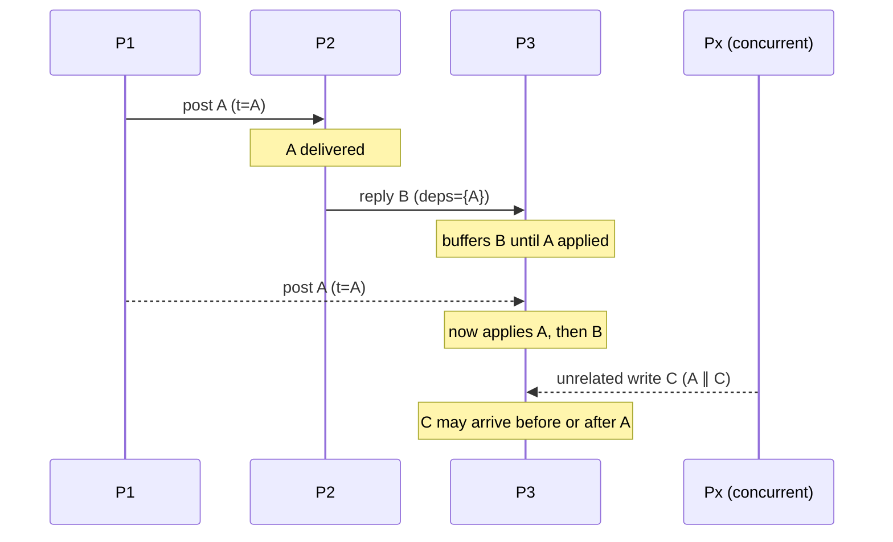

# Causal Consistency and Vector Clocks

> **One-sentence summary.** Under causal consistency every process observes causally related operations in the same order, while *concurrent* (unrelated) operations may be observed in different orders — enough to guarantee intuitions like "a reply arrives after the post it replies to" without paying for global total order.

## How It Works

Causal consistency is defined over Lamport's **happened-before** relation `→` [LAMPORT78]. Event `A → B` iff one of these holds:

1. `A` and `B` are in the same process and `A` executes first,
2. `A` is a message send and `B` is the matching receive, or
3. there exists some `C` such that `A → C` and `C → B` (transitive closure).

Two events that are *not* ordered by `→` in either direction are **concurrent** — written `A ∥ B`. Causal consistency demands only that all processes agree on the order of `→`-related events; concurrent events are free to land in any order on any replica.

The canonical motivation is a forum thread. `P1` posts, `P2` reads the post and replies, `P3` reads the reply and continues. If a replica served `P3` the reply *without* the original post, the conversation would be nonsensical. Implementations prevent that by **attaching causal metadata to every write** (a logical timestamp summarising its dependencies); a server may deliver a write only once all its dependencies have already been applied, otherwise it buffers the message until the gap fills in.

## Vector Clocks

Per-process logical counters are not enough to detect concurrency — you need per-pair information. **Vector clocks** [FIDGE88] [MATTERN88] give each of the `N` processes a vector `V` of length `N`:

- On a local event, `Pi` increments `V[i]`.
- On send, `Pi` attaches its current `V`.
- On receive of `V'`, the receiver sets `V[k] := max(V[k], V'[k])` for every `k`, then increments its own slot.

Ordering is partial: `V_A ≤ V_B` iff every component of `V_A` is `≤` the corresponding component of `V_B`. Then `A → B` iff `V_A < V_B` (strictly less in at least one slot), and `A ∥ B` iff neither `V_A ≤ V_B` nor `V_B ≤ V_A`.

A three-process trace makes this concrete:

| Step | Event                 | V(P1)     | V(P2)     | V(P3)     |
|------|-----------------------|-----------|-----------|-----------|
| 0    | init                  | [0,0,0]   | [0,0,0]   | [0,0,0]   |
| 1    | P1 local write `a`    | **[1,0,0]** | [0,0,0] | [0,0,0]   |
| 2    | P2 local write `b`    | [1,0,0]   | **[0,1,0]** | [0,0,0] |
| 3    | P1 → P2 send+recv     | [1,0,0]   | **[1,2,0]** | [0,0,0] |
| 4    | P2 → P3 send+recv     | [1,0,0]   | [1,2,0]   | **[1,2,1]** |

Events at step 1 and step 2 are **concurrent** (`[1,0,0] ∥ [0,1,0]`). Event at step 4 is causally after both.

## Version Vectors in Databases

Databases usually attach a **version vector per key** rather than per process, using the same rule to detect write conflicts. When a client writes, it includes the version vector it read; the server accepts the write as a descendant if the incoming vector dominates the stored one, and flags a **conflict** when neither dominates. The system then either surfaces both siblings to the application (Riak's default), falls back to last-write-wins, or merges them via a [[07-crdts-and-strong-eventual-consistency]].

## When to Use

- **Geo-replicated key-value stores** where cross-region coordination would be prohibitively slow — you want session guarantees without a global log.
- **Collaborative or social apps** where causal intuitions (comments, replies, likes on posts) matter but a strict total order is overkill.
- **Systems that already accept conflicts** and have a merge strategy — vector clocks supply the detection, the app (or CRDT) supplies the resolution.

## Real-World Examples

- **Dynamo / DynamoDB [DECANDIA07]** — per-key version vectors detect divergent siblings on cross-region writes.
- **Riak [SHEEHY10a] [DAILY13]** — surfaces divergent siblings to the client for application-level resolution.
- **COPS [LLOYD11]** — tracks **key-version** dependencies via a client library; ensures causal reads in a geo-replicated KV store.
- **Eiger [LLOYD13]** — tracks **operation-order** dependencies, supports multipartition transactions, resolves conflicts with LWW.
- **Bayou** — the original causally-consistent mobile-replica database; the intellectual ancestor of COPS/Eiger.
- **Cassandra [ELLIS13]** — explicitly does *not* order causally; uses wall-clock LWW. Simpler, but silently loses concurrent updates.

## Trade-offs

| Aspect | Advantage | Disadvantage |
|--------|-----------|--------------|
| Coordination | No global leader or consensus needed; writes can happen at any replica | Replicas diverge, and the app must handle it |
| Latency | Tolerates multi-datacenter RTTs — delivery just buffers until deps arrive | Reads can stall when a causal dependency is missing |
| Metadata | Carries enough info to detect divergence | Vector size grows with number of participants / keys |
| Conflict handling | System *detects* every conflict | System cannot *resolve* it — that is app-specific |
| Anomalies prevented | "Reply before post" class of anomalies go away | Concurrent writes are still exposed as siblings |

## Divergent Histories

Vector clocks **detect** divergence — they cannot resolve it. When two replicas accept concurrent writes, the result is two version chains that are mutual non-ancestors. The system must then either (a) surface both to the application, (b) pick a winner via LWW (simple, loses data), or (c) merge deterministically via a CRDT. Choice (c) is the only one that preserves both writes without user intervention; see [[07-crdts-and-strong-eventual-consistency]].

## Common Pitfalls

- **Unbounded vector growth.** A new actor means a new slot. Long-lived systems need pruning — TTL on dormant client IDs, client-death tombstones, or dotted version vectors.
- **Using wall-clock timestamps as logical clocks.** Clock skew silently violates `→`: a "later" event can get an earlier timestamp and be discarded. LWW on wall-clock is not causal consistency — it is Cassandra's deliberate trade-off.
- **Assuming causal consistency prevents all anomalies.** It does not. Concurrent writes still diverge; reads can still be stale; invariants across keys (bank balance ≥ 0) still need stronger models.
- **Confusing causal with linearizable for "obviously related" ops.** If two operations look related to a human but the system never carried a dependency edge between them (e.g., they touched different keys via different clients), nothing enforces their order.
- **Forgetting to ship the context.** Causal consistency only works if every write carries its dependency set and every replica honours the buffering rule. One "fast path" that skips metadata and the guarantee is gone.

## See Also

- [[03-sequential-consistency]] — the stronger model above causal; forces a single global order of all writes instead of only causally related ones
- [[05-session-models]] — monotonic reads / writes / read-your-writes / writes-follow-reads; the client-facing guarantees causal consistency gives you for free
- [[07-crdts-and-strong-eventual-consistency]] — the principled way to *resolve* the divergence that vector clocks merely *detect*
