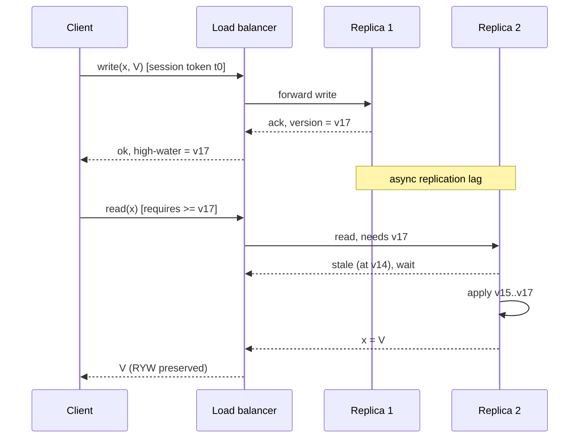

# Session Models (Client-Centric Consistency)

> **One-sentence summary.** Session models describe consistency from a single client's point of view — guaranteeing that its own reads and writes make sense to itself, even on an eventually consistent backend where replicas still diverge for everyone else.

## How It Works

Every consistency model covered earlier — linearizable, sequential, causal — reasons about how *all* clients observe a shared history. Session models flip the frame: they ignore inter-client ordering and focus on what a single client, through its own sequential stream of reads and writes, is entitled to see. A client issues operations one at a time; if it crashes mid-operation, no guarantees are made about that incomplete call. Under eventual consistency, the *nasty* surprise is that a client load-balanced to a different replica after a write may fail to see its own update. Session guarantees plug exactly those anomalies the client would personally notice, **without** requiring global synchronization across replicas.

The four classical guarantees come from Terry et al.'s 1994 work on the Bayou mobile database:

1. **Read-your-writes (RYW).** After `write(x, V)`, every subsequent `read(x)` in the same session returns `V` or a later value. Example: after you post a comment, your page reload shows it.
2. **Monotonic reads.** Once a read has observed `V`, later reads return `V` or later — never an older value. Example: your inbox never loses a message you have already seen.
3. **Monotonic writes.** Writes from the same client become visible to every observer in the order the client issued them. Example: successive edits to a document do not get reordered and resurrect old prose.
4. **Writes-follow-reads (session causality).** If the client writes `V2` after reading `V1`, `V2` is ordered after `V1`'s write globally. Example: your reply is ordered after the post it replies to.

Combining RYW + monotonic reads + monotonic writes yields **Pipelined RAM (PRAM) / FIFO consistency**: writes from a single process propagate to all observers in that process's order, but writes from *different* processes can still be interleaved arbitrarily. Session models are effectively the "single-client slice" of causal ordering; [[04-causal-consistency-and-vector-clocks]] extends the same idea across clients using logical clocks.

The diagram shows the standard trick: the client carries a version token. The second read is free to land on `R2`, but `R2` must block until it has applied up to the token's high-water mark. A naïve round-robin load balancer with no token would let `R2` answer at `v14` and silently break RYW.

## Implementation Techniques

- **Sticky sessions.** Route every request from a client to the same replica; RYW and monotonic reads become trivial because there is only one history.
- **Read tokens / bounded staleness.** Each write returns a version token; each read includes one. Replicas delay the read until they have caught up to that version.
- **Write-through acknowledgement.** The write does not return to the client until it has been applied on the replica the client will read from next.
- **Per-session version vectors.** The client carries a vector of versions it has observed across keys; any replica can serve it once it dominates that vector.

## When to Use

- **User-facing eventually consistent stores.** Social feeds, shopping carts, profile settings — anywhere a user would be confused by not seeing their own edit.
- **Cross-region reads with local writes.** Session tokens let reads land on the nearest replica while preserving personal ordering.
- **Cache-backed databases.** Write-through plus a session-bound read cache avoids stale reads without going strongly consistent.

## Trade-offs

| Guarantee | Typical cost | Payoff |
|---|---|---|
| Read-your-writes | Sticky routing or version tokens per client | The single most user-visible consistency win |
| Monotonic reads | Same-replica routing, or token-based minimum version | No "time travel" backward between reads |
| Monotonic writes | FIFO delivery of a client's writes to each replica | No data resurrection from reordered writes |
| Writes-follow-reads | Client-side metadata propagation across operations | Causal reply ordering within a session |

## Real-World Examples

- **Azure Cosmos DB.** Session consistency is the default tier; the SDK ships an opaque session token per client that is attached to every read.
- **MongoDB causal consistency.** Client sessions carry an `afterClusterTime` token; secondary reads wait until their applied oplog time reaches it.
- **Dynamo / Cassandra.** Application-level stickiness to a coordinator gives a practical RYW story on top of eventually consistent replication.
- **Bayou.** The original mobile-first system that motivated the four guarantees, where a disconnected laptop needed to see its own offline writes on reconnect.

## Common Pitfalls

- **Load balancer breaks RYW.** A plain round-robin in front of replicas defeats sticky routing; pin by client cookie, user ID, or session token.
- **Cross-device sessions.** Your phone and your laptop are *different* client sessions. Session guarantees do not cover device handoff — the laptop may not see the phone's write until replication catches up.
- **Assuming guarantees about other clients.** Session models say nothing about what *another* user sees. Do not reach for them when the invariant crosses client boundaries — that is [[04-causal-consistency-and-vector-clocks]] territory or stronger.
- **Dropping tokens on retry.** Middleware that regenerates requests without copying the session token silently downgrades every retried read to eventual consistency.
- **Unbounded read waits.** Tokens make reads block until replicas catch up; a lagging replica turns into a latency hotspot. Pair token-based reads with a fallback or a timeout.

## See Also

- [[04-causal-consistency-and-vector-clocks]] — generalizes session guarantees across clients via happened-before tracking
- [[06-tunable-consistency-and-witness-replicas]] — server-side knobs (N/R/W) that can be layered under session tokens to pick a replica quorum
