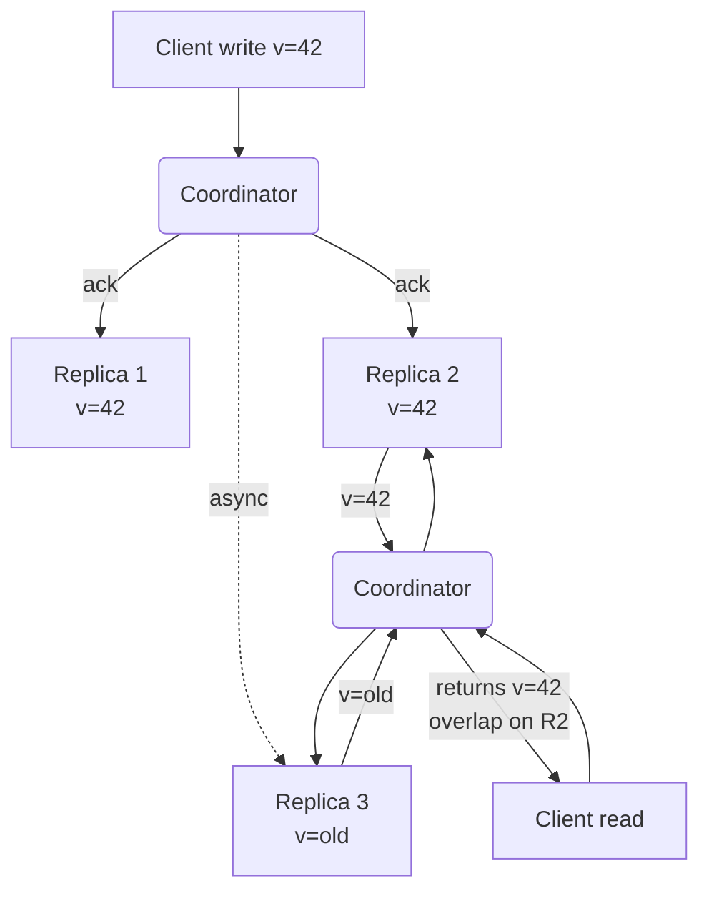
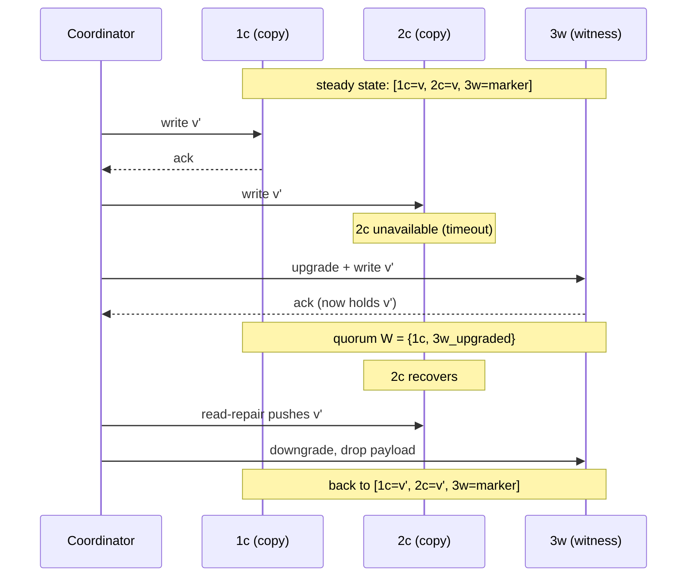

# Eventual and Tunable Consistency with Witness Replicas

> **One-sentence summary.** Tunable consistency exposes three knobs — **N** replicas, **W** write acks, **R** read acks — so operators can trade latency for freshness per request; quorums (`R + W > N`) guarantee overlap between reads and the last completed write, and witness replicas shrink storage cost without breaking that overlap.

## How It Works

**Eventual consistency** is the baseline. Updates propagate asynchronously: if no further writes arrive, every replica *eventually* converges on the same latest value [VOGELS09]. Divergence during propagation is allowed; only convergence is guaranteed. "Eventually" is a property, not a latency SLO — the model provides no time bound. Conflicts that arise from diverged writes must be resolved by a strategy (last-write-wins, vector clocks, or a merge function — see [[04-causal-consistency-and-vector-clocks]] and [[07-crdts-and-strong-eventual-consistency]]).

**Tunable consistency** lets applications pick *where on the staleness / availability / latency curve* each request sits, using three dials:

- **N** — the replication factor: how many nodes store a copy.
- **W** — how many replicas must acknowledge a write before the coordinator declares success.
- **R** — how many replicas must respond to a read before the coordinator returns a value.

The key invariant: **`R + W > N` guarantees that every read intersects every completed write on at least one replica**, so a quorum read always has access to the latest successful value. If `R + W ≤ N`, reads can miss the freshest value entirely — cheaper and faster, but no freshness guarantee.

With `N=3, W=2, R=2`, any two-replica read set shares at least one node with any two-replica write set — here, R2 — so the read returns the latest value even though R3 is still stale.

## Common Quorum Configurations

| N | W | R | Property | Failure tolerance |
|---|---|---|----------|-------------------|
| 3 | 2 | 2 | Strong quorum, balanced | `f = 1` |
| 3 | 3 | 1 | Fast reads, any-replica-down blocks writes | `f_write = 0` |
| 3 | 1 | 3 | Fast writes, any-replica-down blocks reads | `f_read = 0` |
| 5 | 3 | 3 | Strong quorum, higher tolerance | `f = 2` |
| 5 | 1 | 1 | Maximum availability, no freshness guarantee | any |

The quorum math generalises: with `N = 2f + 1`, a majority of `⌊N/2⌋ + 1` tolerates `f` failures and still forms an overlapping set. **Speculative execution** can shave tail latency — the coordinator dispatches more than `R` read requests and counts the first `R` responses, so one slow replica does not slow the read.

## Monotonicity and the Incomplete-Write Trap

Quorum reads are *not* automatically monotonic. Consider a write that acknowledges on 1 of 3 replicas and then fails (coordinator crash, timeout). The write is not "successful," but the value is present on one node. Subsequent quorum reads may or may not include that node:

- Read contacts `{R1(new), R2(old)}` → returns `new`.
- Next read contacts `{R2(old), R3(old)}` → returns `old`.
- Next read contacts `{R1(new), R3(old)}` → returns `new`.

The return value alternates purely based on which replicas answered. The fix is **blocking read-repair**: when the coordinator sees disagreement, it synchronises replicas *before* returning the answer. That restores monotonicity at the cost of extra RTTs and the risk of stalling when the slowest replica is the one that must be written to.

## Witness Replicas

Quorums are great for availability but expensive to store — five replicas means five full copies. **Witness replicas** split the replica set into two roles:

- **Copy replicas** hold the full data record, as normal.
- **Witness replicas** hold only metadata — a marker that a write occurred, no payload.

Two rules preserve the quorum guarantee:

1. Reads and writes still require majorities (`⌊N/2⌋ + 1` participants).
2. At least one participant in every quorum must be a copy replica.

In steady state, only copy replicas carry data, cutting storage cost. When a copy replica is unreachable, a witness is **upgraded** to temporarily hold the record; when the failed copy recovers, repair copies the value back and the witness drops its payload.

With `n` copy and `m` witness replicas, availability matches `n + m` full copies, because data lives either on a copy (steady state) or on an upgraded witness (degraded state), and repair keeps the two in sync.

## Trade-offs

| Knob / choice | Advantage | Disadvantage |
|---------------|-----------|--------------|
| `R + W > N` | Read-your-latest-write; overlap guaranteed | Higher latency, less availability |
| `W = 1` | Write-optimised; tolerates many slow nodes | Unacknowledged replicas may lag; risk of data loss on coordinator crash |
| `R = 1` | Read-optimised; sub-ms latency | Stale reads; no freshness guarantee |
| Speculative reads | Reduces tail latency on reads | Extra network load; doesn't help writes |
| Blocking read-repair | Restores monotonicity | Adds RTTs; couples read latency to slowest replica |
| Witness replicas | Storage savings (proportional to witness count) | Upgrade/repair traffic; more coordination state |

## Real-World Examples

- **Apache Cassandra** — per-query tunable consistency levels (`ANY`, `ONE`, `QUORUM`, `ALL`, `LOCAL_QUORUM`, `EACH_QUORUM`), plus read-repair and hinted handoff.
- **Amazon DynamoDB** — exposes "eventually consistent" (cheap, `R=1` style) vs "strongly consistent" reads on the same table.
- **Riak** — classic `N/R/W` dials, vector clocks for conflict detection, sibling resolution on read.
- **Google Spanner** — combines Paxos groups with witness replicas (voting-only, no data copy) to cut cross-region storage cost while keeping majorities.
- **Azure Cosmos DB** — five explicit tiers (strong, bounded staleness, session, consistent prefix, eventual), implemented over a tunable quorum layer.

## Common Pitfalls

- **Thinking `R=1, W=N` guarantees strong reads.** If the write fails *after* one replica has applied it, the system still holds that value on one node, and `R=1` reads may or may not see it. Strong reads need `R + W > N` **and** successful writes.
- **Assuming quorum reads are monotonic.** They are not, without blocking read-repair. Applications that depend on "once I saw v, I keep seeing v" must either read-repair or layer [[05-session-models]] on top.
- **Believing speculative reads fix write latency.** They only help read tails. Write latency is bounded below by the W-th fastest replica's RTT.
- **Treating witness replicas as free.** Upgrade/downgrade and repair traffic are not zero. In failure-prone environments, witnesses can churn and cost more than a plain copy.
- **Cross-region quorums.** A quorum in a geo-distributed cluster is bounded by the slowest *required* replica's RTT. `W=3` across three continents is hundreds of ms per write regardless of how fast the other two are.
- **Conflating "eventual" with "fast."** Eventual consistency is a correctness property, not a performance one — convergence can take milliseconds or hours depending on anti-entropy cadence.

## See Also

- [[01-cap-pacelec-and-harvest-yield]] — the availability-vs-consistency framing that tunable systems navigate per-request
- [[02-linearizability]] — the strong-consistency endpoint; quorums approximate but don't reach it without extra coordination
- [[07-crdts-and-strong-eventual-consistency]] — what you reach for when you want convergence guarantees *without* coordinated quorums
