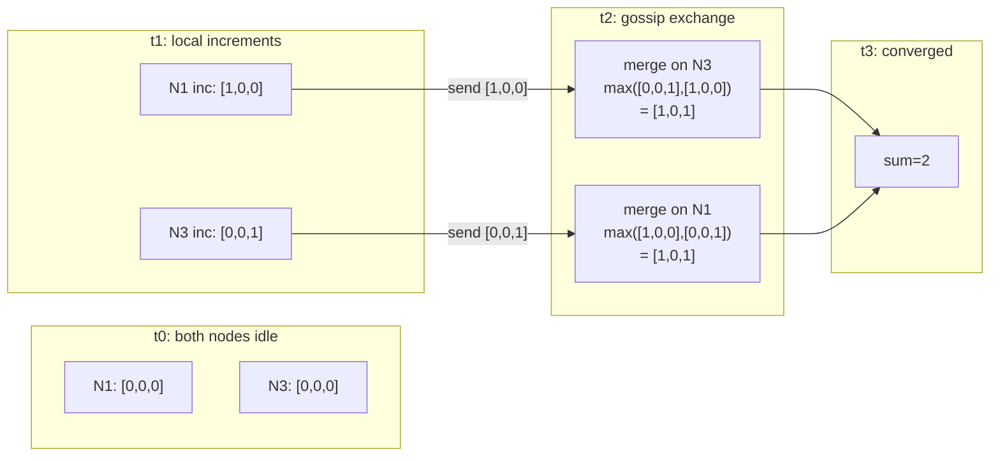

# CRDTs and Strong Eventual Consistency

> **One-sentence summary.** Conflict-Free Replicated Data Types are data structures whose update operations are commutative, associative, and idempotent, so replicas applying the same set of updates in any order converge to the same state — giving Strong Eventual Consistency (SEC) without coordination, consensus, or rollbacks.

## How It Works

Plain eventual consistency only promises replicas *will* agree *eventually* — nothing about what they look like along the way or how conflicts resolve. **Strong Eventual Consistency** strengthens that in one decisive way: any two replicas that have received the same set of updates are in the **same state**, period. No locks, no leader, no rollback. The trick: design the data type so the merge itself cannot produce a conflict.

CRDTs come in two dual flavors:

- **CmRDTs (operation-based)** broadcast each update *operation*. Operations must be **side-effect free**, **commutative** (`x • y = y • x`), and delivered with **causal ordering** so preconditions hold. Any replica applying the same bag of operations lands in the same state.
- **CvRDTs (state-based)** broadcast the *full state* (or a delta) and rely on a **join-semilattice** merge: commutative, associative, idempotent. State merges shrug off duplicates and reordering because re-merging old state is a no-op.

The canonical state-based example is the **G-Counter** (grow-only counter). Each node keeps a vector of per-node increment counts and is only allowed to touch its own slot. `merge` takes the **pointwise maximum**; the value is the sum. Because `max` is commutative, associative, and idempotent, any gossip topology — duplicates, reorders, partitions — still converges to the same total. A **PN-Counter** is a pair of G-Counters `(P, N)` with `value = sum(P) − sum(N)`, restoring decrements. In large clusters where per-node vectors grow embarrassingly, **super-peers** aggregate slices and gossip on behalf of many participants, cutting pairwise chatter.

Registers and sets round out the zoo. An **LWW-Register** stores `(timestamp, value)` and merges by max timestamp — simple, but silently drops concurrent writes. A **Multi-Value (MV) Register** keeps every concurrently written value and hands the application all siblings at read time (Riak's Dynamo-style siblings). A **G-Set** grows by set union. A **2P-Set** pairs an add-set with a remove-set: only previously-added items may be removed, and once tombstoned, never re-addable. An **OR-Set (observed-remove)** attaches a unique tag to each add; a remove only kills tags it has *observed*, so re-adds after a remove behave intuitively — the semantics most users actually want. Finally, **conflict-free JSON** documents (Kleppmann et al.) compose these primitives into deeply nested maps, lists, and text for true concurrent editing with client-side merge.

## When to Use

- **Multi-region writes without a single leader**: edge caches, geo-distributed counters, "likes" and view counts where you want local-write latency and accept approximate global ordering.
- **Offline-first and mobile**: a device edits locally for hours, then merges on reconnect — think collaborative documents, to-do lists, sync engines.
- **Collaborative editing**: character-level merge in editors and whiteboards, where two typists must always see the same document even after disjoint typing bursts.
- **Partition-tolerant counters and sets**: increment counters or gather membership events during a partition, reconcile on heal, lose nothing.

## Trade-offs

| Aspect | Advantage | Disadvantage |
|--------|-----------|--------------|
| Coordination | No consensus, no locks, no leader — writes are purely local | Conflicts are resolved deterministically, not *avoided*; the app still sees merged state and must cope |
| Availability | Available under any partition; monotonic progress | Convergence time depends on gossip; stale reads between merges |
| Metadata | State is composable and monotonic, enabling delta sync | Per-node vectors, add-tags, and tombstones bloat the payload; GC of tombstones is subtle |
| Expressiveness | Counters, sets, maps, registers, JSON, even text sequences | Not every datatype admits a CRDT; some require heavy encoding (RGA/LSEQ for sequences) |
| Determinism | Same inputs → same output, everywhere | LWW merges can silently drop concurrent updates; OR-Set / MV are safer but heavier |

## Real-World Examples

- **Redis Enterprise (Active-Active)**: Multi-master geo-replication built on CRDTs — counters, sets, hashes, and strings reconcile across regions without a primary.
- **Riak**: First-class CRDT bucket types — counters, sets, maps, and registers — exposed directly in the data API.
- **Automerge and Yjs**: JSON/CRDT libraries powering collaborative editing in Figma-style whiteboards, Apple Notes sync, Linear's offline mode, and many local-first apps.
- **Azure Cosmos DB**: Multi-region writes with pluggable conflict-resolution policies, including CRDT-style custom merge.
- **SwiftCloud / Braid**: Research systems exploring CRDTs for client-side replication and the web-as-a-database pattern.

## Common Pitfalls

- **LWW silently loses data**: two concurrent writes with close timestamps — or a clock skew of a few milliseconds — and the "loser" vanishes with no audit trail. For any field where losing a write matters, use MV-Register or OR-Set and surface siblings to the application.
- **Tombstones never die on their own**: 2P-Set and OR-Set both retain remove-markers forever unless you bolt on a distributed GC protocol. Real GC requires knowing every replica has *seen* a given tombstone, which is close to consensus and usually where naïve implementations break down.
- **Not every datatype is CRDT-friendly**: a G-Counter cannot be decremented (use PN), a plain LWW-Register cannot preserve concurrent edits (use MV), and arbitrary-position list insert requires stable-order identifiers (RGA, LSEQ, Logoot) — otherwise concurrent inserts interleave unpredictably.
- **Clock skew breaks timestamp-based merges**: LWW needs a *globally ordered* timestamp. Wall-clock NTP drift can reorder writes; prefer logical or hybrid-logical clocks, or use tag-based CRDTs that avoid timestamps entirely.
- **"CRDT means no conflicts"**: it does not. Conflicts resolve *deterministically*, but the application still sees the merged outcome — which may not match anyone's intent. Design schemas so the automatic merge is also the *desired* merge.
- **Exploding state vectors**: in a cluster of thousands, a per-node slot in every G-Counter is expensive. Use super-peer aggregation, delta-CRDTs, or periodic vector truncation for members known to have left the system.

## See Also

- [[04-causal-consistency-and-vector-clocks]] — CmRDTs lean directly on causal delivery; the same happened-before machinery that orders causally consistent reads also orders CRDT operations.
- [[06-tunable-consistency-and-witness-replicas]] — the dial CRDTs replace: rather than tuning `R + W > N` to overlap quorums, CRDTs let every replica accept writes and rely on deterministic merge to heal divergence.
