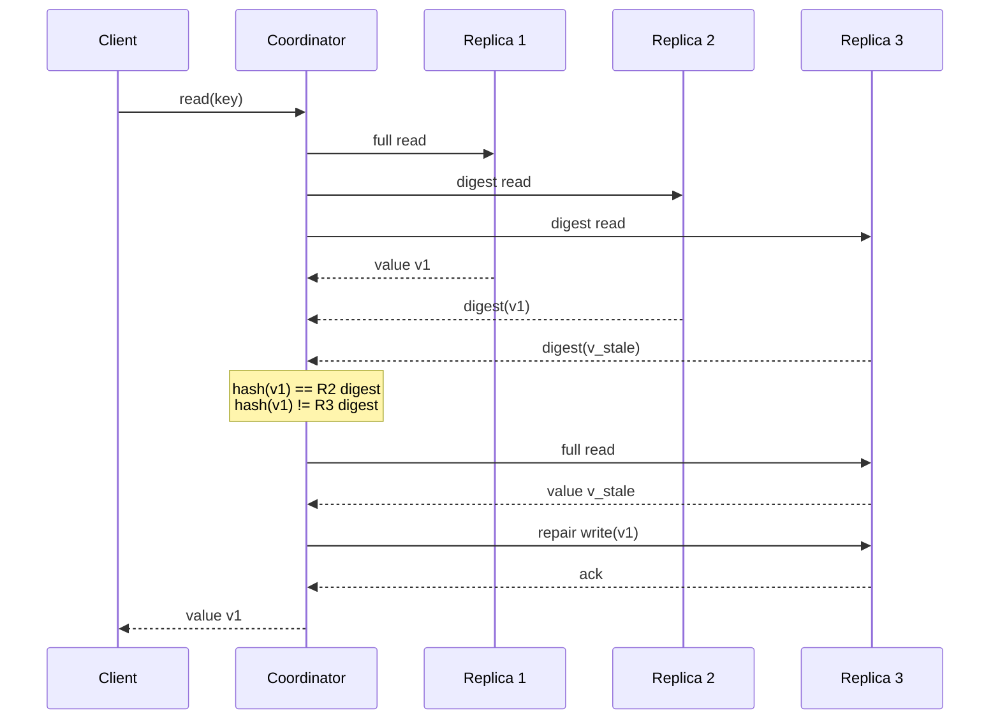

# Read Repair and Digest Reads

> **Read repair is foreground anti-entropy:** the coordinator piggybacks reconciliation on ordinary reads, using cheap digest hashes on the happy path and falling back to full reads only when replicas disagree.

## How It Works

Divergence between replicas is cheapest to detect when a client is already asking for a key: the coordinator has to contact the replicas anyway, so it can compare their responses at the same time. The coordinator performs a distributed read optimistically — assuming replicas are in sync — and, if responses differ, ships the missing updates back to the stale replicas. The scope is narrow by design: we only compare the data the client requested, never the full dataset. In Dynamo-style systems this interlocks with tunable consistency; a quorum read does not require touching every replica, so repair only needs to reconcile the ones that were polled.

Read repair comes in two variants. **Blocking** read repair holds the client request until lagging replicas acknowledge the repair write. This costs latency and availability — the read cannot complete if a repair target is slow — but in exchange it gives **read monotonicity** for quorum reads: once a client has observed some value, every subsequent quorum read will see a value at least that recent, because the replica set was cleaned up before the response returned. **Asynchronous** read repair returns to the client first and schedules the repair as a background task. This is faster and more available but loses monotonicity: a follow-up read may still hit a replica that has not yet caught up.

The digest-read optimization cuts the bandwidth cost of the happy path. Instead of asking every replica for the full value, the coordinator asks exactly one replica for the full payload and asks the remaining N-1 replicas only for a **digest** — a hash of what they would have returned. The coordinator hashes the full read locally and compares against the digests. If every digest matches, replicas are in sync and the full read is returned immediately. If any digest disagrees, the coordinator does not yet know whether the full-read replica or the digest replica is stale, so it issues full reads only to the divergent replicas, merges, and writes repairs to whichever nodes are behind. The digest function is typically a non-cryptographic hash like MD5, chosen because speed dominates the happy-path cost; hash collisions are theoretically possible but tolerated, since background anti-entropy (Merkle trees, version vectors) will repair any records that slipped past a collision.

## When to Use

- **Dynamo-style tunable consistency.** When reads and writes are configured at quorum, blocking read repair layers cleanly on top to deliver monotonic reads without requiring a full synchronous replication factor on every request.
- **Mostly-in-sync replicas, read-heavy workloads.** Read repair is only effective when divergence is the exception; hot keys get naturally repaired because they are constantly queried, so the optimistic path pays for itself.
- **Cassandra-like systems with merge iterators.** Engines that can produce per-replica deltas from a merged result (as Cassandra does with merge listeners on its specialized iterators) can target repair writes precisely, avoiding rewrites of already-correct cells.

## Trade-offs

| Aspect | Blocking read repair | Asynchronous read repair |
|--------|----------------------|--------------------------|
| Latency | Higher — client waits for repair ack | Lower — client gets response immediately |
| Consistency | Read monotonicity under quorum reads | No monotonicity; next read may see older state |
| Availability | Reduced — a slow repair target stalls the read | Preserved — replica slowness is hidden from client |
| Failure mode | Read fails if repair cannot be acknowledged | Read succeeds, repair may be lost on crash |

## Real-World Examples

- **Apache Cassandra** implements blocking read repair on quorum reads, using specialized merge iterators with listeners to identify which specific columns each replica is missing, and scales the work via tunable consistency levels.
- **DynamoDB / Dynamo** takes the asynchronous path: the coordinator returns to the client as soon as enough replicas respond, and repair writes are dispatched in the background, trading monotonicity for latency.
- **Riak** combines read repair with **sloppy quorums** and hinted handoff: reads can target substitute nodes during partitions, and any resulting divergence is reconciled through a mix of foreground repair and background anti-entropy.

## Common Pitfalls

- **Treating read repair as the only anti-entropy mechanism.** Cold data — keys that are rarely read — will never be reconciled, because repair is triggered only by queries. Pair it with a background sweep like [[03-merkle-trees]] to cover the long tail.
- **Non-quorum reads plus async repair.** This combination looks cheap but silently drops read monotonicity: the client may read fresh data, then read again and get stale data from a replica that has not yet caught up. If monotonicity matters, use blocking repair with quorum reads.
- **Assuming digests never collide.** MD5 collisions are astronomically rare but not impossible. Read repair should never be the *only* safety net; rely on [[03-merkle-trees]] or [[04-bitmap-version-vectors]] to catch whatever the digest path misses.

## See Also

- [[02-hinted-handoff]] — the complementary write-side repair mechanism that catches divergence introduced during writes rather than reads.
- [[03-merkle-trees]] — background anti-entropy that reconciles cold data read repair can never reach.
- [[04-bitmap-version-vectors]] — precise causal gap detection, a more surgical alternative to range-hash comparison.
