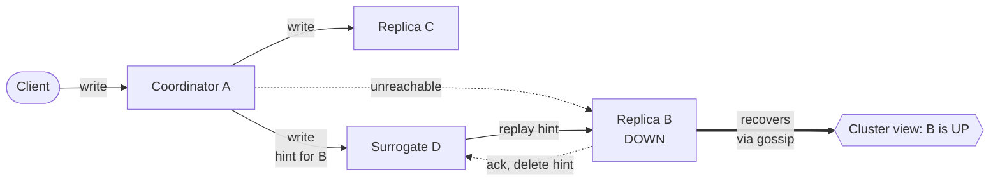

# Hinted Handoff

> **Hinted handoff** is a write-side anti-entropy mechanism where a surrogate node buffers writes destined for an unavailable replica and replays them once the target recovers.

## How It Works

When a coordinator dispatches a write to the replica set and one of the target replicas fails to acknowledge, the coordinator (or one of the peer replicas) stores a special record called a *hint*. The hint wraps the write payload together with metadata identifying the intended replica. The hint-holder keeps the record locally and waits. When the cluster's failure detector or gossip layer reports the target as UP again, the hint-holder streams the buffered writes back to it; once the target acknowledges each replay, the hint is deleted. The net effect is that a transient outage does not cause a permanent divergence — the missing writes are simply queued on a healthy neighbor and drained on recovery.

Hinted handoff is often paired with *sloppy quorums*, as used in Dynamo-style systems such as Riak. With a strict quorum, a write to a replica set `{A, B, C}` with `W=2` would fail if `B` is down and only one healthy replica could be reached beyond the coordinator. Under a sloppy quorum, the coordinator is allowed to promote any healthy node outside the replica set (say `D`) as a stand-in, so the write lands on `{A, D, C}` and the `W=2` threshold is met — `D` holds the copy intended for `B` as a hint and forwards it once `B` returns. This preserves write availability and durability at the cost of consistency for readers that hit the original replica set before the hint has been replayed: a quorum read on `{B, C}` immediately after the outage can miss the write entirely.

Cassandra behaves differently by default. Hinted writes do *not* count toward the replication factor unless the client requests consistency level `ANY`: the hint log isn't readable, so using it to satisfy `W` would let a write appear acknowledged while no queryable replica has seen it. Instead, Cassandra treats hints as a best-effort catch-up channel layered on top of normal quorum semantics — the write fails if the live replica count alone can't meet the consistency level, and hints merely shorten the window during which read-repair or Merkle-tree anti-entropy would otherwise need to fix things.

## When to Use

- **Transient replica failures** — the common case for cloud deployments where nodes reboot, GC-pause, or briefly partition. Hinted handoff keeps the system making progress without blocking writers.
- **Availability-over-consistency deployments** — AP-leaning systems (Dynamo, Riak, Cassandra) that accept a bounded staleness window in exchange for always-writable semantics.
- **High-write Dynamo-style databases** — where blocking or failing every write during a single-node hiccup would be operationally catastrophic.
- **Clusters with robust failure detection** — hints are only useful if the system can reliably learn when the target comes back. Gossip with phi-accrual detectors or heartbeat quorum are typical prerequisites.

## Trade-offs

| Aspect | With hinted handoff | Without |
|--------|---------------------|---------|
| Write availability during replica outage | High — surrogate absorbs the write, quorum can still be met | Writes fail or block once healthy replicas drop below `W` |
| Read consistency during outage | Degraded — clients hitting the original replicas miss the write until replay | Consistent by construction, but only because the write was refused |
| Storage overhead on surrogates | Proportional to outage duration and write rate; requires TTL + cap | None |
| Recovery complexity | Replay pipeline, hint GC, throttling, UP/DOWN detection | Simpler — pure anti-entropy handles everything |

## Real-World Examples

- **Apache Cassandra**: hints are persisted under the `hints/` directory on the coordinator. When gossip marks a peer as UP, Cassandra streams the hints back and deletes them on acknowledgement. Hints only count toward replication if the client opts into `CL=ANY`.
- **Riak**: combines sloppy quorums with hinted handoff. A fallback vnode on a healthy node accepts writes originally destined for an unavailable primary vnode and forwards them when the primary rejoins the ring.
- **Amazon DynamoDB**: conceptually uses a similar internal mechanism — writes are durably stored on healthy replicas even when the target is unreachable, and background processes reconcile once the target returns. The machinery is hidden from clients behind DynamoDB's consistency API.

## Common Pitfalls

- **Unbounded hint storage if a node never returns**: without a TTL, a surrogate can accumulate hints indefinitely while a permanently dead node sits on the replica list. Always cap hint lifetime and fall back to full anti-entropy via [[03-merkle-trees]] for long outages — hints are for minutes-to-hours, not days.
- **Sloppy quorum reads miss recent writes**: a sloppy-quorum write that lands on `{A, D, E}` is invisible to a quorum read on `{B, C}` until the hint replays. This weakens consistency even for "quorum" reads, which is often missed when teams reason about `R + W > N`.
- **Replay storms on node return**: a large or long-absent node can be hit by a flood of hint replays from every peer at once, consuming bandwidth and IO at the worst possible moment (boot time). Throttle replay rate per-recipient and back off if the target reports pressure.

## See Also

- [[01-read-repair-and-digest-reads]] — the read-side foreground counterpart that fixes divergence at query time rather than at recovery time.
- [[03-merkle-trees]] — the structural fallback for long outages when hints have expired or were never stored.
- [[04-bitmap-version-vectors]] — a precise way to track which specific writes a recovering node missed, without replaying every hint blindly.
