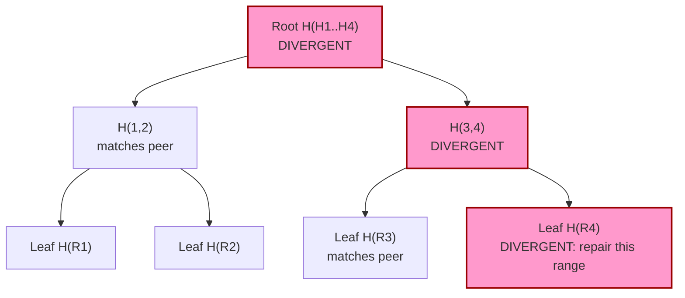

# Merkle Trees for Replica Reconciliation

> **A Merkle tree summarizes a dataset as a hierarchy of hashes so two replicas can locate divergent ranges by exchanging O(log N) hashes instead of streaming every record pairwise.**

## How It Works

A Merkle tree is built by first partitioning the replica's data into disjoint ranges — usually by token range, primary-key bucket, or file offset. Each leaf stores the hash of all records inside one range (for example, `H(R1) = hash(records in [0, 1000))`). Every interior node stores the hash of its children concatenated together, so `H(1,2) = hash(H(R1) || H(R2))`. The root therefore transitively covers the entire dataset: its value changes if and only if *some* record under it changed. Because the hash is deterministic over sorted contents, two replicas that hold identical data must compute identical trees.

Reconciliation exploits that property to skip most of the dataset. Two nodes first exchange only their root hashes. If the roots match, the replicas are in sync and the protocol terminates after a single comparison. If they differ, each side sends the hashes of the root's children; the peer descends only into the subtrees whose hashes disagree and prunes the matching ones entirely. After log_2(N) levels of pairwise hash comparison the protocol has isolated the exact leaf ranges that diverge, and only those ranges are shipped as raw records for repair. This turns a full pairwise diff of N records into a traversal that costs O(log N) hash comparisons plus the size of the actually divergent ranges.

The efficiency has a cost: every write changes a leaf's hash, and because each interior node is a function of its children, the leaf-to-root path must be recomputed. Naively rehashing the whole tree on every write is catastrophic, so real implementations defer the work — they mark dirty leaves in a bitmap and rebuild only the affected branches just before an anti-entropy run, or they keep a streaming hash that is updated incrementally as records are written. The tree is therefore treated as a cache that is rebuilt lazily, not as a primary index.

The highlighted path (Root -> H(3,4) -> H(R4)) is the only subtree walked during reconciliation; the H(1,2) subtree is pruned after one comparison.

## When to Use

- **Full-dataset reconciliation between replicas** that must eventually converge exactly — for example, restoring a node after prolonged downtime or validating a new replica after bootstrap.
- **Periodic background anti-entropy** that catches data read repair never touches. Cold rows that no client has asked for will never trigger a foreground repair, so a scheduled Merkle sweep is the only way to notice they have drifted.
- **Very large replicas where shipping the whole dataset is infeasible.** A terabyte-scale keyspace with only a handful of divergent rows can be reconciled with a few kilobytes of hash exchange.
- **Blockchains and distributed ledgers** use the same structure (often called a "hash tree" or "Merkle-DAG") so light clients can verify membership with a logarithmic proof — an ancillary but familiar example of the same primitive.

## Trade-offs

| Aspect | Advantage | Disadvantage |
|--------|-----------|--------------|
| Bytes shipped on sync | Logarithmic in dataset size when replicas agree; only divergent ranges are resent | Still proportional to the *number* of divergent ranges, which can blow up after long partitions |
| Detection granularity | Operator can tune leaf range size to match expected drift patterns | Coarse leaves force resending large ranges for a single stale row; fine leaves bloat the tree |
| Write cost | Can be deferred via dirty bits / lazy rebuilds | Every write ultimately dirties the full leaf-to-root path, causing write amplification |
| Memory overhead | Tree is far smaller than the dataset (hashes only) | Still O(N / leaf_size) nodes must be held in memory or on disk for fast comparison |
| Freshness of hashes | Rebuilding lazily keeps the hot write path cheap | Stale hashes at repair time produce false positives and unnecessary range streaming |

## Real-World Examples

- **Cassandra**: `nodetool repair` builds a Merkle tree per token range on each replica, exchanges the root hashes, and streams only the ranges whose hashes disagree. Validation compaction is the step that (re)computes these trees.
- **Dynamo / DynamoDB**: the original Dynamo paper describes a Merkle tree per virtual node; background reconciliation compares trees between the replicas responsible for each key range.
- **Amazon S3 cross-region replication and IPFS**: not pairwise reconciliation, but the same content-addressable hashing idea — objects (or chunks) are identified by hashes so divergence can be detected without re-reading payloads.

## Common Pitfalls

1. **Tree depth vs. leaf granularity.** Coarse leaves produce a tiny tree that is cheap to compare but forces streaming megabytes to repair a single stale cell. Fine leaves pinpoint diffs but make the tree itself large and expensive to rebuild. The sweet spot depends on expected drift size, not dataset size.
2. **Naive hash recomputation.** Rebuilding the whole tree for every repair session, on every node, starves the cluster of I/O and CPU. Maintain per-range dirty bits (or an incremental hash) so only changed subtrees are recomputed.
3. **Repair storms.** Scheduling anti-entropy repairs across many nodes concurrently saturates disks and the replication network. Stagger repairs, rate-limit streaming, and coordinate with the cluster so that at most a small number of ranges are being rebuilt at once.

## See Also

- [[01-read-repair-and-digest-reads]] — foreground repair for hot data; Merkle trees are the complementary background path for cold data.
- [[04-bitmap-version-vectors]] — a recency-oriented alternative that logs *which* keys changed instead of hashing ranges.
- [[02-hinted-handoff]] — short-term outage complement; Merkle trees catch whatever hints failed to deliver.
