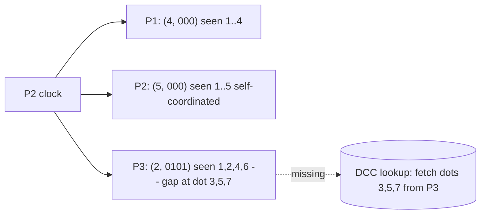

# Bitmap Version Vectors

> **Per-node logical clocks of dots, compressed as a contiguous prefix plus a bitmap of out-of-order writes, so anti-entropy can detect and ship exactly the missing writes instead of the whole dataset.**

## How It Works

Every coordinated write in the system is labeled with a *dot* `(i, n)` — a node-local sequence number `i` produced by node `n`. Each node assigns `i = 1` for its first write and increments the counter on every subsequent write it coordinates. A dot is therefore a globally unique, monotonically growing identifier for a single write event, scoped to its author.

Each node maintains a logical clock: a set of dots it has "seen," either because it coordinated the write itself or because a peer replicated it. Dots coordinated locally are contiguous by construction — a node cannot skip its own sequence numbers. Dots replicated from peers can arrive out of order, so the local view of a peer's sequence may have holes. Anti-entropy is driven by those holes: two nodes exchange their clocks, diff them, and copy over exactly the writes corresponding to missing dots.

The compact representation is what gives the technique its name. For each source node, the clock stores a pair `(max_consecutive, bitmap)`. `max_consecutive` is the highest sequence number seen with no gaps below it; the bitmap encodes which later dots have been seen past that prefix. For example, `(3, 01101)` means "seen dots 1..3 consecutively, plus the bits set at positions 1, 2, and 4 past 3 — i.e., dots 5, 6, and 8". The actual data records are not inlined; dots map into a *dotted causal container* (DCC) keyed by the user key, which holds the value and causal context for each dot. Once every node in the system has observed a consecutive prefix up to index `i` for a given source, that source's log entries at or below `i` can be truncated and the prefix advanced.

## P2's View of the Cluster

This is the chapter's example rendered as a table: node `P2` tracks what it has seen from each peer. Note the gap on `P3` — dot 4 is missing, so the prefix stalls at 2 and bits 6 and 8 sit unmatched in the bitmap.

| Source | max_consecutive | Bitmap (offsets past max) | Dots seen | Gap? |
|--------|-----------------|---------------------------|-----------|------|
| P1     | 4               | `000`                     | 1, 2, 3, 4 | no  |
| P2     | 5               | `000`                     | 1, 2, 3, 4, 5 | no (self) |
| P3     | 2               | `0101`                    | 1, 2, **4 missing**, 6, 8 | yes: dot (3, P3) and (5, P3), (7, P3) |

During sync, P2 ships the compact triple to P3; P3 replies with the data records for the missing dots by looking them up in its DCC, and P2 patches its bitmap. Once bit 3 is filled in, `max_consecutive` slides from 2 to 4 (or further, collapsing adjacent set bits into the prefix).

## When to Use

- **Eventually-consistent key-value stores** where per-key causal history matters and conflicts must be resolved by causality rather than wall-clock timestamps.
- **Systems that cannot afford to ship full datasets during anti-entropy**: only the writes whose dots are missing are replicated, which is dramatically cheaper than scanning whole tables.
- **Complement to [[03-merkle-trees]] when freshness is the priority**: Merkle trees are tuned for full-coverage reconciliation over large immutable ranges; bitmap version vectors are tuned for "which recent writes did you miss?"

## Trade-offs

| Aspect | Advantage | Disadvantage |
|--------|-----------|--------------|
| Precision of gap detection | Identifies the exact missing dots, not just ranges | Bookkeeping per source node, per key family |
| Compactness | Prefix + bitmap is tiny vs. listing every dot | Bitmap grows when writes arrive badly out of order |
| Truncation | Prefix advances and old log entries can be reclaimed once the cluster catches up | A single lagging node blocks truncation globally |
| Long-term offline nodes | Correctly re-syncs them when they return | Log grows unboundedly until they return (or are evicted) |
| Complexity vs classical version vectors | More accurate causality and smaller clocks in practice | More moving parts (dots, DCCs, bitmap math, truncation protocol) |

## Real-World Examples

- **Riak DVV (dotted version vectors)**: the production implementation that motivated the original paper. Riak uses DVVs to resolve sibling values precisely and to drive active anti-entropy without the false-positive conflicts naive version vectors produce under concurrent writes.
- **Apache Cassandra** deliberately does **not** use this. It relies on last-write-wins timestamps plus [[01-read-repair-and-digest-reads]] and [[03-merkle-trees]]; it trades causal precision for simpler machinery and a schema-wide hash view.
- **Academic reference**: Gonçalves et al., 2015 — "Concise Server-Wide Causality Management for Eventually Consistent Data Stores" — the paper that formalized the bitmap-compressed representation and truncation protocol.

## Common Pitfalls

- **Long-offline nodes prevent truncation**. Because the global prefix can only advance when *every* node has seen a given dot consecutively, one node that has been down for a day can make the log grow unboundedly. Mitigate with tombstones, max-age thresholds, or explicit eviction of nodes that miss too many rounds.
- **DCC overhead per key**. Each key needs a dotted causal container storing value + causal context per dot. For workloads with very small values (a few bytes), the metadata can dwarf the payload. Size it against your value distribution before adopting.
- **Per-source bookkeeping complicates membership churn**. Every node you've ever seen needs an entry in every clock. Frequent joins, leaves, or renames inflate clocks and confuse the "everyone has seen up to i" check used for truncation. Couple with a stable membership/epoch protocol.

## See Also

- [[01-read-repair-and-digest-reads]] — hot-data counterpart that reconciles at read time instead of via background sync.
- [[03-merkle-trees]] — scope-based alternative that compares entire datasets hierarchically rather than tracking individual writes.
- [[05-gossip-dissemination]] — the transport often used to exchange these compact clocks between peers.
