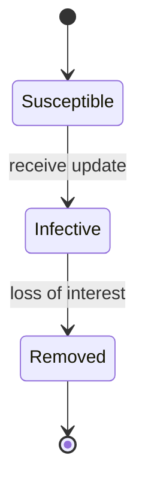
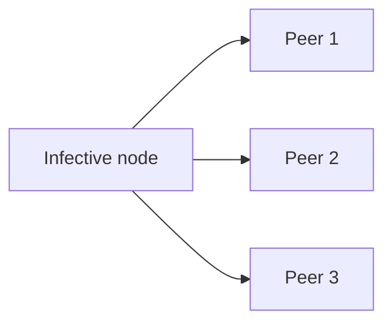

# Gossip Dissemination

> **Epidemic broadcast where each node randomly forwards updates to `f` peers per round, propagating information in O(log N) rounds with built-in redundancy.**

Gossip protocols blend the *reach* of a broadcast with the *reliability* of anti-entropy. Instead of relying on a single coordinator — which is expensive at scale and fragile under failure — every node that learns a new piece of information helps spread it. The result is a self-healing, partition-tolerant way to propagate small, infrequent updates such as membership changes, schema versions, or node health.

## How It Works

Each process periodically selects `f` peers at random (where `f` is the *fanout*) and exchanges the currently "hot" messages with them. Whenever a node learns something new from a peer, it starts relaying that message onward in its next rounds. Because peer selection is probabilistic, the same message will reach some nodes more than once. That overlap — *message redundancy* — is not a bug; it is precisely what makes gossip resilient to dropped packets, crashed peers, and transient partitions. You trade bandwidth for robustness.

The textbook borrows its vocabulary from epidemiology. Every process starts *susceptible* — it has not yet seen the update. On receiving it, the process becomes *infective* and actively forwards it to randomly chosen neighbors. Eventually it becomes *removed*, having lost interest in relaying a message it now sees echoed back to it too often. There are two common *loss-of-interest* rules: a **probabilistic** one (each round, flip a biased coin to decide whether to stop) and a **threshold** one (stop after receiving the same message more than *k* times). Both rules must be tuned against the cluster size and fanout, and threshold-based counting typically yields better latency with less redundancy.

Convergence latency scales as **O(log N)** in the cluster size `N` for a fixed fanout `f`. Double the cluster and you add only one round — *if* you hold `f` constant; otherwise latency creeps up. That is why large deployments either raise `f` or accept slower convergence. The consistency model gossip provides is *convergent*: nodes tend to agree about older events sooner than about freshly injected ones. There is no linearizable ordering, only probabilistic eventual agreement. Overlay networks (next article) build a fixed spanning-tree topology on top of this gossip substrate to cut redundancy in the stable case while falling back to random dissemination under failure.

## When to Use

- **Cluster-wide metadata propagation** — membership, schema versions, node state, load hints. These messages are small, infrequent, and must eventually reach everyone, which is gossip's sweet spot.
- **Flexible-membership systems** where no single coordinator has an authoritative list of all nodes, so broadcast is impossible.
- **Mesh networks or high-churn deployments** in which nodes join and leave constantly; randomized peer selection adapts automatically as the topology shifts.
- **Failure detection heartbeats** — SWIM (Serf, Consul), Cassandra's gossip endpoint state, and similar protocols piggyback liveness signals onto gossip rounds.

## Trade-offs

| Aspect | Advantage | Disadvantage |
|--------|-----------|--------------|
| Reliability under partition | Randomized paths route around failures; messages eventually arrive if *any* indirect link exists | Latency and redundancy rise sharply when partitions persist |
| Message redundancy | Overlap provides natural retries and fault tolerance | Duplicates waste bandwidth and CPU; steady-state overhead per node is non-zero |
| Latency vs fanout | Higher `f` drives O(log N) convergence faster | Higher `f` multiplies network traffic and duplicate floods |
| Membership knowledge | No global view required — each node only needs a small random sample of peers | Without sampling services, full-view gossip becomes expensive as `N` grows |
| Bandwidth at steady state | Gracefully degrades when there is nothing to say (loss-of-interest quiesces traffic) | Poorly tuned loss-of-interest rules cause rumors to circulate forever |

## Real-World Examples

- **Apache Cassandra**: Gossip propagates membership, schema version, load info, and endpoint state every second between randomly chosen peers.
- **Consul / HashiCorp Serf**: SWIM-style gossip handles failure detection and membership across datacenters, with partial views so each node only tracks a bounded subset.
- **Amazon Dynamo**: Gossip distributes the preference list and ring metadata so every coordinator knows which replicas own which keys.
- **Riak**: Uses gossip for ring state and cluster membership; Plumtree (hybrid gossip) was added to Riak Core for more efficient broadcast.

## Common Pitfalls

- **Wrong fanout**: Set `f` too low and convergence slows, partitions become fatal, and small failures stall propagation. Set `f` too high and you waste bandwidth, flood peers with duplicates, and push latency backwards by overwhelming CPU.
- **Unbounded message lifetime**: Without a proper loss-of-interest rule (probabilistic or threshold-based), messages circulate indefinitely, eating bandwidth long after every node has received them.
- **Using gossip for high-throughput replication**: Gossip is meant for *metadata* — small, infrequent updates. Streaming data records through gossip inverts its economics; redundant delivery that was a feature for membership becomes ruinous for write-heavy workloads. The chapter explicitly warns against this.
- **Assuming strong ordering**: Gossip provides *convergent* consistency — not linearizable, not even causal by default. Build causal reconciliation (e.g., version vectors) on top if you need it; do not expect gossip alone to give you any ordering guarantee stronger than "older events agree sooner."

## See Also

- [[06-hybrid-gossip-and-partial-views]] — Plumtree and HyParView optimize gossip with spanning-tree overlays and bounded partial views.
- [[04-bitmap-version-vectors]] — causal reconciliation primitive often layered on top of gossip to resolve conflicting updates.
