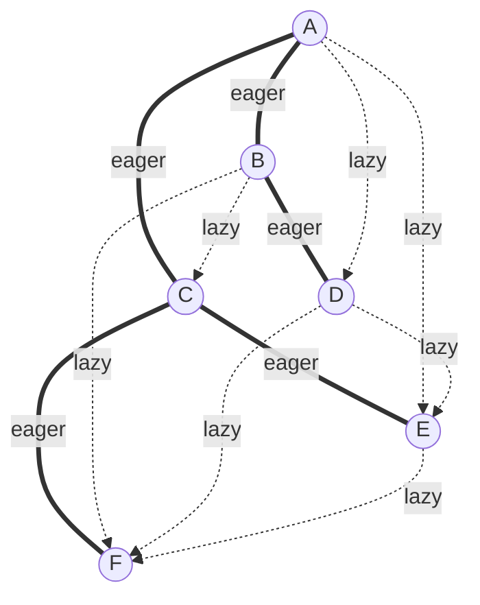

# Hybrid Gossip and Partial Views

> **Plumtree and HyParView combine an eager spanning-tree overlay for efficient delivery with lazy gossip fallback for repair, using small active plus larger passive peer views to scale without a global membership list.**

## How It Works

**Spanning-tree overlay.** Pure gossip achieves robustness by selecting peers at random, but that same randomness produces duplicates: to guarantee delivery across partitions, every message must travel redundant paths. A *spanning tree overlay* trades some of that robustness for efficiency. Nodes sample their peers and pick the "best contact points" — typically the ones with lowest latency — to form a unidirected, loop-free graph that covers the whole cluster. Once that tree exists, a message can be distributed in a fixed number of steps with no probabilistic uncertainty and no wasted edges. The cost of this economy is fragility: because each edge is load-bearing, a single broken link disconnects an entire subtree from the broadcast.

**Plumtree (push/lazy-push multicast trees).** Plumtrees reconcile the two extremes by running both patterns simultaneously. Each node maintains two classes of neighbors supplied by a peer sampling service. To its *eager-push* set (the tree neighbors) it forwards the full message payload. To every other peer it *lazy-pushes* only the message identifier. A node that sees an ID it has never encountered queries a peer to pull the full payload — that pull both delivers the missing message and promotes the responding edge into the eager tree. In steady state the tree does nearly all the work, so bandwidth stays close to the theoretical minimum. When a node or link fails and an eager path breaks, the lazy-push network notices (nodes further downstream announce IDs that the orphaned branch never received), and the system gracefully degrades into gossip until the tree heals. Because the fastest responders get promoted, the tree naturally converges toward a latency-minimizing topology.

**HyParView partial views.** HyParView supplies the peer sampling that Plumtree rides on without requiring any node to know the full membership list. Each node keeps an *active view* — a small set (e.g., 5) used for eager push — and a larger *passive view* holding backup candidates. Nodes periodically *shuffle*: they exchange slices of both views with a random peer, adding received entries to their passive view and cycling out the oldest to bound its size. When a node `P1` suspects an active peer `P2` has failed, it drops `P2` and tries to promote a replacement `P3` from the passive view. If `P3`'s active view is already full it may decline — unless `P1`'s active view is empty, in which case `P3` *must* accept and evict one of its own peers. This asymmetry biases the protocol toward bootstrapping speed: a new or recovering node becomes an effective cluster member quickly, at the cost of a few forced rotations.

Solid edges form the eager spanning tree that carries full payloads; dotted edges are the lazy-push network that exchanges only message IDs and heals the tree after failures.

## When to Use

- **Large clusters** where the message redundancy of pure gossip (every update fanned out to `f` random peers) is too expensive but you still need probabilistic robustness.
- **Moderate-churn systems** — nodes join, leave, or crash regularly but not constantly. HyParView excels at quickly converging its overlay after topology changes.
- **Pub/sub-style broadcast** of cluster-wide state: membership changes, configuration updates, schema versions, failure notifications.
- **Steady-state efficiency with gossip reliability** — situations where you want tree-level bandwidth most of the time but never want to lose a message when the tree breaks.

## Trade-offs

| Aspect | Pure Gossip | Plumtree + HyParView |
|---|---|---|
| Messages per broadcast | `O(N · f)` — high redundancy by design | Close to `N − 1` on the tree plus small lazy-push overhead |
| Failure recovery speed | Immediate — every path is already redundant | Short gap while lazy-push detects and heals the broken edge |
| Membership cost | Often requires (near-)full view on every node | Small active + bounded passive view per node; no global list |
| Latency to all nodes | Bounded by `log N` rounds but variable per node | Deterministic path length along the tree, minimized by construction |
| Implementation complexity | Low — random selection and loss-of-interest | Higher — eager/lazy split, shuffle, active/passive bookkeeping |

## Real-World Examples

- **Partisan** — the high-performance Erlang distributed computing framework uses HyParView for its peer sampling layer, letting BEAM clusters scale past the limits of Erlang's default fully-connected mesh.
- **Riak Core** — uses Plumtree for cluster-wide information dissemination (ring state, handoff coordination, metadata updates).
- **Academic origin** — Leitão, Pereira, and Rodrigues (2007) introduced both Plumtree (push/lazy-push multicast trees) and HyParView (hybrid partial view), which together form the canonical hybrid gossip stack.

## Common Pitfalls

1. **Ignoring "islands."** Strong local preferences — for example, always picking the lowest-latency peer — can form tightly-connected cliques that converge internally but delay propagation to the rest of the cluster. Periodic shuffle and some randomness in peer selection are essential.
2. **Undersized active view.** If the active view is too small (say, one or two peers), a single failure can sever an entire subtree until lazy-push notices the gap and promotes a passive-view replacement. Size the active view to tolerate the expected fault rate.
3. **Oversized active view.** The opposite mistake: expanding the active view to increase reliability recreates the redundancy of pure gossip and negates the main efficiency win. The tree should be thin; robustness comes from the lazy-push network, not from more eager edges.
4. **Forgetting shuffle.** Without periodic shuffling, passive views grow stale, failed or departed nodes linger as replacement candidates, and recovery after an active-view failure slows dramatically. Shuffle is what keeps the overlay adapting to churn.

## See Also

- [[05-gossip-dissemination]] — the probabilistic, fully-random baseline that hybrid gossip degrades into when the tree breaks.
