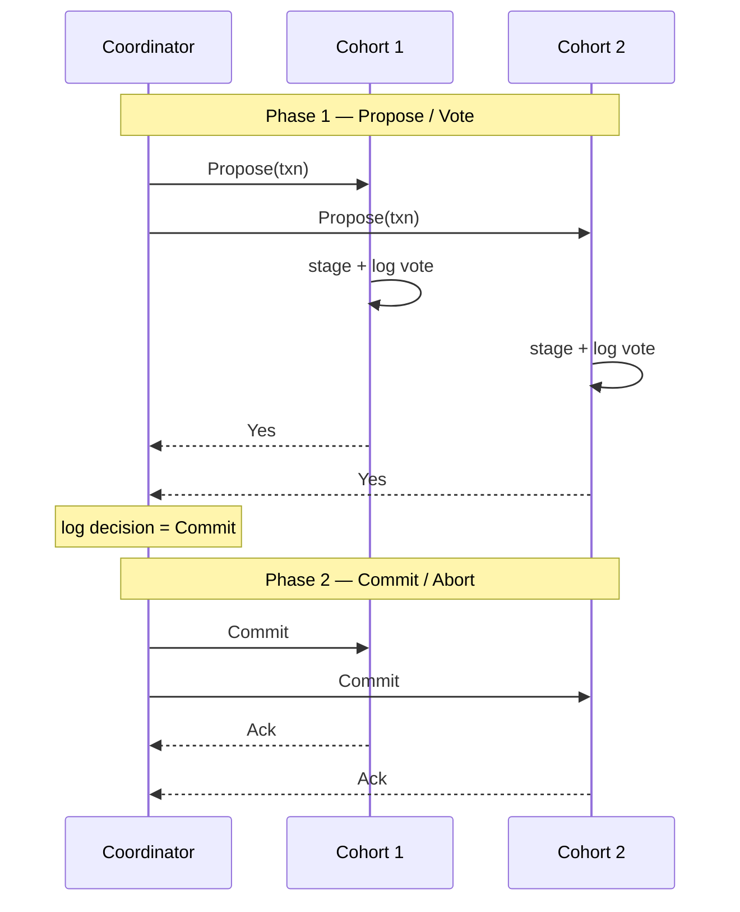

# Two-Phase Commit (2PC)

> **Two-phase commit is a coordinator-driven atomic commitment protocol:** a single leader collects yes/no votes from every cohort, then broadcasts a unanimous commit or abort — simple and correct, but it blocks indefinitely if the coordinator dies between the two phases.

## How It Works

2PC solves a narrow but hard problem: make a transaction that touches multiple partitions land atomically — either every cohort commits or none does — without letting any cohort unilaterally change the decision. The protocol designates one node as the **coordinator** (fixed, elected, or just whichever node received the request); every other participant is a **cohort**, typically the owner of one partition. The coordinator proposes a value (usually a transaction identifier plus its operations) and drives both phases to a unanimous outcome. Atomic commitment forbids disagreement, which is why 2PC is not Byzantine-safe: a lying cohort breaks the whole guarantee.

The **propose phase** distributes the transaction and gathers votes. The coordinator sends a `Propose` message; each cohort executes the transaction locally into a *partially committed* (or *precommitted*) state, writes its vote and intent to a durable log, and replies yes or no. The coordinator logs every incoming vote. By voting yes, a cohort makes a **promise**: it has staged the work durably, will not unilaterally abort, and will wait for the coordinator's final word. The **commit/abort phase** flips the switch: if every vote was positive, the coordinator writes a commit decision to its log and sends `Commit` to everyone; a single no, or a single timeout during propose, turns the whole round into an `Abort`. Cohorts act on the second message, log the outcome, and acknowledge. Because commit decisions are always unanimous, the coordinator's decision log can safely be replicated to peers or backup coordinators for recovery.

## When to Use

- **Multipartition atomic updates where the coordinator is already highly available.** If you can back the coordinator with a standby, a Paxos group, or a Raft quorum, 2PC's blocking problem largely evaporates and you keep its simplicity.
- **Established XA-style transaction managers.** MySQL's XA support, PostgreSQL's prepared transactions, and Kafka's transactional producer/consumer protocol all use 2PC because the semantics are well-understood and map cleanly onto existing recovery code.
- **Low message-overhead requirements.** 2PC uses `2N` messages per round (propose + commit to each of `N` cohorts, plus acks). When network round-trips dominate cost, its compactness beats richer protocols like 3PC or Paxos-per-transaction.

## Trade-offs

| Aspect | Advantage | Disadvantage |
|--------|-----------|--------------|
| Simplicity | Easy to reason about, implement, and debug | Correctness rests on durable logs plus a live coordinator — both must hold |
| Availability | Correct under normal operation with minimal messaging | Blocking: cohorts that voted yes cannot make progress without the coordinator |
| Cohort failure | Coordinator can abort if a cohort disappears during propose | A cohort that crashes *after* voting yes is stuck until it rejoins and learns the decision |
| Message count | `O(N)` per phase, `2N` round-trip total | Coordinator is the hot spot and single point of contention for every round |

## Failure Scenarios

**Cohort failure during propose.** If a cohort fails before replying to `Propose`, the coordinator times out and aborts — no commit can happen without unanimity. This is a clean availability cost: any single unavailable partition kills the transaction, which is why Spanner runs 2PC across Paxos *groups* instead of individual nodes so a leader failover masks the outage. A cohort that crashes *after* voting yes is the tricky case: it has promised to obey the coordinator's decision and so must replay the coordinator's log on recovery before serving reads, because the transaction may have committed elsewhere.

**Coordinator failure between phases.** If the coordinator collects all votes and then dies before sending `Commit` or `Abort`, the cohorts are stuck in **uncertainty**: they have staged the transaction, promised not to unilaterally abort, and have no way to know whether the coordinator's final decision was commit or abort — or whether some peer was already told. They cannot time out and decide on their own, because a peer may have received the opposite decision first and already acted. This is why 2PC is called a **blocking** atomic commitment protocol: a permanent coordinator failure freezes the cluster until a replacement recovers the coordinator's decision log (or re-runs the vote from scratch if nothing was durably recorded).

## Real-World Examples

- **MySQL XA** exposes 2PC via the XA interface so an external transaction manager can coordinate commits across multiple MySQL instances and other XA-compliant resources.
- **PostgreSQL** implements 2PC through `PREPARE TRANSACTION` / `COMMIT PREPARED`, leaving prepared transactions durably on disk until an external coordinator resolves them.
- **MongoDB** uses 2PC for multi-document transactions, though the docs flag that as of v3.6 the guarantee was closer to *transaction-like* semantics rather than strict ACID until later refinements.
- **Google Spanner** runs 2PC *on top of Paxos groups* rather than bare nodes; each cohort is a replicated state machine, so a cohort or coordinator "failure" is masked by a leader election within the group, sidestepping the classic 2PC availability hole.

## Common Pitfalls

- **No backup coordinator.** Running 2PC with a single-node coordinator and no standby converts every coordinator crash into a cluster-wide freeze. Always pair 2PC with coordinator replication — hot standby, Paxos group, or at minimum a durable decision log that any node can recover from.
- **Assuming timeouts alone make 2PC safe.** Cohort-side timeouts can *abort* during propose, but they cannot safely decide anything after a yes vote — the coordinator may already have committed with a peer. Safety comes from durable logs plus a recoverable decision, not from timers.
- **Confusing 2PC with 2PL.** Two-phase commit is an atomic commitment protocol (cross-node "did we all agree to commit?"). Two-phase locking is a concurrency control protocol (growing then shrinking lock sets within a transaction). They are orthogonal and frequently used together; conflating them leads to confused designs.

## See Also

- [[02-three-phase-commit]] — adds a prepare round and cohort timeouts to make atomic commit non-blocking, at the cost of split-brain risk under partitions.
- [[03-calvin-deterministic-transactions]] — skips 2PC entirely by pre-ordering transactions through a sequencer so every replica deterministically executes the same batch.
- [[04-spanner-truetime]] — runs 2PC over Paxos groups with TrueTime-bounded timestamps, using replication to mask the availability cost of bare 2PC.
- [[06-percolator-snapshot-isolation]] — a client-driven 2PC layered over Bigtable, where locks, data, and write records live in separate columns.
- [[07-coordination-avoidance-ramp]] — identifies when atomic commit is overkill: I-confluent operations commit without coordination, and RAMP gives read-atomic isolation without 2PC.
