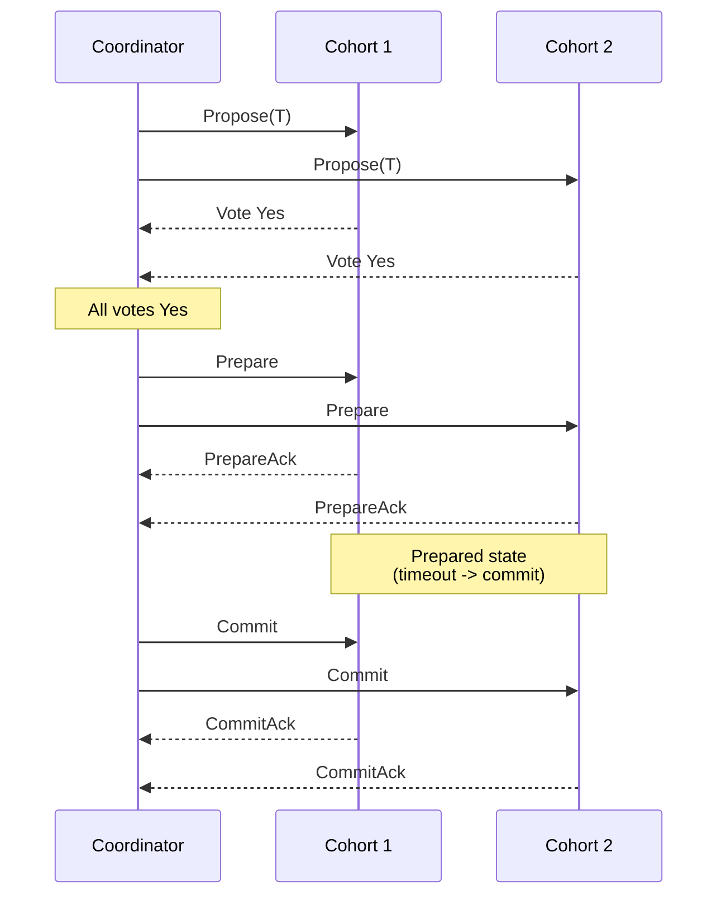

# Three-Phase Commit (3PC)

> **3PC** adds an intermediate `Prepare` step plus symmetric timeouts so cohorts can unblock themselves after a coordinator crash — but it splits into inconsistent outcomes under network partitions.

## How It Works

3PC attacks the single defect of [[01-two-phase-commit]]: the uncertainty window in which cohorts hold locks waiting for a dead coordinator's verdict. It inserts a third phase between vote collection and commit, so that by the time any participant reaches the commit step, every live participant has already observed that the vote passed. The round now runs in three strictly ordered steps:

1. **Propose.** The coordinator broadcasts the transaction to every cohort and collects `Yes`/`No` votes. If any vote is negative or the coordinator times out waiting for votes, the round aborts just like 2PC.
2. **Prepare.** Once all votes are `Yes`, the coordinator does *not* commit yet — it sends a `Prepare` message carrying the vote result. Each cohort acknowledges and transitions into the *prepared* state. The critical invariant is that a cohort reaching prepared has seen proof that everyone else also voted `Yes`.
3. **Commit.** After all `Prepare` acknowledgments arrive, the coordinator issues `Commit`, cohorts flip the transaction visible, and the round finishes.

Unlike 2PC, **both sides run timeouts**. A coordinator that does not hear a vote aborts. A cohort that does not hear `Prepare` within its timeout also aborts. A cohort that has reached the prepared state but does not hear `Commit` **commits unilaterally** on timeout. 3PC also assumes a synchronous network with bounded message delay and no communication failures; this assumption is what makes those cohort-side decisions safe — in theory.

## Why It Unblocks Where 2PC Blocks

The unblocking trick is a state-machine argument. In 2PC, a cohort that has voted `Yes` and then lost contact with the coordinator cannot tell whether the coordinator chose commit or abort; both futures are reachable, so it must wait. In 3PC, reaching the *prepared* state is itself evidence: the coordinator would not have sent `Prepare` unless every cohort voted `Yes`, and it would not send `Prepare` to anyone until it decided to commit. So a prepared cohort that sees its coordinator disappear can commit on timeout and be confident its peers will reach the same decision. A cohort that has not yet seen `Prepare` can safely abort on timeout, because no one can have committed yet. The protocol collapses the ambiguous middle state of 2PC into two unambiguous halves.

## When to Use

Honestly, rarely. 3PC lives mostly in textbooks. Reach for it only when every precondition holds: the deployment runs on a tightly controlled, synchronous network where messages either arrive within a known bound or not at all, coordinator availability is the binding constraint, and you cannot afford an external consensus dependency. Most modern systems prefer consensus-backed commit instead — run 2PC over Paxos/Raft groups rather than single nodes, so the coordinator role is itself highly available. That path (taken by [[04-spanner-truetime]], CockroachDB, and similar systems) delivers 3PC's non-blocking property without 3PC's partition hazard and with no synchronous-network assumption.

## Trade-offs

| Aspect | Advantage | Disadvantage |
|--------|-----------|--------------|
| Coordinator failure handling | Non-blocking: prepared cohorts commit on timeout, unprepared ones abort | Correctness depends on the synchronous-model assumption holding |
| Message overhead | Deterministic three-round structure | 50% more round-trips than 2PC — every commit pays the cost |
| Network model | Simple to analyze under ideal conditions | Assumes no lost messages and bounded delay — partitions violate both |
| Consistency under partition | — | Split-brain: some cohorts commit, others abort, leaving contradictory state |
| Practical deployment | Theoretically sound improvement on 2PC | Largely superseded by consensus-based commit in real systems |

## The Split-Brain Problem

The fatal case is a network partition that falls between `Prepare` and `Commit`. Suppose the coordinator successfully prepares cohorts `{A, B}` but the link to `{C, D}` drops before their `Prepare` messages arrive. `A` and `B` have reached the prepared state; when the coordinator also becomes unreachable, their timeouts fire and they follow the protocol by **committing**. `C` and `D` never saw `Prepare`; their timeouts fire and they follow the protocol by **aborting**. Both halves acted correctly per the spec, yet the cluster now holds half a committed transaction and half an aborted one — a durable inconsistency that no amount of coordinator recovery can repair. This is why 3PC is often called non-blocking *on a reliable network*; once you admit partitions, its safety guarantee evaporates. Contrast 2PC, which blocks but stays consistent: 3PC trades blocking for a worse failure mode, which is usually the wrong trade.

## Real-World Examples

- **Almost no production database uses pure 3PC.** The synchronous-network assumption is untenable over real wide-area links, and the split-brain hazard is unacceptable for anything touching money or user state.
- **Spanner, CockroachDB, YugabyteDB**: run 2PC *over Paxos groups* (see [[04-spanner-truetime]]). Each cohort is itself a replicated state machine, so coordinator and participant failures are absorbed by consensus rather than by a brittle timeout rule.
- **Calvin / FaunaDB**: sidesteps the problem entirely (see [[03-calvin-deterministic-transactions]]) by reaching consensus on transaction *order* up front; with a deterministic schedule, cohort crashes no longer require a distributed commit vote at all.

## Common Pitfalls

- **Assuming 3PC tolerates partitions.** Its non-blocking property holds only in a synchronous model with no message loss. On a real network, partitions produce the split-brain scenario above; it is strictly less safe than 2PC under those conditions.
- **Forgetting cohort-side timeouts — or setting them too aggressively.** Both the coordinator *and* the cohort need timeouts, and the cohort's timeout must be long enough that a slow-but-alive coordinator is not misread as a failed one. Missing timeouts on either side silently degrade the protocol back to 2PC (or worse).
- **Treating 3PC as a drop-in 2PC replacement.** Extra round-trips, extra failure modes, and extra assumptions about the network all come with it. If you need non-blocking commit, use a consensus-backed 2PC instead — the engineering maturity and partition tolerance are far better.

## See Also

- [[01-two-phase-commit]] — the blocking protocol 3PC tries to fix, and the baseline whose simplicity usually wins in practice.
- [[03-calvin-deterministic-transactions]] — achieves non-blocking execution by ordering transactions deterministically before they acquire locks.
- [[04-spanner-truetime]] — the modern path: 2PC layered over Paxos groups delivers 3PC's availability goal without the partition hazard.
