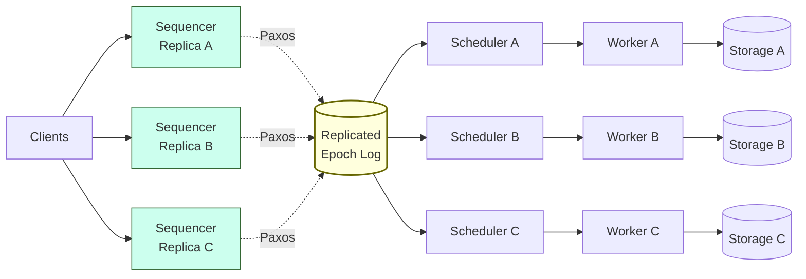

# Calvin: Deterministic Distributed Transactions

> **Calvin agrees on transaction *order* before execution, so every replica runs the same input and produces the same output — with no need for 2PC, because there is nothing to roll back when a node fails.**

## How It Works

Traditional multipartition transactions execute first and coordinate afterwards: every shard acquires locks, two-phase commit decides the fate of the round, and rollback is on the table until the coordinator has collected every vote. Calvin inverts that order. It pushes all transactions through a *sequencer* that fixes a global serial order before any work happens, replicates that order via Paxos, and only then lets shards execute. Because every replica receives an identical, pre-ordered batch of transactions, they compute the same final state independently — coordination is moved *out* of the execution path.

Three subsystems make up a Calvin node, and they are usually colocated. The **sequencer** is the entry point: it accepts incoming transactions, groups them into short time windows — the Calvin paper uses 10-millisecond *epochs* — and replicates the entire epoch as a single unit through Paxos (or asynchronous replication with a leader when latency matters more than availability). The **scheduler** receives a replicated epoch and produces a deterministic execution schedule that respects the sequencer's order while still running non-conflicting transactions in parallel. The **worker** threads, managed by the scheduler, actually execute each transaction's read/write set against local storage. Because the schedule is a pure function of the ordered input, running it twice on two different replicas yields byte-identical state.

Every replica runs the same pipeline on the same input, so their storage layers converge without cross-replica commit traffic.

## The Four-Step Worker Protocol

Once an epoch is scheduled, each worker thread executes each transaction in four deterministic steps:

1. **Determine active participants.** Inspect the transaction's read and write sets and compute which nodes hold records being written — these are the *active* participants who will mutate state.
2. **Collect and forward local reads.** Read the portion of the read set that lives on this node from local storage, then ship those records to every active participant that needs them.
3. **Receive forwarded reads.** If this worker is on an active participant, gather the read-set records forwarded by its peers until the transaction's full read set is assembled locally.
4. **Execute and persist.** Run the transaction against the assembled reads and write the results to local storage. No results are forwarded — every active replica independently executes on identical inputs and arrives at identical state.

## Why No 2PC

In [[01-two-phase-commit]], a coordinator must collect `prepare` votes from every shard, decide commit or abort, and broadcast the outcome — because shards execute *before* they know whether the transaction will survive. Calvin does the opposite: the decision to run a transaction, and the exact order in which to run it, is fixed in the replicated epoch log *before* any worker touches storage. If a replica crashes mid-execution, a peer has already computed (or will compute) the same final state from the same ordered input, and recovery is a matter of replaying the log. There is no cross-shard vote to collect because there is no possibility of one shard "aborting" while another "commits" — the schedule is the same everywhere.

Spanner takes the opposite route: it runs 2PC across per-shard Paxos groups and uses TrueTime to assign commit timestamps. The contrast is fundamental — Spanner coordinates at commit time across shards, Calvin coordinates at admission time across replicas.

## When to Use

- **Read/write sets known in advance.** Pre-declared transactions from stored procedures, OLTP APIs, or generated from query plans before execution.
- **High-contention workloads.** When locks are the bottleneck, removing them (or shortening their hold time to microseconds) is a huge throughput win.
- **Geo-replicated systems where 2PC latency dominates.** Pay a single sequencer round-trip per epoch instead of a 2PC round-trip per transaction.

## Trade-offs

| Aspect | Advantage | Disadvantage |
|--------|-----------|--------------|
| Commit protocol | No 2PC; no cross-shard coordination at execute time | Replicas must agree on epoch contents via Paxos — a round-trip per batch |
| Failure model | Any replica can recover from peers by replaying the same ordered input | Sequencer is on the hot path; its throughput caps the whole system |
| Concurrency | Deterministic schedule eliminates live locking decisions | Cannot natively handle transactions with dependent reads that drive further reads/writes |
| Latency profile | Per-transaction latency is roughly one epoch (~10 ms) plus execution | Interactive transactions that span many round-trips don't fit the model |
| Replay | Storage state is a deterministic function of the log — perfect for auditing and recovery | Non-deterministic operations (random IDs, wall-clock reads) must be resolved at the sequencer |

## Real-World Examples

- **FaunaDB**: the canonical production Calvin implementation. Sequencer and scheduler sit in front of partitioned storage, with epochs replicated via Raft-style consensus.
- **Spanner / CockroachDB / YugabyteDB**: the counter-example — 2PC over Paxos groups per shard, with TrueTime or hybrid logical clocks providing timestamp ordering. These systems trade higher per-transaction coordination cost for natural support for interactive, dependent-read transactions.
- **VoltDB**: shares the deterministic-execution idea (single-threaded partitions replaying the same command stream) without Calvin's multipartition sequencer, so multipartition transactions are handled differently.

## Common Pitfalls

1. **Dependent reads.** If a transaction's next read key depends on a value read earlier, Calvin cannot pre-declare the read set. Workarounds involve running an "analysis" read-only pass first to discover the set, then submitting the real transaction — effectively paying for the transaction twice.
2. **Sequencer as a funnel.** Every write in the system crosses the sequencer. Under-provisioning it, or running cross-region sequencers on a single leader, turns a theoretically scalable system into a choke point.
3. **Assuming drop-in SQL compatibility.** Calvin does not natively support arbitrary interactive transactions over a connection. Application code written for a 2PC SQL database — `BEGIN`, conditional branches on read values, `COMMIT` — needs rearchitecting around stored-procedure-style pre-declared transactions.
4. **Non-determinism leaks.** Any operation whose result varies between replicas (wall-clock `NOW()`, `random()`, external HTTP calls) must be resolved by the sequencer and pinned into the transaction before replication, or replicas will diverge despite identical ordering.

## See Also

- [[01-two-phase-commit]] — the cross-shard coordination step that Calvin's design deliberately avoids.
- [[04-spanner-truetime]] — the contrasting approach: 2PC over per-shard Paxos groups with TrueTime-bounded timestamps.
- [[07-coordination-avoidance-ramp]] — an even lighter approach that sidesteps coordination entirely when application invariants allow it.
