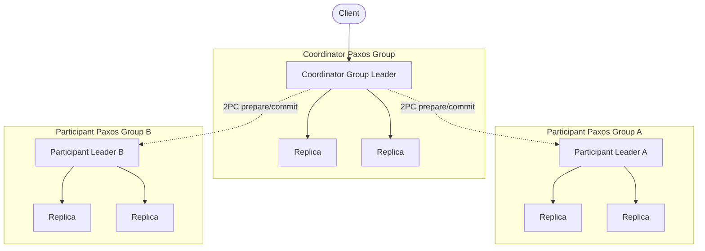

# Spanner: 2PC over Paxos with TrueTime

> **Spanner combines per-shard Paxos replication, two-phase locking for isolation, two-phase commit across shards, and a bounded-uncertainty clock API (TrueTime) to provide externally consistent distributed transactions at global scale.**

## How It Works

A Spanner deployment is built from *spanservers* — replica processes that each host a handful of *tablets* (contiguous key ranges). A tablet is replicated across several spanservers in different failure domains, and those replicas form a *Paxos group* with a long-lived leader elected by Multi-Paxos. The Paxos group is the unit of replication, placement, and failover: every write to that key range is funneled through the group leader and committed into the Paxos log before being applied.

Within a single Paxos group, the leader owns a *lock table* (two-phase locking for isolation) and a *transaction manager* (for cross-shard coordination). Writes and synchronized reads acquire locks from the lock table; snapshot reads bypass locks entirely and read directly from any replica at a chosen timestamp. Single-shard transactions never leave the group — one round of Paxos plus local 2PL is sufficient.

Multi-shard transactions invoke classical two-phase commit, but the "nodes" of the 2PC protocol are *Paxos groups*, not individual servers. The client picks one participating group's leader to act as the 2PC coordinator. That coordinator prepares each participant leader; each participant acquires locks, chooses a prepare timestamp, and replicates a `prepare` entry through its own Paxos log before voting. The coordinator then chooses a commit timestamp greater than every prepare timestamp, logs a `commit` entry in its Paxos group, notifies the participants, and they each replicate the commit through Paxos and release locks.

## TrueTime and Commit-Wait

TrueTime does not return a single timestamp; it returns an interval `TT.now() = [earliest, latest]` that is *guaranteed* to contain the true absolute time. The uncertainty bound `ε = (latest - earliest) / 2` is kept small (typically a few milliseconds) by a fleet of GPS receivers and atomic clocks in every datacenter, with a daemon that polls several sources and rejects outliers.

The commit protocol uses two TrueTime invariants. First, the coordinator picks a commit timestamp `s` that is at least `TT.now().latest` *and* strictly greater than every prepare timestamp from participants. Second — the critical step — the coordinator performs **commit-wait**: it sleeps until `TT.now().earliest > s` before releasing locks or acknowledging the client. By the time locks drop, wall-clock time has provably passed `s` everywhere.

This is what buys **external consistency**: if transaction `T1` commits before `T2` begins in real time, `T1`'s commit timestamp is strictly less than `T2`'s commit timestamp. Any observer that sees `T1`'s effects will, when it subsequently starts `T2`, read at a higher timestamp and therefore see `T1`.

## Why 2PC Still Works Here

The textbook objection to 2PC is that it is *blocking*: a coordinator crash between prepare and commit freezes the cohort in an uncertain state, and a single cohort failure during prepare kills the transaction. Spanner sidesteps this by replacing every role in the 2PC graph with a Paxos group. Only the *leader* of each group participates in 2PC messaging, and if a leader crashes mid-transaction, the group runs a leader election and the new leader recovers the prepared state from the Paxos log. 2PC now tolerates minority failures inside each shard — a pragmatic marriage where Paxos provides availability and 2PC provides atomicity across shards.

## Transaction Types

- **Read-write transactions** — pessimistic, require 2PL locks and a leader. Multi-shard variants pay the 2PC tax plus commit-wait.
- **Read-only transactions** — lock-free and served from any sufficiently up-to-date replica. Spanner assigns a safe read timestamp from TrueTime so the snapshot is causally consistent with prior commits. A leader is only consulted if the client demands a read at the latest timestamp.
- **Snapshot reads** — client supplies a timestamp; any replica that has applied everything up to that timestamp can serve. MVCC stores every committed version keyed by its commit timestamp, so old snapshots remain readable until garbage collection.

## Trade-offs

| Aspect | Advantage | Disadvantage |
|--------|-----------|--------------|
| Consistency | External consistency (strongest transactional guarantee) | Commit-wait adds ~2ε latency on every commit |
| Cross-shard writes | Correct atomic commit even over WAN | Extra 2PC round-trip on top of Paxos replication |
| Reads | Lock-free from any replica at a chosen timestamp | MVCC storage overhead; stale-ish reads off leader |
| Availability | Survives minority failures per shard via Paxos | Loss of quorum in a group halts the shard |
| Deployability | Mature SQL semantics at planetary scale | Depends on atomic clocks + GPS for tight ε |

## Real-World Examples

- **Google Spanner**: the original. Runs on Google's dedicated time infrastructure with ε typically in single-digit milliseconds.
- **CockroachDB**: open-source Spanner-inspired database that replaces TrueTime with **HLC** (Hybrid Logical Clocks) and a configurable maximum clock offset. It provides serializability and bounded-staleness reads but *not* full external consistency without additional assumptions.
- **YugabyteDB**: similar HLC-based design, optimized for PostgreSQL compatibility.

Commodity infrastructure cannot match Google's ε without investing in GPS and atomic clocks, which is why open-source descendants settle for weaker real-time guarantees.

## Common Pitfalls

- **Expecting external consistency without commit-wait.** Skip the wait and you lose the real-time guarantee; a client that sees `T1` can start `T2` on another coordinator and receive an earlier timestamp.
- **Confusing linearizability with external consistency.** Linearizability is a single-object guarantee; external consistency extends the real-time ordering property to multi-object transactions. Per-key linearizability is not enough.
- **Assuming CockroachDB matches Spanner.** It provides serializability with HLCs and a conservative max-offset, which is bounded-staleness in the external-consistency sense. Without tight, audited clocks, "Spanner-like" is not "Spanner-identical".
- **Ignoring commit-wait in latency budgets.** Every write transaction pays ε of wall-clock sleep *after* Paxos and 2PC complete. In multi-region deployments this is usually small compared to network RTT, but it matters for tight SLOs.

## See Also

- [[01-two-phase-commit]] — the cross-shard atomic-commit primitive Spanner runs between group leaders.
- [[03-calvin-deterministic-transactions]] — the contrasting approach that avoids 2PC by pre-ordering transactions through a sequencer instead of waiting on physical time.
- [[05-consistent-hashing]] — a partitioning primitive used to route keys to the correct Paxos group.
