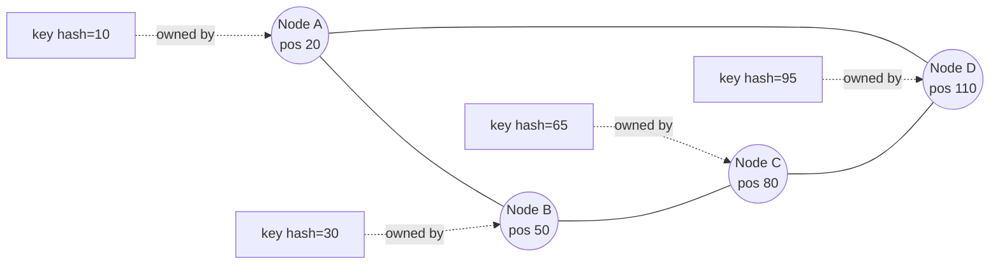

# Consistent Hashing for Partitioning

> **Consistent hashing maps hashed routing keys onto a ring so that a node join or leave only reshuffles `K/n` keys among immediate neighbors instead of rebalancing the whole cluster.**

Partitioning a dataset across a cluster requires a rule that maps every routing key to exactly one node. That rule has to survive the cluster growing and shrinking without repeatedly moving every byte on disk. Consistent hashing is the trick that makes this cheap: instead of computing a node index from the cluster size, each node claims a slice of a fixed hash space, so most keys stay put when the membership changes.

## How It Works

The hash function projects both *keys* and *nodes* into the same large integer space — say, 64-bit or 128-bit integers. That space is then treated as a circle: after the largest value it wraps back to the smallest. Each node, on joining, picks (or is assigned) a position on this ring. The node owns the arc that runs *from its predecessor's position, clockwise, up to its own*. To locate a key, clients (or a routing layer) hash the key, drop the hash onto the ring, and walk clockwise until they hit the first node position — that node is the owner. Because every position on the ring belongs to exactly one arc, lookup is unambiguous and requires no central directory; any node holding the ring's metadata can route requests.

When node `E` joins at position `65`, only keys hashing into the arc `(50, 65]` move — they transfer from `C` to `E`. Nodes `A`, `B`, and `D` are untouched. Symmetrically, if `C` leaves, its arc is absorbed by its clockwise neighbor, and again only that one arc's keys relocate.

## The Problem It Solves

The naive alternative is `hash(key) mod N`, where `N` is the cluster size. It is dead simple, but catastrophic on resize: go from `N` to `N' = N + 1` and the modulus changes for nearly *every* key, because `hash(k) mod N` and `hash(k) mod (N+1)` coincide only by accident. A one-node addition forces a cluster-wide data shuffle. With consistent hashing, adding a node disturbs exactly one arc. If the ring has `K` total hash slots and `n` nodes, the expected number of keys that move per membership change is `K/n` — one node's worth of data, not the whole cluster's.

## Virtual Nodes

Giving each physical node a single ring position leaves a lot to luck: random placements produce uneven arcs, and therefore lopsided load. Real systems — Cassandra, Dynamo, Riak — fix this by assigning each physical machine *many* virtual positions (vnodes) on the ring, typically dozens to hundreds. Vnodes averaged out across the circle yield near-uniform arc sizes, and when a machine dies, its vnodes are absorbed by many different neighbors in parallel, spreading the repair work rather than dumping it on one unlucky successor.

## When to Use

- **Peer-to-peer clusters** where any node can accept a request and route it onward using only its ring view — no central shard map.
- **Elastic deployments** that scale up and down frequently. Minimizing data movement per resize is the whole point.
- **Distributed caches** like `libketama`-style memcached clients, where a cache miss from a misrouted key is cheap but rehashing *all* keys on a pool change would evict the entire cache at once.
- **Wide-area, eventually-consistent databases** (Dynamo-style) where nodes come and go due to partitions and joining a new replica should not provoke a cluster-wide stampede.

## Trade-offs

| Aspect | Advantage | Disadvantage |
|--------|-----------|--------------|
| Data movement on resize | Only `K/n` keys move — the arc adjacent to the change | Any movement still costs network and disk; repeated churn can still hurt |
| Routing | Decentralized; every node with the ring map can route | Nodes must gossip ring membership; stale views mis-route |
| Load distribution | Uniform with vnodes, near-optimal at scale | Single-position assignment creates hotspots and imbalanced arcs |
| Query patterns | Excellent for point lookups by key | Range scans are awkward — hashing obliterates key ordering, so a scan of `user_id BETWEEN ...` hits every partition |
| Hotspots | Adding capacity eases pressure on balanced workloads | A single hot key cannot be split — all replicas for that key remain on the same owning node |

## Real-World Examples

- **Apache Cassandra**: Token ring with vnodes; each node owns many tokens, and the partitioner (Murmur3 by default) maps rows to tokens.
- **Amazon Dynamo and DynamoDB**: The foundational system. Consistent hashing plus preference lists (next N successors on the ring) for replication.
- **Riak**: Ring with fixed number of vnodes (typically 64 or 256), each owned by some physical node; membership changes only reassign vnode ownership.
- **Couchbase vBuckets**: Different mechanism — a fixed 1024-bucket map — but pursuing the same goal of decoupling key placement from cluster size.
- **Contrast: HBase and CockroachDB** range-partition the key space, keeping key ordering (so range scans are cheap) at the cost of more sophisticated rebalance logic and split/merge machinery.

## Common Pitfalls

- **Skipping vnodes**: One position per node leaves ring arcs unevenly sized and concentrates recovery load on a single successor when a node dies. Always use vnodes in production.
- **Expecting range scans to work**: A hash-partitioned table spreads lexicographically adjacent keys to random nodes. Scans that in a B-tree hit one partition now fan out across the whole cluster. If you need range queries, pick a range-partitioned system or use a secondary index.
- **Treating hot partitions as a capacity problem**: Adding nodes rebalances *cold* arcs fine, but a single popular key still hashes to one owner. Solutions are key salting, read replicas, or caching — not more nodes.
- **Stale ring views**: Routing correctness depends on every node (or client) agreeing on the current ring. Failure to propagate membership changes leads to writes landing on old owners and silent data divergence. Pair consistent hashing with a reliable dissemination layer like [[05-gossip-dissemination]].

## See Also

- [[04-spanner-truetime]] — Spanner uses *range* partitioning (tablets split on key ranges) rather than hashing, trading uneven resize costs for cheap range scans and ordered indexes.
- [[07-coordination-avoidance-ramp]] — RAMP transactions span partitions, so stable routing from consistent hashing keeps their two-phase reads cheap; if the partition map churned on every resize, coordination-avoidance savings would be swamped by rebalance traffic.
