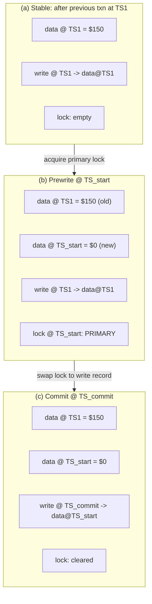

# Percolator: Snapshot Isolation via Client-Driven 2PC

> **Percolator layers snapshot-isolated transactions on top of Bigtable by using a timestamp oracle and a client-driven two-phase commit that stores data, locks, and write metadata in separate columns.**

## How It Works

Percolator is a library — not a server — that bolts multi-row transactions onto Bigtable, a storage engine that natively only guarantees single-row atomic reads and writes. The trick is to represent every transactional row as three columns:

- **`data`** — versioned cell contents, keyed by timestamp. Multiple committed versions coexist (MVCC).
- **`lock`** — set while a transaction is mid-commit on this row. Holds the primary-lock pointer so recovery can find the transaction's pivot.
- **`write`** — the "table of contents" that says, at timestamp `TS`, which `data@TS_x` is the visible committed value. Readers consult `write` to find the right version of `data`.

Every transaction calls the *timestamp oracle* twice — once for its **start timestamp** (the snapshot it reads from) and once at commit time for its **commit timestamp** (the version its writes become visible at). The oracle hands out cluster-wide monotonically increasing integers, so all participants agree on ordering.

Writes accumulate in a client-side buffer until commit. At commit the client itself drives a two-phase protocol: there is no dedicated transaction coordinator service. All atomicity comes from Bigtable's *conditional mutation* API, which gives read-modify-write on a single row in a single RPC.

## Snapshot Isolation in One Paragraph

A transaction under snapshot isolation (SI) reads from a *consistent snapshot* taken at its start timestamp — it only sees versions committed before that moment, and the snapshot never shifts under it. Two transactions conflict only if they both write the same cell; whichever commits first wins and the other aborts (*first committer wins*). This prevents **read skew** — the classic case where a transaction reads `x=70`, a concurrent transaction sets `x=50, y=50`, and the first one then reads `y=50` and computes a nonsensical total. But SI does *not* prevent **write skew**, where two transactions modify disjoint cells, each individually preserving some invariant, while their combined effect violates it. SI histories are therefore not serializable — but reads are lock-free, which is the whole point.

## The Prewrite / Commit Dance

1. **Prewrite.** The client attempts to acquire a lock on every written cell via conditional mutation. It picks one cell's lock as the **primary**; all others point to it. It aborts if it finds either (a) any existing lock on those cells, or (b) a `write` record with a timestamp newer than its start timestamp (someone else already committed over it).
2. **Commit.** Client re-visits the oracle for a commit timestamp. Starting with the primary, it performs a single conditional mutation per row that *atomically* clears the lock and writes a new `write` record pointing to the buffered `data@TS_start`. Once the primary flip succeeds, the transaction is officially committed; secondary locks can be cleaned up at leisure.
3. **Recovery.** If the client crashes mid-commit, its locks are orphaned. Any later transaction that encounters such a lock doesn't block — it *resolves* it. It walks the pointer to the primary and inspects it: if the primary has already been swapped to a `write` record, the earlier transaction committed, so the stuck secondary is rolled forward. If the primary is still locked or already cleared with no `write`, the orphan is rolled back. Because every mutation is atomic on a single row, two cleaners cannot disagree.

## Why This Is 2PC Without a Coordinator

In classical [[01-two-phase-commit]], a dedicated coordinator remembers the prepare/commit decision and drives cohorts to completion; if it dies, cohorts block. Percolator shifts that responsibility into the data itself. The **primary lock is the atomicity pivot**: its single conditional-mutation flip is the commit point. Before the flip the transaction is un-committed and recoverable by rollback; after the flip it is committed and recoverable by roll-forward. The client only *drives* the protocol — it does not *own* its outcome. Recovery is *cooperative*: any subsequent reader or writer that bumps into an abandoned lock becomes the cleaner. This scales because you never need a highly-available coordinator process; Bigtable's single-row atomicity is the only coordination primitive.

## When to Use

- **On top of a single-row-atomic store** — Bigtable, HBase, or any KV layer that exposes conditional-mutation / CAS semantics on one row.
- **Workloads that tolerate SI** — analytics, incremental processing, dashboards, content indexing. Anything where write skew is rare or handled at the application layer.
- **Incremental batch-to-online transitions** — Percolator's original use case was Google's web index: it replaced periodic MapReduce rebuilds with continuous, transactional updates.

## Trade-offs

| Aspect | Advantage | Disadvantage |
|---|---|---|
| Coordination | No dedicated transaction coordinator — primary-lock is the pivot | Commit latency includes two oracle round-trips plus per-row conditional mutations |
| Scaling | Scales with the underlying store; no hot central path | Timestamp oracle is still a single logical sequence and can become the bottleneck |
| Isolation | SI gives lock-free reads and repeatable-read semantics | Write skew is not prevented; histories are not serializable |
| Recovery | Any later transaction can roll forward/back abandoned locks | Long-lived abandoned locks block readers on the affected rows until resolved |
| Portability | Requires only single-row atomicity from the storage layer | Multi-row atomicity must be simulated — more RPCs than a native 2PC coordinator |

## Real-World Examples

- **Google's Percolator** — the original paper describes its use for the incremental web index, replacing full MapReduce rebuilds with streaming transactional updates so freshly crawled pages appeared in results within minutes.
- **TiDB / TiKV** — a MySQL-compatible distributed SQL database whose transaction layer is a near-direct implementation of Percolator over a Raft-replicated KV store.
- **Omid and Phoenix-over-HBase** — HBase ecosystem projects that port the Percolator model to HBase to get cross-row SI transactions on top of a single-row-atomic store.

## Common Pitfalls

- **Forgetting write skew.** SI is *not* serializable. Banking-style invariants that span multiple rows (e.g., "sum of account balances must stay positive") can still be violated; either promote such transactions to SSI/serializable or enforce the invariant via explicit conflict rows.
- **Treating the timestamp oracle as free.** It's on the critical path of every transaction, twice. Under heavy load it becomes the system bottleneck; production systems batch oracle requests or shard the oracle to survive.
- **Ignoring stuck locks.** A client that crashes between prewrite and primary-commit leaves locks that block *any* reader of those rows. If no resolver ever comes along (e.g., a cold row), the lock sits forever. Healthy deployments need active lock-TTL sweepers or aggressive resolver logic in every client.

## See Also

- [[01-two-phase-commit]] — the canonical coordinator-driven protocol; Percolator is the client-driven, cooperatively-recovered variant.
- [[04-spanner-truetime]] — an alternative path to snapshot-style reads, substituting bounded-uncertainty physical time for a central oracle.
- [[07-coordination-avoidance-ramp]] — even weaker isolation that skips locks and oracles entirely when the workload's invariants permit.
