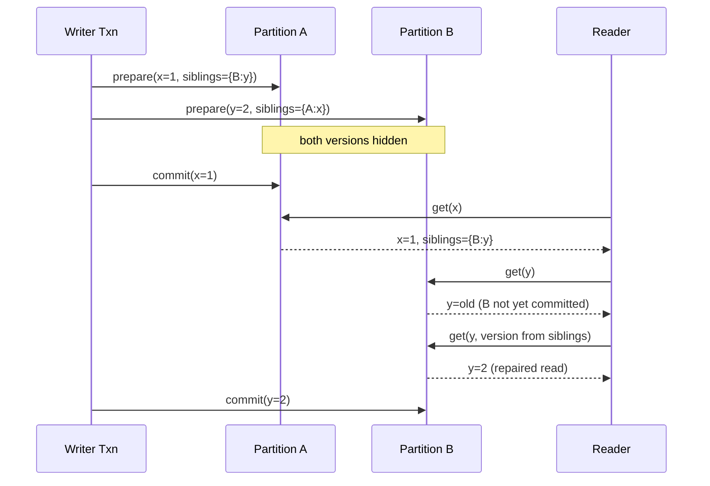

# Coordination Avoidance and RAMP Transactions

> **If operations preserve invariants under merge (I-Confluence), transactions can commit locally without coordination; RAMP is a concrete design that achieves this at the read-atomic isolation level using write metadata instead of locks.**

## The Core Idea: I-Confluence

Serializability is expensive because it forces every transaction to observe a single global order, which in a distributed system means coordinating with remote partitions on every commit. Coordination avoidance asks a sharper question: for *this particular workload*, which invariants actually require global agreement? The answer is given by **Invariant Confluence**. An operation is *I-confluent* for a set of invariants if any two independently valid, diverged database states can always be merged into a single state that still satisfies those invariants. When I-Confluence holds, each partition can execute transactions against its *local* snapshot, defer merging to a background reconciliation step, and never touch a coordinator.

The research claim behind coordination avoidance is strong and precise: **coordination is only required when an invariant is *not* I-confluent**. Counter increments, set insertions, and append-only logs are I-confluent for most reasonable invariants, so they can scale linearly. Uniqueness constraints, foreign-key deletions, and "balance stays non-negative" are typically not — two partitions each satisfying the invariant locally can produce a merged state that violates it, and no after-the-fact merge function can repair that. Those are the cases where you must pay for coordination; everything else is wasted round-trips.

## Four Required Properties

A system that offers coordination avoidance must preserve all four of these simultaneously:

- **Global validity.** Required invariants hold in every committed state — whether a node is showing its own local view or a post-merge converged view — and no transaction ever reads an invalid state.
- **Availability.** If a client can reach the nodes holding its data, its transaction must reach a commit-or-abort decision without waiting for unreachable nodes.
- **Convergence.** In the absence of new writes and permanent partitions, all nodes eventually agree on the same state.
- **Coordination freedom.** A transaction's local execution never blocks on, or depends on, operations being performed at other nodes on behalf of other clients.

## RAMP Transactions

**RAMP — Read-Atomic Multi-Partition** — is the canonical concrete design in this family. Its goal is narrow but useful: atomic *visibility* of a multi-partition write, without locks and without a coordinator in the read path. RAMP provides three guarantees:

- **Read atomic.** A reader never sees *fractured* writes — states where one transaction's updates are visible on some partitions but not on others. All of a transaction's writes become visible to concurrent readers together, or none do.
- **Synchronization independence.** One client's in-flight transaction cannot stall, abort, or force another client's transaction to wait. There are no read/write locks, no mutex-style contention.
- **Partition independence.** A client only contacts partitions whose keys it actually touches. Uninvolved partitions stay out of the critical path.

Notice what RAMP *does not* offer: it is weaker than snapshot isolation. It says nothing about write-write conflicts, lost updates, or serializable ordering. It only prevents the specific anomaly of seeing half a multi-partition transaction.

## How RAMP Achieves Read Atomic

The trick is multi-versioning plus *sibling metadata*. Every write carries a small descriptor of its sibling writes — the other keys, on other partitions, that belong to the same transaction. Writes install in two phases:

1. **Prepare.** The transaction places a new version at each target partition but keeps it hidden from readers.
2. **Commit.** The transaction flips all prepared versions to visible. Because the flip happens per partition without cross-partition locking, a reader racing the commit may briefly see a partial view.

That is where metadata earns its keep. When a reader finds a visible write whose sibling list references versions it has *not* seen on other partitions, it knows a transaction is mid-install. It performs a second round of reads, explicitly requesting the sibling versions by ID. Those versions either exist (the commit finished, and the reader now has the full set) or are fetchable from the still-visible older versions (the reader falls back to a consistent prior snapshot). In either case the reader repairs its own view without blocking writers or other readers. Stale versions are kept only as long as in-progress readers might need them, then garbage-collected.

## When to Use

- **Cross-partition fan-out reads with tolerant writes** — social feeds, follower timelines, activity streams — where you must not show a half-updated post but strict serializability is overkill.
- **Foreign-key-style references** across shards, where a read should never resolve a pointer to a not-yet-visible target.
- **Low-latency OLTP at scale** where 2PC round-trips dominate tail latency and stale-but-coherent reads are acceptable.

## Trade-offs

| Aspect | Advantage | Disadvantage |
|---|---|---|
| Coordination | No distributed locks, no central commit coordinator | Still two phases per write — prepare then commit |
| Isolation | Atomic visibility across partitions | Weaker than SI: no write-write conflict detection, no serializability, no defense against lost updates or write skew |
| Reads | Partition-independent; clients only touch what they need | May pay an extra round-trip when they observe an in-flight write and must fetch sibling versions |
| Storage | Simple MVCC layout | Extra per-write metadata (sibling list) and multiple live versions until readers drain |

## Real-World Examples

- **RAMP (Bailis et al., 2014)** is a research prototype; its ideas influence how other systems reason about multi-partition visibility.
- **FoundationDB** offers read-only snapshot reads that give similar partition-independent, lock-free read semantics, though on top of a stronger underlying transaction model.
- **CRDT-backed stores** (Riak, Redis Enterprise CRDTs) generalize the I-Confluence idea: they restrict operations to mergeable types and skip coordination entirely.
- **Contrast: Spanner and Calvin** — both buy full serializability by coordinating (via Paxos and a deterministic sequencer respectively), trading latency for strong guarantees that RAMP deliberately declines.

## Common Pitfalls

- **Assuming RAMP prevents lost updates or write skew.** It does not. Two concurrent transactions writing overlapping keys can both commit; RAMP only guarantees that each is observed atomically, not that they were serialized.
- **Conflating read-atomic with snapshot isolation.** SI requires a consistent snapshot across *all* reads in a transaction and detects write-write conflicts. Read-atomic is a strictly weaker property — use SI when you need SI.
- **Treating I-Confluence as a blanket license.** I-Confluence is defined relative to a *specific set of invariants*. Adding a new constraint (e.g., global uniqueness) can silently demote a previously coordination-free workload into one that now needs a coordinator.
- **Forgetting stale-version GC.** RAMP keeps old versions for in-flight readers; a leak in that lifecycle turns into unbounded storage growth under read pressure.

## See Also

- [[01-two-phase-commit]] — the coordination protocol RAMP is deliberately skipping for read visibility.
- [[03-calvin-deterministic-transactions]] — another way out: coordinate cheaply at a deterministic sequencer instead of per-transaction.
- [[06-percolator-snapshot-isolation]] — stronger isolation (snapshot isolation with write-write conflict detection) at the cost of timestamp coordination and locks.
