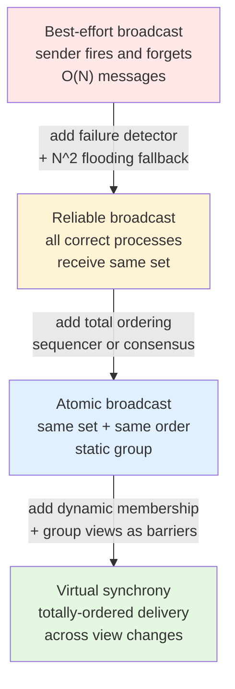

# Atomic Broadcast and Virtual Synchrony

> **One-sentence summary.** Atomic broadcast delivers the same messages, in the same order, to every correct member of a group — and it is provably equivalent to consensus, which is why every consensus protocol you have heard of is really an atomic broadcast in disguise.

## How It Works

A broadcast is the primitive used to disseminate a message from one process to a group. Database replication is the canonical use case: a coordinator wants every replica to observe the same writes. The guarantees available form a ladder, and each rung pays a higher cost for a stronger property.

**Best-effort broadcast** is the cheapest: the sender fires messages at each recipient and walks away. If the sender crashes mid-broadcast, some recipients see the message and others do not — the system silently diverges. That is unusable for replication.

**Reliable broadcast** guarantees that every correct process eventually receives the same set of messages, even if the original sender crashes. A naive implementation pairs a failure detector with a flooding fallback: every process that receives a message forwards it to every other process it knows about. If the sender disappears, a surviving receiver re-propagates. The price is O(N^2) messages — each of N surviving recipients forwards to the other N-1 — but no single crash can strand the group.

**Atomic broadcast** (a.k.a. *total order multicast*) adds ordering on top of reliability. It guarantees two properties simultaneously:

- **Atomicity**: either every correct process delivers a message, or none does.
- **Order**: every correct process delivers messages in the same sequence.

That second guarantee is what makes atomic broadcast equivalent to consensus — if every replica applies the same operations in the same order starting from the same state, they end in the same state [CHANDRA96]. Paxos, Raft, and ZAB are, at their core, atomic broadcast protocols.

## Virtual Synchrony

Atomic broadcast assumes a **static** group. Real clusters are not static — nodes join, crash, and get evicted. Virtual synchrony extends atomic broadcast to **dynamic** groups by introducing the idea of a *group view*: a snapshot of the current membership that every member agrees on. When membership changes, the system installs a new view and announces it to all surviving members.

The defining trick is the distinction between message **receipt** and message **delivery**:

- *Receipt*: a member has the bytes in its queue.
- *Delivery*: every member of the view has received the message, so it can safely be acted upon.

Received-but-not-yet-delivered messages sit pending until the group confirms that every member in the current view has them. A message **sent in a view can only be delivered in that same view** — so group view changes act as *barriers* that broadcasts cannot cross. This is what gives dynamic groups the same atomic-delivery guarantee as a static atomic broadcast: you never get the awkward state where half the old group saw message M and the other half joined the new view without it.

Implementations often optimize by electing a **sequencer** — a single process that stamps a total order on messages — instead of running consensus per message. The sequencer's local view is authoritative as long as it lives; liveness then hinges on detecting sequencer failure and electing a replacement.

Despite its elegance, virtual synchrony never saw broad commercial adoption [BIRMAN06]. Building distributed systems on dynamic group membership turned out to be harder to reason about than engineers expected, and the ecosystem gravitated toward simpler leader-based protocols like Paxos and Raft that solve atomic broadcast directly over a fixed quorum.

## When to Use

- **State-machine replication**: any system where replicas must apply the same operations in the same order (configuration stores, distributed locks, replicated logs).
- **Coordinating cluster membership**: when you need every member to agree on the current set of live nodes — this is exactly Zookeeper's niche.
- **Ordered event dissemination**: multiplayer games, collaborative editors, financial order books where the sequence of events is the state.

## Trade-offs

| Aspect | Best-effort | Reliable (flooding) | Atomic broadcast | Virtual synchrony |
|---|---|---|---|---|
| **Message cost** | O(N) | O(N^2) on crash | 2 rounds (w/ leader) | 2 rounds + view-change cost |
| **Ordering** | none | none | total | total within a view |
| **Membership** | static | static | static | dynamic |
| **Survives sender crash** | no | yes | yes | yes |
| **Equivalent to consensus** | no | no | yes | yes |
| **Implementation complexity** | trivial | low | high | very high |

## Real-World Examples

- **Apache Zookeeper** implements atomic broadcast via ZAB (see [[02-zookeeper-atomic-broadcast-zab]]) and exposes it as an ordered update log to applications.
- **etcd and Consul** use Raft (see [[05-raft-consensus]]), another atomic-broadcast protocol, to replicate their key-value state.
- **Isis Toolkit and Spread Toolkit** were the classical virtual-synchrony systems — influential in academia and in a few specialist deployments (air-traffic control, stock exchanges), but niche in mainstream infrastructure.
- **Google Chubby, Apache BookKeeper, CockroachDB** all reduce replication to atomic broadcast under the hood, typically via Paxos or Raft variants.

## Common Pitfalls

- **Confusing reliable with atomic.** Reliable broadcast guarantees the *set* of delivered messages matches; it does not say anything about order. Applying messages in different orders on different replicas corrupts state even when every replica "got the same messages."
- **Ignoring the cost of flooding.** The O(N^2) fallback in naive reliable broadcast is fine for N = 5, painful for N = 50, catastrophic for N = 500. Production atomic-broadcast protocols use quorum-based replication, not flooding.
- **Assuming view-change is cheap.** In virtual synchrony, every membership change forces a barrier — all in-flight messages must drain before the new view installs. Frequent churn throttles throughput.
- **Treating receipt as delivery.** An application that acts on a received-but-not-yet-delivered message breaks atomicity: if a view change intervenes, some replicas will have acted and others will not.

## See Also

- [[02-zookeeper-atomic-broadcast-zab]] — the most widely deployed atomic broadcast protocol
- [[03-classic-paxos]] — consensus from first principles; equivalent to atomic broadcast [CHANDRA96]
- [[04-multi-paxos-and-variants]] — optimizations that make atomic broadcast practical
- [[05-raft-consensus]] — an understandable reformulation of atomic broadcast via a strong leader
- [[06-byzantine-consensus-pbft]] — atomic broadcast when some members may lie
