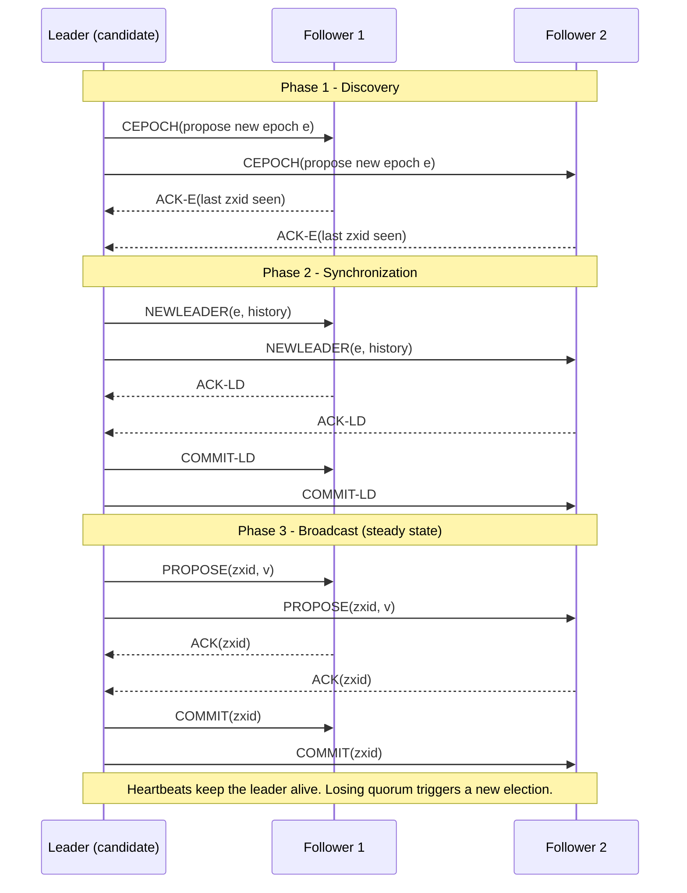

# Zookeeper Atomic Broadcast (ZAB)

> **One-sentence summary.** ZAB is a leader-based atomic broadcast protocol — powering Apache Zookeeper — that uses monotonically increasing epochs and a three-phase cycle (Discovery, Synchronization, Broadcast) to guarantee totally ordered, reliable message delivery under crash failures.

## How It Works

ZAB participants take one of two roles: a **leader** (temporary, a single one per epoch) and **followers**. Clients connect to any node; if that node is not the leader, it forwards writes to the leader. The leader sequences incoming updates based on its local view and broadcasts them to followers so every replica applies the same commands in the same order — the atomic broadcast guarantee that underlies Zookeeper's linearizable writes.

To guarantee leader uniqueness and safe recovery, ZAB splits time into **epochs**, each identified by a monotonically increasing number. Within an epoch there is at most one leader. A prospective leader is chosen by any election heuristic (picking a live node with high probability); safety comes from the subsequent protocol steps, not the election itself.

Once a candidate emerges, it runs three phases:

1. **Discovery** — The prospective leader queries followers for the highest epoch each has seen and proposes a new epoch strictly greater than all of them. Followers respond with the ID of the last transaction they saw in the previous epoch. After this step, no process will accept proposals for earlier epochs.
2. **Synchronization** — The leader declares itself for the new epoch and collects acknowledgments. Because followers reported their highest committed proposals, the leader can pick the most up-to-date node and stream missing transactions from that single source, delivering any committed proposals from prior epochs before any new-epoch proposal.
3. **Broadcast** — Steady state. The leader accepts client writes, assigns them order, sends a `PROPOSE`, waits for a **quorum** of acknowledgments, and then sends `COMMIT`. It resembles a two-phase commit without aborts: followers cannot veto a valid leader's proposal, only acknowledge or ignore (if the epoch is stale).

Both leader and followers exchange **heartbeats** for liveness. If the leader loses quorum heartbeats it steps down; if a follower stops hearing from the leader it starts a new election. This triggers a fresh epoch and restarts the three-phase cycle.

## When to Use

- **Coordination services**: leader election, distributed locks, configuration, and group membership where a hierarchical, linearizable key-value store is required.
- **Control-plane metadata**: cluster-state stores that are read-heavy, small-volume, but must be strongly consistent across a handful of nodes.
- **Bootstrapping other systems**: when a larger distributed system needs a reliable, ordered event log to sequence rare but critical decisions (e.g., partition reassignment).

## Trade-offs

| Aspect | Advantage | Disadvantage |
|--------|-----------|--------------|
| Steady-state latency | Only 2 message rounds (propose + commit) — no per-write election | Every write funnels through the leader, capping throughput at one node's bandwidth |
| Leader model | Long-lived leader lets proposals be ordered from local state without per-write consensus | Leader loss forces a full Discovery + Synchronization cycle before writes resume |
| Recovery | Highest-committed-proposal rule means state is copied from a single up-to-date node | Synchronization can be slow if the chosen follower's log is long |
| Epoch numbering | Monotonic epochs prevent stale leaders from corrupting the log | Requires stable monotonic counters across restarts (durable logs are mandatory) |
| Ordering | FIFO per client and total order globally — matches how apps reason about Zookeeper watches | Cannot batch across partitions; scaling reads requires observer replicas, not shards |

## Real-World Examples

- **Apache Zookeeper**: the canonical ZAB user — a hierarchical key-value store exposing znodes, watches, and ephemeral nodes for coordination.
- **Apache Kafka (historical)**: the Kafka controller and ISR state sat in Zookeeper for years; Kafka has since migrated to its own Raft-based protocol (KRaft), but ZAB powered Kafka at internet scale for a decade.
- **Hadoop HDFS NameNode HA**: uses Zookeeper for leader election and failover coordination between active and standby NameNodes.
- **Apache HBase**: relies on Zookeeper for master election and RegionServer liveness.

## Common Pitfalls

- **Stale leader accepting proposals from an old epoch**: a leader that has been partitioned away may continue to issue proposals thinking it is still in charge. The fix is baked in — followers reject proposals from any epoch other than the currently established one — but it only works if followers persist the current epoch durably and compare on every message.
- **Aggressive heartbeat tuning**: set `tickTime` and `syncLimit` too tight and transient network hiccups trigger needless re-elections, each of which pauses writes. Set them too loose and real leader failures take seconds to detect.
- **Confusing ZAB with Paxos**: ZAB is an atomic broadcast protocol optimized for primary-backup replication, not a general consensus algorithm. Its guarantees (FIFO order per-client plus total order) and its assumption of a distinguished long-lived leader differ from classic Paxos, which treats every decision as an independent consensus instance.
- **Treating Zookeeper as a database**: ZAB's two-round broadcast is fast but still synchronous and quorum-bound. Putting high-throughput data writes through Zookeeper saturates the leader and starves the coordination workloads it actually serves.

## See Also

- [[01-atomic-broadcast-and-virtual-synchrony]] — the abstract primitive ZAB implements concretely.
- [[04-multi-paxos-and-variants]] — another leader-based approach; Multi-Paxos skips the Prepare round via a distinguished proposer similar in spirit to ZAB's epoch leader.
- [[05-raft-consensus]] — a leader-based consensus algorithm with the same "elect once, replicate many" shape, using terms instead of epochs.
