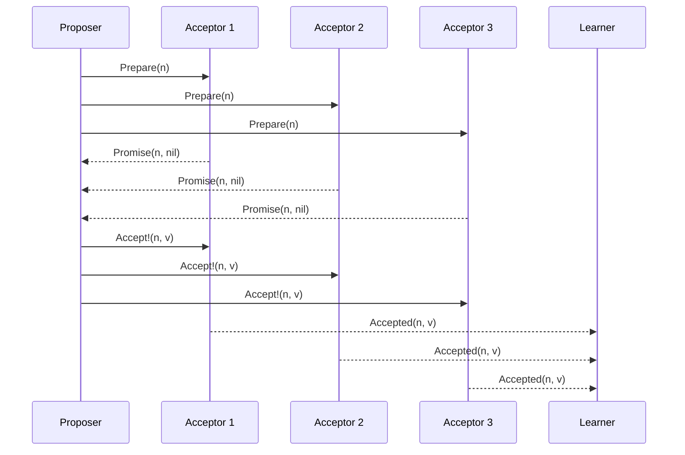

# Classic Paxos Algorithm

> **One-sentence summary.** Classic Paxos is an asynchronous crash-tolerant consensus protocol in which proposers collect `Promise` votes from a majority of acceptors and then replicate a value, guaranteeing safety with `2f + 1` nodes when `f` may fail.

## How It Works

Paxos splits participants into three roles — often colocated on the same process. **Proposers** receive values from clients and try to get them accepted. **Acceptors** vote on proposals; a majority must agree before any value is chosen. **Learners** store the chosen value, acting as replicas. Every proposal carries a unique, monotonically increasing number, typically an `(id, timestamp)` pair where the node id breaks timestamp ties.

The algorithm satisfies three classical consensus properties: **Agreement** (all correct processes decide the same value), **Validity** (the decided value was actually proposed by someone), and **Termination** (correct processes eventually decide). Because of FLP impossibility, no consensus algorithm can guarantee termination within a bounded time in a fully asynchronous system — Paxos therefore guarantees **safety always** and relies on an external failure detector (and randomized backoff) for liveness.

A round proceeds in two phases:

1. **Propose (voting).** The proposer sends `Prepare(n)` to a majority of acceptors. Each acceptor, if it has not already promised a higher-numbered proposal, responds with `Promise(n)` and includes the highest-numbered value it has previously accepted, if any. The acceptor thereby refuses to accept anything numbered below `n`.
2. **Replication.** Once the proposer gathers promises from a quorum, it sends `Accept!(n, v)`. The value `v` must be the one attached to the highest-numbered `Promise` response it received; only if no acceptor reported a previous value may the proposer use its own. Acceptors accept unless they have since promised a higher number, and notify learners on success.

Quorums are majorities: with `N = 2f + 1` nodes, any two majorities intersect in at least one acceptor. That **intersection guarantee** is what carries a previously accepted value forward into future rounds — a later proposer is forced to observe any value that already reached a quorum, preserving Agreement even across proposer crashes.

## When to Use

- **Strongly consistent replicated state.** Any service that needs a single, linearizable sequence of decisions — configuration stores, lock services, coordination kernels.
- **Leader election and metadata agreement.** Picking a unique leader or committing cluster-membership changes where disagreement would split-brain the system.
- **Replicated logs for state-machine replication.** Though classic single-decree Paxos agrees on one value, it is the building block for [[04-multi-paxos-and-variants]], which runs a sequence of instances to form a log.

## Trade-offs

| Aspect | Advantage | Disadvantage |
|--------|-----------|--------------|
| Safety | Holds under arbitrary message delay, loss, reorder, and up to `f` crashes | Requires at least `2f + 1` nodes — pure cost for fault tolerance |
| Liveness | Guaranteed once a single proposer is distinguished and nodes are alive | Dueling proposers can livelock indefinitely without randomized backoff |
| Messages | `O(N)` messages per decision (two round-trips) | Every decision needs both phases; reads must also run Paxos to be linearizable |
| Topology | Any participant can propose; roles are symmetric | No built-in leader — Multi-Paxos is usually needed for throughput |

## Real-World Examples

- **Google Chubby** — lock service for Bigtable and GFS, built atop Multi-Paxos for configuration and primary election.
- **Google Spanner** — uses Paxos per replica group to agree on each shard's transaction log across datacenters.
- **libpaxos** — a reference C implementation of classic Paxos and variants, used to prototype atomic-broadcast systems.
- **Neo4j Causal Cluster** — Paxos-based protocols coordinate cluster discovery and role assignment.

## Common Pitfalls

- **Livelock from dueling proposers.** Two proposers alternating `Prepare` with ever-higher numbers can each invalidate the other's promises forever. Fix: randomized exponential backoff, or promote a distinguished proposer (Multi-Paxos).
- **Wrong quorum math.** Using `f + 1` as total size instead of `2f + 1`, or letting phase-1 and phase-2 quorums fail to intersect, breaks Agreement. The intersection guarantee is the entire basis of safety.
- **Assuming one round suffices.** A single acceptor's `Accept` does not constitute agreement — only a majority does. Proposers that declare success prematurely can be contradicted by a later round that picks up a different value.
- **Ignoring already-accepted values.** If a proposer receives a `Promise` carrying a previously accepted value, it **must** re-propose that value, not its own. Forgetting this rule is the classic way to violate Agreement after a proposer crash.
- **Confusing liveness with safety.** Paxos will stall without a reliable failure detector and stable leader, but it will never return an inconsistent decision — those two properties are independent.

## See Also

- [[01-atomic-broadcast-and-virtual-synchrony]] — the broadcast primitive Paxos effectively implements per decision
- [[04-multi-paxos-and-variants]] — distinguished-leader optimization and its derivatives (Fast, EPaxos, Flexible)
- [[05-raft-consensus]] — an understandability-first redesign covering the same ground
- [[06-byzantine-consensus-pbft]] — extends the model to adversarial failures at `3f + 1` cost
