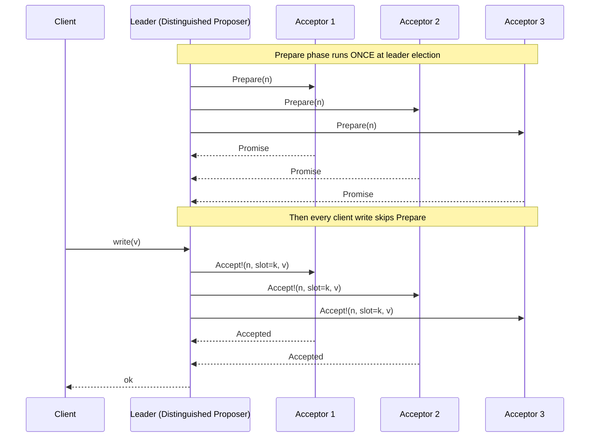

# Multi-Paxos and Paxos Variants

> **One-sentence summary.** Multi-Paxos and its cousins — Fast Paxos, EPaxos, and Flexible Paxos — each shave off a round trip, a leader, or a quorum constraint from classic Paxos, trading availability, latency, or throughput in different ways.

## How It Works

Classic Paxos decides a single value: a proposer runs `Prepare`/`Promise` and then `Accept!`/`Accepted`, burning two round trips for every decision. The variants below all start with that baseline and then optimize along one axis.

**Multi-Paxos** keeps classic Paxos honest once, then reuses the outcome. A *distinguished proposer* — the leader — wins the `Prepare` phase *once* and thereafter skips straight to `Accept!` for every subsequent value. Instead of a write-once register, you now have an **append-only replicated log**: slot 1 holds the first committed value, slot 2 the next, and so on. Failed leaders and log truncation via snapshots are handled out of band; the leader keeps a durable log and periodically checkpoints state so the log does not grow unbounded.

**Leases** extend this: the leader periodically renews a timed promise from followers that no one else will be elected for the next T seconds. Inside its lease window the leader can serve **linearizable reads locally** without a round trip. The catch is that leases are a *performance optimization, not a safety mechanism* — correctness depends on bounded clock drift.

**Fast Paxos** lets proposers (or even clients) contact acceptors directly, eliminating one round trip. The cost is a fatter cluster: `3f+1` acceptors, fast quorum of `2f+1`. Acceptors may receive conflicting values from different proposers; when they do, the coordinator detects a **collision** and reruns a classic round to recover. Under contention, these recovery rounds can make Fast Paxos *slower* than classic Paxos.

**Egalitarian Paxos (EPaxos)** removes the leader bottleneck entirely. Every command picks a temporary leader (whoever received it), which runs a `Pre-Accept` phase against a fast quorum of `⌈3f/4⌉` replicas. Each replica returns its view of any *interfering* commands — commands whose execution order matters. If everyone agrees on the dependency set, the command commits on the **fast path**. Otherwise the leader merges dependency lists and runs a second phase on the **slow path**. Execution replays the dependency graph in reverse order, so only conflicting writes ever block one another.

**Flexible Paxos** drops the majority-quorum requirement. It only needs `Q1 + Q2 > N`, where `Q1` is the propose-phase quorum and `Q2` is the accept-phase quorum. With 5 nodes you could pick `Q1=4, Q2=2`: leader election is harder, but steady-state replication waits for only two acknowledgments. **Vertical Paxos** is a close cousin that splits read and write quorums along the same principle.

## When to Use

- **Multi-Paxos**: any log-replicated state machine — metadata stores, config services, lock services — where a single stable leader is acceptable and writes dominate reads. Chubby, Spanner, and ZooKeeper-style systems use this shape.
- **Fast Paxos**: geo-replicated systems where the extra round trip to a leader dominates latency *and* write contention is low, so collisions are rare.
- **EPaxos**: multi-datacenter deployments where clients are distributed and the leader-as-bottleneck hurts tail latency, as long as the workload has mostly non-interfering commands (e.g. partitioned keys).
- **Flexible Paxos**: clusters that can tolerate a harder leader-election failure mode in exchange for cheaper steady-state writes — useful in large (7–9 node) Paxos groups.

## Trade-offs

| Variant | Quorum (accept) | Round-trips (steady state) | Leader | Failure mode | Throughput ceiling |
|---|---|---|---|---|---|
| Classic Paxos | `f+1` of `2f+1` | 2 | per-round (any proposer) | duelling proposers can livelock | low (per-decision elections) |
| Multi-Paxos | `f+1` of `2f+1` | 1 | single stable leader | leader failure stalls writes until re-election | high |
| Fast Paxos | `2f+1` of `3f+1` | 1 (no collision) / 3+ (collision) | coordinator + direct proposers | collisions under contention | high when uncontended, collapses under contention |
| EPaxos | fast: `⌈3f/4⌉`; slow: `⌊f/2⌋+1` | 1 (fast path) / 2 (slow path) | per-command | dependency graph grows with conflict rate | high and evenly distributed |
| Flexible Paxos | `Q2` where `Q1+Q2 > N` | 1 | single stable leader | can tolerate `N-Q2` failures only while leader is stable | higher than Multi-Paxos (smaller Q2) |

## Real-World Examples

- **Google Chubby** and **Spanner**: Multi-Paxos replicated logs for lock/metadata and transactional state, respectively. Spanner adds TrueTime-backed leases for linearizable reads.
- **Apache BookKeeper / ZooKeeper**: conceptually close to Multi-Paxos via [[02-zookeeper-atomic-broadcast-zab]], with a stable leader driving an ordered log.
- **ScyllaDB LWT**: experiments with EPaxos-style dependency tracking to avoid hot-partition bottlenecks on lightweight transactions.
- **etcd, CockroachDB, TiKV**: chose [[05-raft-consensus]] over Multi-Paxos for the same structural reasons — strong leader, replicated log — but with a more prescriptive specification.

## Common Pitfalls

- **Lease-based reads and clock drift**: Multi-Paxos leases assume bounded clock skew. If the leader's clock runs fast and it keeps serving reads past the point where followers already consider the lease expired, a newly elected leader can accept writes the old leader never sees — breaking linearizability.
- **Fast Paxos under contention**: the supposed win of one round trip disappears when two proposers race. Each collision forces a classic-round recovery, inflating both latency and message count. Benchmark Fast Paxos with *your* contention profile, not just happy-path numbers.
- **EPaxos dependency explosion**: the performance model assumes most commands are non-interfering. Workloads where many commands conflict (hot keys, counters, monotonic IDs) cause dependency graphs to balloon, execution to serialize, and fast-path hits to collapse.
- **Flexible Paxos availability trap**: shrinking `Q2` is only free while the leader is stable. During leader election you now need the *larger* `Q1` — if too many nodes are down you cannot elect a new leader at all, even though steady-state writes had been happily progressing.

## See Also

- [[03-classic-paxos]] — the single-decree baseline every variant optimizes.
- [[05-raft-consensus]] — a prescriptive Multi-Paxos with explicit leader election and log-matching rules.
- [[02-zookeeper-atomic-broadcast-zab]] — a sibling protocol that, like Multi-Paxos, relies on a stable leader and epoch-numbered rounds.
