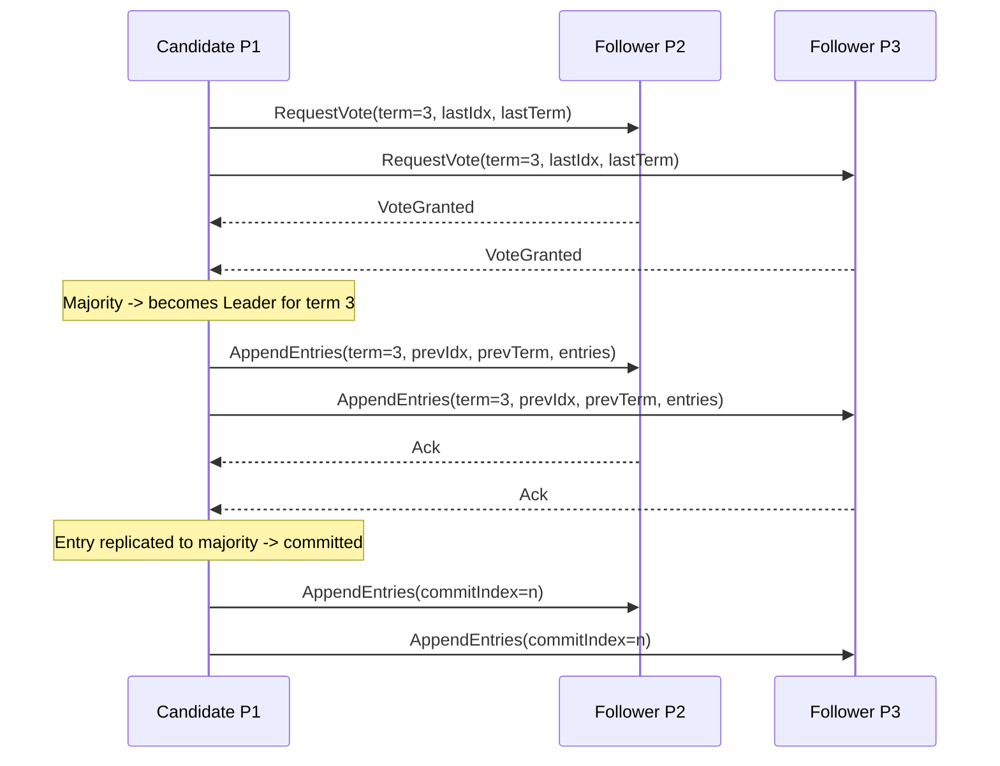
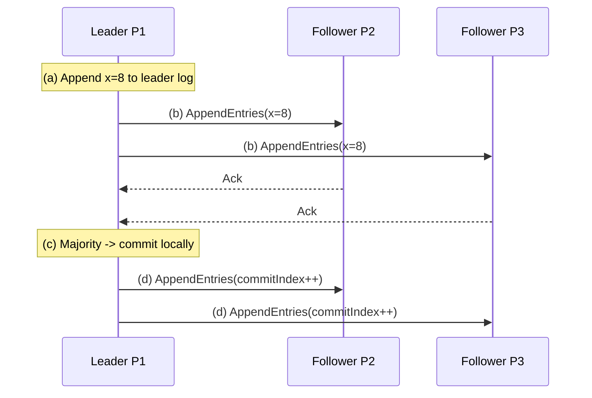

# Raft Consensus Algorithm

> **One-sentence summary.** Raft achieves the same crash-tolerant consensus as Multi-Paxos, but reorganizes the protocol around a strong leader, monotonic terms, and three explicit sub-problems — leader election, log replication, and safety — so engineers can actually implement it correctly.

## How It Works

Raft was introduced in 2013 with the explicit goal of being *understandable*, because Paxos had become notorious for being hard to reason about and harder to implement. Like [[04-multi-paxos-and-variants]], a single distinguished leader orders all operations; unlike Paxos, Raft decomposes the algorithm into three cleanly separated sub-problems and gives each one a named RPC.

**Three roles.** Every node starts as a **follower** — a passive replica that persists log entries and answers RPCs. A follower that stops hearing from the leader transitions to **candidate** and tries to collect a majority of votes. The winner becomes **leader** for a bounded period called a **term** (epoch). Terms are monotonically numbered; there is at most one leader per term, and every RPC carries the sender's term. If any node sees a higher term, it updates its own term and steps down to follower.

**Leader election.** A candidate sends `RequestVote` including its current term plus the index and term of its last log entry. A follower grants its vote only if the candidate's log is **at least as up-to-date** as its own (longer log, or equal length with a higher last-entry term). Since every node votes at most once per term, two candidates cannot both win. Split votes are possible — and are resolved by **randomized election timeouts**, so some candidate's timer fires first and it captures the cluster before others wake up.

**Log replication.** The leader accepts client commands, appends them to its own log, and replicates via `AppendEntries`. Each `AppendEntries` RPC carries `prevLogIndex` and `prevLogTerm`; the follower rejects the request unless its log already matches at that position. This **log matching property** — if two logs agree on index/term for an entry, they agree on everything before it — is what makes Raft's consistency argument simple. Rejections cause the leader to decrement its tracked index for that follower and retry with an earlier anchor until a common ground is found, after which divergent follower tail entries are overwritten.

**Commit procedure.** An entry is considered committed once it has been replicated to a majority. The leader advances its `commitIndex` locally and piggybacks the new `commitIndex` on the next `AppendEntries` (including periodic heartbeats), so followers apply committed entries to their state machines at their own pace.

**Safety.** Three invariants make the protocol provably correct: at most one leader per term (majority voting), a leader never overwrites or reorders its own log (append-only), and only nodes whose logs contain all committed entries can be elected (the up-to-date vote check). Together, these guarantee that any entry committed under one leader survives into every subsequent leader's log.

## When to Use

- **Replicated state machines** for strongly consistent metadata — service discovery, cluster membership, distributed locks, feature flags.
- **Leadered transactional storage** where one region owns a data range and replicates a redo-log-style stream to followers (e.g., CockroachDB's per-range Raft groups).
- **Coordination services** replacing a Paxos-based implementation when operational clarity and debuggability outweigh the last few percent of theoretical optimization.

## Trade-offs

| Aspect | Raft | Multi-Paxos |
|--------|------|-------------|
| Mental model | Strong leader + terms + log matching | Proposer/acceptor/learner roles, ballots |
| Log shape | Strictly contiguous, append-only | Slot-based; holes allowed, filled later |
| Failure recovery | New leader must already hold all committed entries | New leader can learn committed values via Prepare |
| Liveness trick | Randomized election timeouts | Distinguished proposer / leader lease |
| Throughput ceiling | Single leader bottleneck | Same (Multi-Paxos) or parallel (EPaxos) |
| Implementability | Reference spec + many open-source libraries | Famously under-specified |

## Real-World Examples

- **etcd** and **Consul**: Raft-replicated key-value stores underpinning Kubernetes and service-mesh control planes.
- **CockroachDB** and **TiKV**: One Raft group per data range, scaling horizontally by sharding Raft groups rather than making any one of them bigger.
- **RethinkDB**: Uses Raft for cluster metadata and shard placement.
- **Kafka KRaft controller**: Replaces the Zookeeper-based (see [[02-zookeeper-atomic-broadcast-zab]]) controller with a self-managed Raft quorum, eliminating the external dependency.

## Common Pitfalls

- **Forgetting to randomize election timeouts.** With fixed timeouts, every follower becomes a candidate at the same instant after a leader failure, and split votes cascade across term after term without progress.
- **Skimping on the log matching check.** Accepting an `AppendEntries` without verifying `prevLogIndex`/`prevLogTerm` breaks the inductive guarantee that equal-term/equal-index entries are identical, silently corrupting replicas.
- **Not stepping down on a higher term.** Every RPC — both request and response — must be inspected; if the peer's term is higher, the node must convert to follower before acting, or two leaders will briefly coexist.
- **Committing entries from previous terms by counting replicas alone.** A new leader must replicate a *current-term* entry before it can commit older entries; Raft's "figure 8" scenario shows why counting replicas of an old-term entry is unsafe.
- **Treating followers as fungible during log repair.** The leader must back up `nextIndex` per follower until `AppendEntries` succeeds, then overwrite — not merge — the follower's divergent suffix.

## See Also

- [[04-multi-paxos-and-variants]] — the algorithm Raft was designed to replace in practice
- [[03-classic-paxos]] — the ancestral asynchronous consensus protocol
- [[02-zookeeper-atomic-broadcast-zab]] — another leader-based atomic broadcast with comparable structure
