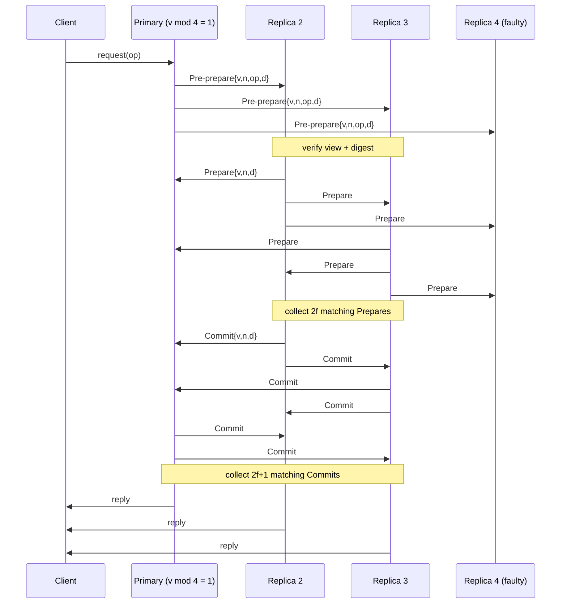

# Byzantine Consensus and PBFT

> **One-sentence summary.** Byzantine consensus lets a cluster agree on values even when some replicas lie, forge messages, or behave arbitrarily — PBFT achieves this with three cross-validated phases and `n = 3f+1` replicas to tolerate `f` faults.

## How It Works

Classic consensus protocols like Paxos and Raft assume *crash* failures: a node either follows the algorithm correctly or stops. Byzantine failures are broader — nodes may send contradictory messages to different peers, forge payloads, drop selectively, or simply be corrupted by bugs, misconfiguration, or hardware faults. The name comes from the "Byzantine Generals Problem": generals coordinating by messenger where some messengers and some generals may be traitors.

Practical Byzantine Fault Tolerance (PBFT) is the canonical algorithm for this setting. It assumes *independent* node failures (an adversary cannot compromise all nodes with a single exploit), *weak synchrony* (the network is eventually responsive), and that inter-node traffic is *encrypted and signed* so peers can verify sender identity. To tolerate `f` Byzantine nodes, PBFT requires `n = 3f+1` replicas — strictly more than the `2f+1` crash-tolerant quorums need. The extra replica is there because, of any quorum of `2f+1` responses, up to `f` may come from liars; the remaining `f+1` honest responses must still outnumber them.

PBFT organizes replicas into *views*. In view `v`, replica `v mod N` is the *primary* and the rest are *backups*. Clients send requests to the primary, which drives the protocol. On suspected primary failure, replicas broadcast view-change events; after `2f+1` such events, the next primary takes over.

The normal-case protocol has three phases, each cross-validating the last:

1. **Pre-prepare** — the primary assigns a sequence number and broadcasts `{view, seq, payload, digest}` to all backups. Each backup verifies the view and digest.
2. **Prepare** — each backup broadcasts a `Prepare(view, seq, digest)` message to every other replica (omitting the payload — the digest stands in for it). A replica advances only after collecting `2f` matching Prepares from *different* backups.
3. **Commit** — each replica broadcasts `Commit(view, seq, digest)` and waits for `2f+1` matching Commits (possibly including its own) before finalizing and replying to the client. The client accepts the result once it sees `f+1` matching replies.

Digests — signed cryptographic hashes of the payload — are the reason the Prepare phase does not drown in re-broadcast payloads. A digest is collision-resistant and signed, so a backup can confirm "I saw the same request you saw" cheaply. To bound log growth, every `N` requests the primary takes a *stable checkpoint*: it broadcasts the sequence number and state digest, waits for `2f+1` acknowledgements, and uses those as proof that everyone can safely discard pre-prepare, prepare, commit, and checkpoint messages up to that sequence number.

Two important optimizations sit on top of the base protocol. *Tentative execution* lets a client collect `2f+1` matching tentative responses from replicas that have executed after Prepare (before Commit finishes) — if they match, the client can often avoid waiting for the full Commit round. *Read-only requests* skip ordering entirely: the client asks all replicas, each executes in its current state after draining in-flight writes to the target, and `2f+1` matching responses complete the read in a single round-trip.

## When to Use

- **Permissioned blockchains and ledgers** where participants are known but mutually distrusting — each organization runs its own replica and none trusts the others to not rewrite history.
- **Regulated, multi-tenant systems** that must remain correct even when an operator, insider, or hardware fault produces corrupt or contradictory outputs.
- **High-value state machines** (financial settlement, registries) where "one bug silently corrupts a replica" must not cascade into a committed lie.

## Trade-offs

| Aspect | Crash-tolerant (Paxos/Raft) | Byzantine (PBFT) |
|--------|-----------------------------|------------------|
| Quorum size | `2f+1` | `3f+1` |
| Message complexity per decision | `O(N)` (leader-to-followers) | `O(N^2)` (all-to-all in Prepare + Commit) |
| Round-trips in normal case | 1 (Multi-Paxos/Raft steady state) | 3 (Pre-prepare, Prepare, Commit) |
| Failure model | Nodes may crash or drop messages | Nodes may lie, forge, or equivocate |
| Crypto on the wire | Optional | Required (signatures + digests) |
| Practical cluster size | 3–7 common, scales to dozens | Typically ≤ 20–30 before `N^2` chatter dominates |

The `O(N^2)` cost is fundamental: every replica must hear from every other replica to cross-validate. This is why PBFT scales poorly past a few dozen nodes without variants (HotStuff, Tendermint-style pipelining) that reduce or pipeline messaging.

## Real-World Examples

- **Hyperledger Fabric** (early orderer options and variants) — permissioned enterprise blockchain using BFT-style ordering.
- **Tendermint / CometBFT** (Cosmos ecosystem) — PBFT-derived protocol with instant finality for proof-of-stake chains.
- **Ripple / XRP Ledger** — Byzantine agreement over trusted Unique Node Lists.
- **Hyperledger Sawtooth** (older PBFT consensus plugin) — opt-in BFT for enterprise networks needing fast finality.
- Any permissioned chain where probabilistic finality (Nakamoto-style) is unacceptable and participants are known but untrusted.

## Common Pitfalls

- **Assuming TLS + auth equals BFT.** Encrypting and authenticating channels only prevents *external* attackers. A valid, authenticated node running corrupted code can still equivocate — you need the protocol to cross-validate, not just the transport.
- **Underestimating bandwidth.** The Prepare and Commit phases are all-to-all; even with digests, message counts grow quadratically. Provision the network accordingly.
- **Trying to scale past a few dozen replicas.** Classic PBFT was designed for small permissioned groups. Large validator sets need BFT variants (HotStuff, streamlined/pipelined protocols) or sharding.
- **Ignoring view-change cost.** A flaky primary can trigger repeated view changes, each of which is an expensive `O(N^2)` dance. Tune timeouts carefully.
- **Conflating Byzantine with Sybil tolerance.** PBFT assumes a fixed, known membership. Open systems also need a membership / staking mechanism to prevent identity forging — that is a separate problem.

## See Also

- [[03-classic-paxos]] — the crash-tolerant baseline (`2f+1`, `O(N)`) that PBFT generalizes.
- [[04-multi-paxos-and-variants]] — leader-based optimizations in the non-Byzantine setting.
- [[05-raft-consensus]] — understandable crash-tolerant consensus; contrast strong leader with PBFT's view-based primary.
