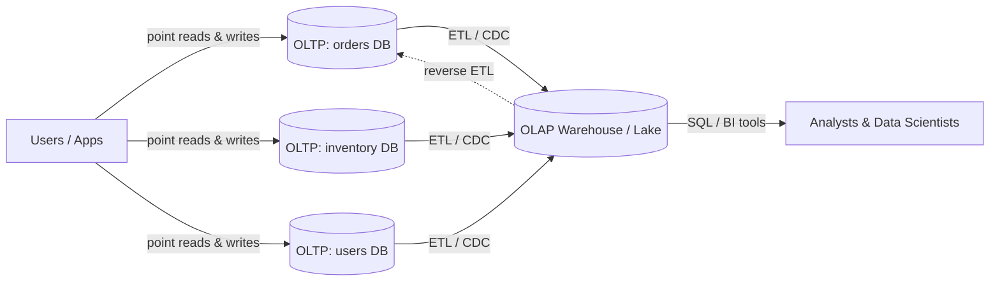

# Operational vs Analytical Systems (OLTP vs OLAP)

> **One-sentence summary.** Operational (OLTP) systems serve live user traffic with fast point reads and writes of current state, while analytical (OLAP) systems serve business questions by scanning large histories — and nearly every data-platform decision flows from which side of this line you are on.

## How It Works

An **operational system** is the database your application code talks to while a user is actively clicking around. A request arrives, you fetch a small number of records by key (a *point query*), maybe mutate them, and return within a few milliseconds. The dataset represents the *latest state* of the world: the current cart, the current balance, the current inventory level. Writes are frequent, small, and originate from user actions. Because a slow query here blocks a real user, OLTP engines are tuned for per-row access, short transactions, and high concurrency.

An **analytical system** exists to answer questions *about* that data rather than serve it. Instead of "give me user 42's profile," the queries are "what was our revenue per region per week for the last two years." A single query may scan billions of rows to compute an aggregate, then return a handful of numbers. Data arrives in bulk via ETL/ELT pipelines (periodic dumps or event streams) from the operational stores; the warehouse holds a *read-only copy*, often structured as a history of events rather than mutable current state. Because analysts write arbitrary SQL against it, it must tolerate expensive ad-hoc scans without affecting anything user-facing.

The two are kept separate for a reason: the schemas, storage layouts, and resource profiles that make OLTP fast make OLAP slow, and vice versa. In a typical enterprise, dozens or hundreds of operational databases (one per service) feed a single warehouse so analysts can join across domains without hammering production.

## When to Use

- **Pick OLTP** when a human or service is waiting on the response: a checkout flow that debits inventory and records an order, an auth service verifying a session token, a game backend updating a player's position. Latency is measured in milliseconds, the working set fits in memory or on fast SSD, and the query shape is known ahead of time.
- **Pick OLAP** when the question is about *many* records at once: weekly revenue by cohort, funnel conversion, a data-science notebook fitting a churn model over two years of events. You are willing to wait seconds-to-minutes, you don't know all queries in advance, and you need to join data that lives in several operational systems.
- **Pick a real-time OLAP engine** (Pinot, Druid, ClickHouse) when analytical-shaped queries must power a user-facing surface — a product-analytics dashboard, an ad-targeting lookup, an in-app "trending now" widget — where you need aggregate-style queries but at OLTP-like latency.

## Trade-offs

Adapted from Table 1-1 in *Designing Data-Intensive Applications*:

| Property | OLTP (Operational) | OLAP (Analytical) |
|---|---|---|
| Main read pattern | Point queries by key | Aggregates over many rows |
| Main write pattern | Row-level create / update / delete | Bulk ETL load or event stream |
| Query volume | Many small queries per second | Few, each complex and expensive |
| Latency target | Milliseconds | Seconds to minutes |
| Query shape | Fixed, baked into app code | Arbitrary, ad-hoc, SQL by humans or BI tools |
| Data represents | Current state at a point in time | History of events over time |
| Dataset size | Gigabytes to terabytes | Terabytes to petabytes |
| Users | End users (indirectly, via app) | Analysts, data scientists, ML pipelines |

## Real-World Examples

- **OLTP stores**: PostgreSQL, MySQL, and MongoDB for self-managed workloads; Amazon Aurora, Azure SQL Hyperscale, Google Cloud Spanner, and DynamoDB for cloud-managed OLTP at scale. All optimize for row-level access and high write concurrency.
- **Classic OLAP warehouses**: Snowflake, Google BigQuery, Amazon Redshift, Azure Synapse, Teradata — columnar storage, massively parallel query execution, batch ingest, priced for scan-heavy workloads.
- **Real-time / product-analytics OLAP**: Apache Pinot, Apache Druid, and ClickHouse — built to ingest streams and return aggregate queries in sub-second latency, which is what makes them suitable as the backend for user-facing analytics dashboards inside products like LinkedIn or Uber.
- **HTAP systems**: TiDB, SingleStore, and Google AlloyDB advertise hybrid transactional/analytical processing in one system. Under the hood most still run an OLTP engine coupled to a columnar replica — the OLTP/OLAP split is hidden, not removed. HTAP is useful when the *same* records must be both mutated and scanned with low latency (e.g., real-time fraud detection), but it does not replace a warehouse that consolidates data across many independent services.

## Common Pitfalls

- **Running heavy analytics against your production OLTP database.** A single analyst's `GROUP BY` over a large table can saturate I/O and drag user-facing latency into the seconds. Isolate with a read replica at minimum, or ETL into a warehouse for anything recurring.
- **Using an OLAP engine for point lookups.** Columnar warehouses are optimized for scanning few columns across many rows; asking them for "user by ID" typically costs seconds and burns credits. If you need key lookups, keep an OLTP store in front.
- **Assuming HTAP removes the need for a warehouse.** HTAP handles mixed workloads on *one* dataset, but a real warehouse exists largely to *combine* data across hundreds of independent operational systems. Those are different problems.
- **Forgetting that the warehouse is always stale.** ETL/ELT latency (minutes to hours) means dashboards lag reality. Design around this — or adopt streaming ingestion if freshness actually matters.
- **Blurring the boundary accidentally.** Features like "show the user their own last-30-days analytics" look like OLTP but have OLAP shape. Either pre-aggregate into the OLTP store or put a real-time OLAP engine behind the feature; do not bolt it onto a row-store and hope.

## See Also

- [[02-data-warehousing-and-data-lakes]] — how data physically moves from OLTP into the analytical side via ETL/ELT, and the warehouse-vs-lake distinction
- [[03-systems-of-record-and-derived-data]] — a related but orthogonal framing: which store owns the truth, and which ones are rebuildable copies
