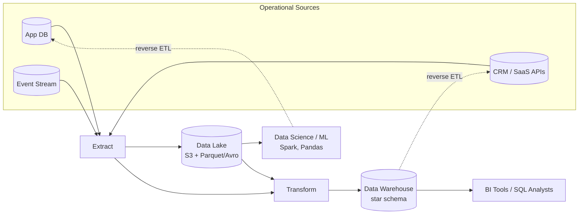

# Data Warehousing, Data Lakes, and the Lakehouse

> **Analytical storage has evolved from rigid schema-on-write warehouses, through flexible schema-on-read data lakes, to hybrid lakehouses — with reverse ETL closing the loop back into operational systems.**

## How It Works

In the late 1980s companies stopped running analytics directly on OLTP databases because large scans disturbed transactional workloads and relational schemas were poorly shaped for aggregation queries. The solution was a **data warehouse**: a separate, read-only copy of data from every operational system, restructured into an analysis-friendly schema (typically star or snowflake). Data gets there via **ETL — extract, transform, load**: periodic dumps or streaming updates are extracted from OLTP sources, transformed into the warehouse schema, cleaned, and loaded. When the transformation runs *inside* the warehouse after loading, the pattern flips to **ELT**, which is now popular because cloud warehouses have the compute to transform at query or batch time.

Relational warehouses work beautifully for SQL analysts and BI tools, but data scientists running Python, R, or Spark often need raw text, images, sensor feeds, or feature vectors that do not fit a relational schema. This led to the **data lake**: a centralized store (usually an object store like S3) that simply holds files in whatever format is convenient — Parquet, Avro, JSON, images, video. The lake imposes **schema-on-read** rather than schema-on-write, so each consumer interprets the raw data their own way (the "sushi principle" — raw data is better). The lake also acts as an intermediate stop: operational systems land raw data in the lake, and downstream ETL jobs then shape subsets of it into the warehouse.

The **lakehouse** is the current synthesis: open table formats (Iceberg, Delta Lake, Hudi) add ACID transactions, schema enforcement, time travel, and efficient columnar indexes *on top of* data-lake files. One storage tier now serves both BI-style SQL and data-science workloads. Finally, **reverse ETL** sends curated analytical outputs — customer scores, ML recommendations, churn predictions — back into operational tools like CRMs and email platforms, so the insights produced in the warehouse can drive live product behavior.

## When to Use

- **Warehouse** — You have well-defined business metrics, SQL-literate analysts, and BI dashboards (Looker, Tableau, Mode). Governance, auditability, and predictable query performance matter more than raw flexibility.
- **Data lake** — You need to retain raw, high-volume, or non-relational data (clickstreams, logs, media, sensor output) for ML training, exploratory analysis, or future use cases you have not specified yet. Storage cost per TB must be low.
- **Lakehouse** — You want one storage tier to serve BI *and* ML without maintaining two copies. Open table formats give you ACID guarantees over object storage.
- **ELT over ETL** — Pick ELT when the warehouse engine is cheap and elastic (Snowflake, BigQuery), transformations change often, and you want raw data preserved so new transformations can be backfilled without re-ingesting.

## Trade-offs

| Aspect | Data Warehouse | Data Lake | Lakehouse |
|--------|----------------|-----------|-----------|
| Schema | Schema-on-write, relational | Schema-on-read, none enforced | Schema-on-write via table format, open files |
| Storage format | Proprietary columnar | Open files (Parquet, Avro, JSON, binary) | Open columnar + transactional metadata (Iceberg, Delta) |
| Typical consumers | BI analysts, SQL dashboards | Data scientists, ML engineers | Both |
| Flexibility | Low — model upfront | High — any file, any shape | Medium-high — tables plus raw files |
| Query performance | Excellent for SQL aggregations | Slow without careful partitioning | Near-warehouse with columnar + indexes |
| Governance | Mature — roles, lineage, audit | Weak by default — "data swamp" risk | Emerging — catalog + ACID help |

## Real-World Examples

- **Snowflake, Google BigQuery, Amazon Redshift** — Cloud data warehouses that separate storage from compute; Snowflake stores its data on S3 while presenting a SQL warehouse interface.
- **S3 + Parquet / Avro** — The canonical data-lake stack: cheap object storage plus open columnar/row file formats.
- **Databricks, Apache Iceberg, Delta Lake, Apache Hudi** — Lakehouse platforms and open table formats that add ACID transactions, schema evolution, and time travel over lake files.
- **Fivetran, Airbyte, Singer** — Managed ETL/ELT connectors that extract from SaaS APIs (Salesforce, Stripe, Zendesk) where you have no direct DB access.
- **Census, Hightouch** — Reverse-ETL tools that sync modeled warehouse tables back into operational SaaS (CRMs, ad platforms, marketing automation).
- **TFX, Kubeflow, MLflow** — Deploy ML models trained on analytical data into operational systems (a form of reverse ETL for model artifacts).

## Common Pitfalls

- **Data swamp** — A lake without a catalog, naming conventions, or owners becomes unsearchable. Teams copy the same raw file a dozen times with no one sure which version is correct.
- **Schema-on-read chaos** — Without schema enforcement, producers silently change field names or types and every downstream notebook breaks on a different day.
- **ETL pipelines breaking on schema drift** — Rigid ETL jobs that assumed a fixed upstream schema fail silently or load corrupt data when source systems evolve; lakehouse table formats and contract-tested pipelines reduce this.
- **Running analytics on the OLTP database** — Ad-hoc aggregation queries lock rows, spike latency for users, and fight row-oriented storage. Move them to a warehouse or lake.
- **Treating the warehouse as a system of record** — The warehouse is derived data; losing it should be recoverable from sources. If the warehouse becomes the only copy, you have lost the separation that made it safe.
- **ELT without cost controls** — Loading raw data first is cheap; running unbounded transformations on a usage-billed warehouse can produce surprise invoices.

## See Also

- [[01-operational-vs-analytical-systems]] — why analytical storage exists as a separate tier in the first place
- [[03-systems-of-record-and-derived-data]] — warehouses and lakes are classic derived data systems, not sources of truth
