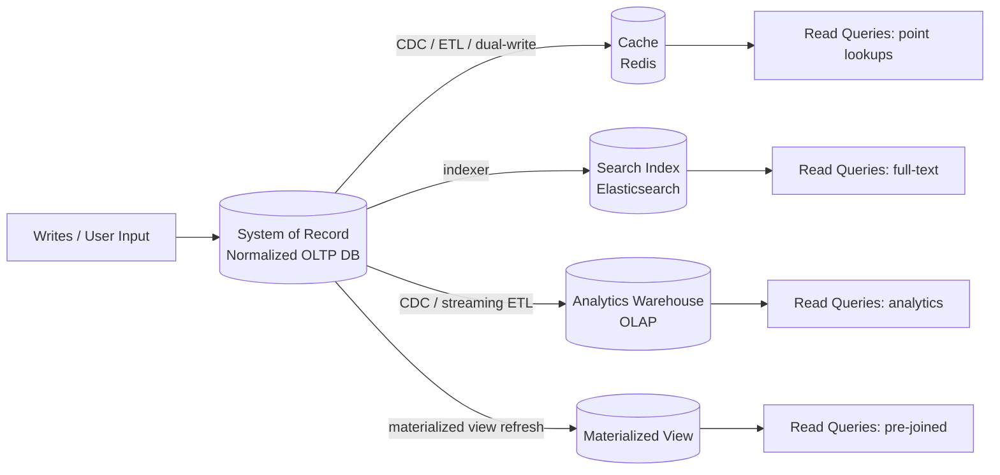

# Systems of Record and Derived Data

> **One-sentence summary.** A system of record holds the authoritative, canonical version of data; derived data systems hold copies transformed for faster or differently-shaped reads, and can always be rebuilt from the source of truth.

## How It Works

A **system of record** (also called a *source of truth*) is the place where a fact is first written and is stored exactly once, typically in a normalized form. If any other store disagrees with it, the system of record wins by definition. New user input, business events, and state changes land here before flowing anywhere else.

A **derived data system** holds a copy of that data after some transformation: a cache, a search index, a denormalized view, a materialized view, a read replica, an analytics warehouse, or even a trained ML model. Derived data is *redundant* in the strict sense — no information is added — but it is usually essential for performance, because the system of record often cannot answer every query shape efficiently. The defining property of derived data is **rebuildability**: if you delete it, you can regenerate it by re-running the derivation over the source of truth.

Crucially, whether a store is a system of record or a derived system is not a property of the technology but of **how you use it**. The same Postgres instance can be authoritative in one application and a derived read-side projection in another. What matters is being explicit about the direction of data flow, because every derived system needs a well-defined update mechanism to stay in sync with its source.

## When to Use

Introduce a derived system when:

- **Performance demands it.** The system of record is too slow for hot read paths (e.g., rendering a feed on every page load).
- **Query shape mismatches the storage shape.** Full-text search, geospatial queries, graph traversals, or heavy aggregations are awkward on a normalized OLTP schema.
- **Consumers are heterogeneous.** Different teams or services need the same data in different representations — a mobile feed, an internal dashboard, a recommendation pipeline.

Avoid a derived system when:

- **Scale is small** and the source of truth can comfortably serve reads directly — the added complexity of a sync pipeline costs more than it saves.
- **Reads are infrequent** and latency is not user-facing.
- **Consistency requirements are strict** and you cannot tolerate the update lag that derivation introduces.

## Trade-offs

| Aspect | System of Record | Derived System |
|--------|------------------|----------------|
| Authority | Canonical — wins all conflicts | Secondary — must defer to source |
| Consistency guarantees | Strong (typically ACID within the store) | Eventual — lags the source by some window |
| Rebuildability | Cannot be rebuilt; losing it means losing data | Can always be rebuilt from the source |
| Write path | Direct writes from application / user input | Writes produced by a derivation pipeline, not by users |
| Update lag | None — reads see their own writes | Non-zero — milliseconds to hours depending on pipeline |
| Failure tolerance | Loss is catastrophic; requires durable storage and backups | Loss is recoverable by re-running the derivation |

## Real-World Examples

- **Postgres + Elasticsearch**: Postgres is the system of record for products; Elasticsearch is a derived index rebuilt from Postgres to serve full-text queries. If ES is wiped, a reindex job restores it.
- **OLTP + Redis cache**: A relational DB is authoritative; Redis caches hot keys. A Redis crash triggers cache misses, not data loss, because the DB still has every row.
- **OLTP + Kafka + OLAP warehouse**: Operational Postgres emits change events through Kafka; a warehouse like Snowflake or BigQuery consumes them and becomes a derived analytics store (see [[02-data-warehousing-and-data-lakes]]).
- **Materialized views**: A pre-computed join or aggregation inside the same database, refreshed on a schedule or on write. The underlying tables are the source; the view is derived.
- **Read replicas**: Physical streaming copies of a primary database. They are derived, lag the primary slightly, and can be rebuilt by re-replicating from the primary or a backup.

## Common Pitfalls

- **Treating a derived store as the source of truth.** Writing directly into the search index or cache and expecting it to hold the only copy — the first incident that wipes it will wipe real data.
- **Bidirectional writes creating drift.** Letting applications write to both the source and a derived store independently, rather than deriving one from the other. Over time the two disagree and no one can tell which is right.
- **Ignoring update lag.** Designing user flows that read-after-write from a derived store (e.g., searching for a product immediately after creating it) and being surprised when results are stale.
- **Hard-to-rebuild caches.** Populating a cache with data that no longer exists in any source — e.g., values computed from state that has since been overwritten. If the cache dies, the data is unrecoverable, which means it was secretly the source of truth all along.
- **Unclear ownership of the derivation pipeline.** When no one owns the job that keeps a derived store fresh, it silently falls behind and quietly becomes wrong.

## See Also

- [[01-operational-vs-analytical-systems]] — analytical systems are almost always derived systems, consuming data produced by operational ones
- [[02-data-warehousing-and-data-lakes]] — the canonical large-scale derived system, built by ETL/ELT from operational sources of truth
