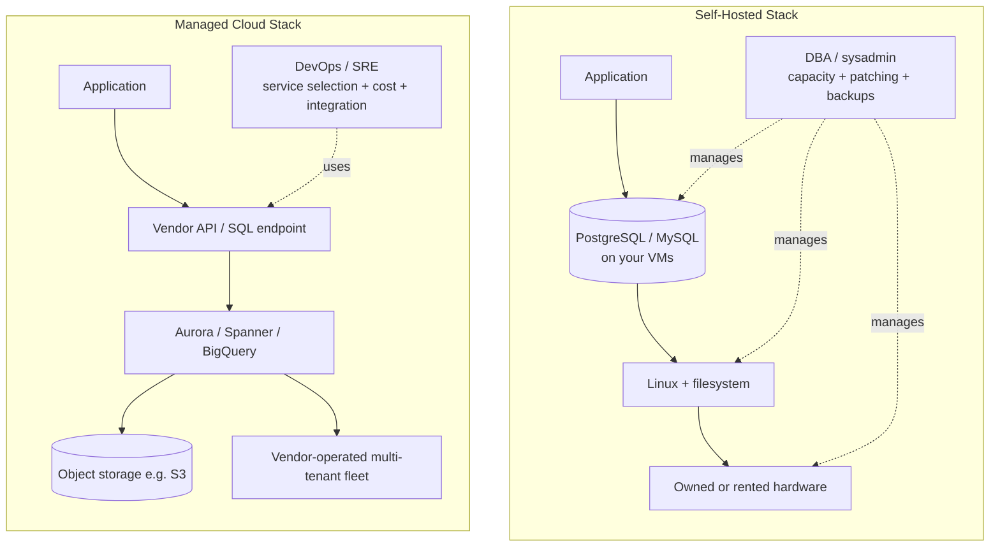

# Cloud Services vs Self-Hosting

> **Choosing between running data systems yourself and subscribing to managed cloud services is a trade-off between cost, control, operational burden, and how quickly your team can move.**

## How It Works

Every data-system deployment sits somewhere on a spectrum. At one end is **self-hosting**: you take off-the-shelf software (open source like PostgreSQL, MySQL, MongoDB, ClickHouse, or commercial) and install it on hardware you own in a datacenter, on rented servers, or on IaaS virtual machines. You retain root access, you tune the kernel and the database, and you are responsible for capacity planning, patching, backups, failover, and on-call. At the other end are **managed cloud services** (SaaS or PaaS) where the vendor operates the software behind an API. You provision a cluster with a few clicks, pay metered bills, and never touch the underlying machines.

The cloud-native model does more than relocate servers — it changes the economics and the org chart. Fixed capital expenditure on hardware becomes operational, usage-based billing: storage is not a disk you bought but a meter that ticks, and compute scales up and down to match load. On the operations side, the traditional **DBA / sysadmin** roles that babysat individual machines give way to **DevOps** and **SRE** teams that treat infrastructure as code, prefer ephemeral VMs, and focus on automation, integration, and cost optimization. Capacity planning becomes financial planning; performance tuning becomes cost tuning.

## When to Use

**Self-hosting wins when:**
- Load is large and **steady** — at scale, amortized hardware plus experienced staff beats margin-laden cloud pricing.
- **Regulatory or data-residency** rules force specific jurisdictions, air-gapped networks, or physical custody of data.
- **No managed offering fits** — niche storage engines, modified open-source forks, or research workloads.
- The workload is **latency-sensitive at the microsecond level** (e.g., high-frequency trading) and needs full hardware control.

**Managed cloud wins when:**
- Load is **bursty or variable** (analytics, seasonal traffic) so elasticity retires idle machines.
- You want **speed to market** and lack the in-house expertise to operate the system safely.
- Ops headcount is small and should focus on product, not patching kernels.
- You need **global reach** — multi-region replication, edge presence, or cross-region failover.
- The system is non-core; you would rather pay a specialist than become one.

## Trade-offs

| Aspect | Self-Hosted | Managed Cloud |
|---|---|---|
| Cost model | CapEx + fixed OpEx, cheaper at steady high scale | Metered OpEx; elastic but margin-loaded; egress/query fees bite |
| Ops burden | Heavy: capacity, patching, failover, on-call | Lighter for the system itself; shifts to integration and cost governance |
| Reliability | Bounded by your team's skill and runbooks | Vendor pools expertise across many customers; limited by their SLA |
| Lock-in | Low — portable binaries, standard protocols | High — proprietary APIs, data gravity, non-standard features |
| Customization | Full: tune configs, patch source, run forks | Limited to knobs the vendor exposes |
| Compliance | You own controls and audit evidence end-to-end | Shared-responsibility model; trust the provider, verify via certifications |
| Skills required | DBA, sysadmin, kernel, networking | DevOps/SRE, service-catalog fluency, cost/FinOps |

## Real-World Examples

- **Self-hosted**: PostgreSQL / MySQL / MongoDB clusters on EC2 or bare metal; ClickHouse for self-run analytics; Apache Spark on EMR or Kubernetes when teams want cluster-level control.
- **Cloud-native OLTP**: AWS Aurora, Google Cloud Spanner, Azure SQL DB Hyperscale — databases designed from scratch around cloud storage.
- **Cloud-native OLAP**: Snowflake (built on S3), Google BigQuery, Azure Synapse — serverless warehouses that scale compute independently.
- **Cloud-native key-value**: DynamoDB — a managed service with no self-hosted equivalent, trading portability for zero-ops scaling.

## Common Pitfalls

- **Underestimating egress and query costs.** Per-query pricing (BigQuery) or per-GB egress fees can turn a "cheap" managed service into the biggest line item once analytics traffic or cross-region replication ramps up.
- **Assuming "managed" means "zero ops".** You still need monitoring, access control, schema evolution, incident response, and capacity/quota planning; only the machine-level toil is gone.
- **Creeping vendor lock-in.** Each proprietary feature used (stored procedures, auth integrations, change streams) raises the cost of ever leaving. Keep an exit plan and prefer standard APIs where feasible.
- **Compliance surprises.** Shared-responsibility models draw the line differently than teams expect; data residency, key custody, and sub-processor lists need explicit review, not assumption.
- **Cost-planning mistakes at scale.** Metered billing removes capacity planning, but demands *financial* planning — unowned resources, forgotten dev clusters, and chatty cross-AZ traffic silently dominate the bill.
- **Hybrid without a strategy.** Running both models without clear ownership produces the worst of each: lock-in *and* ops burden.

## See Also

- [[05-separation-of-storage-and-compute]] — the architectural shift that makes cloud-native databases elastic and underpins the economics of managed services.
- [[07-microservices-and-serverless]] — a complementary operational model that pushes the managed-service logic all the way to application code.
