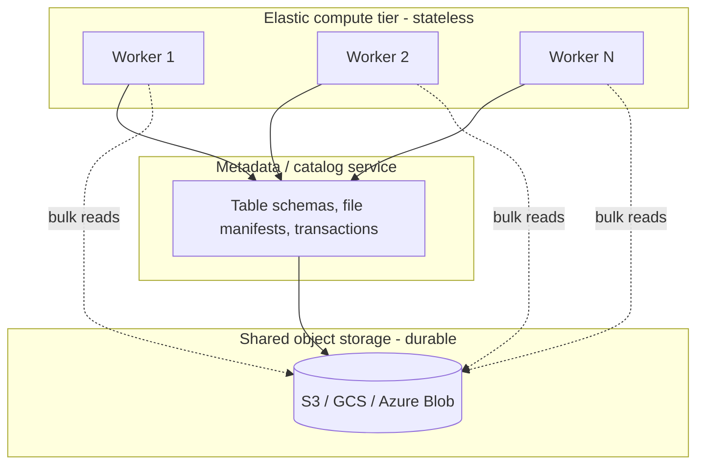

# Separation of Storage and Compute

> **One-sentence summary.** Cloud-native systems disaggregate durable state into a shared object store and run stateless compute workers on top, so each tier can scale, fail, and be billed independently.

## How It Works

In the classical architecture, one machine owned both disk (storage) and CPU/RAM (compute). Durability came from RAID across disks bolted to that same box, and scaling meant buying a bigger box or carefully sharding data across peer nodes. This couples two very different resources: storage grows monotonically with your dataset, while compute demand is spiky — a nightly report, a Black Friday surge, a model training run.

Cloud-native systems break this coupling. Durable bytes live in a dedicated storage service — typically an object store like S3, Azure Blob, or Google Cloud Storage — which already replicates data across machines and availability zones. Above it sits a thin metadata/catalog service that tracks table schemas, file locations, and transaction state. On top, a pool of **stateless** compute workers is provisioned on demand: they fetch data over the network, do the work, and can disappear without losing anything. Local SSDs on those workers exist, but only as an ephemeral cache. Virtual block devices like EBS sit in the middle of this spectrum — they emulate a disk so legacy software keeps working, but every I/O becomes a network call, so they trade cloud-native throughput for drop-in compatibility.

Because compute holds no unique state, the system can spin up a 100-node cluster for a ten-minute query and destroy it afterwards. Multiple customers can share the same physical pool (multitenancy) because isolation is enforced in software at the catalog and request layer, not by giving each tenant their own box.

## When to Use

- **Analytical workloads with bursty scans.** Snowflake-style warehouses where queries are rare but huge, and idle compute is pure waste.
- **Independent scaling of data and workers.** Petabyte-scale datasets that need cheap storage but only occasional compute, or small datasets that need massive parallel compute.
- **Multi-tenant SaaS platforms.** When you want to pack many customers onto a shared fleet without giving each one a dedicated node.
- **Data lakes and lakehouses.** When several engines (SQL, Spark, Python) need to read the same canonical dataset without copying it.

## Trade-offs

| Storage tier | Durability | Latency | Throughput | Elasticity | Cost | Typical use |
|---|---|---|---|---|---|---|
| **Local SSD** | None beyond the instance; lost on failure/resize | Microseconds | Very high (PCIe-attached) | Rigid — tied to instance size | Highest per GB, free I/O | Hot cache, scratch, shuffle spill |
| **Virtual block device (EBS, managed disks)** | High within a zone; survives instance restart | Sub-millisecond, network-bound | Moderate; capped by provisioned IOPS | Detach/attach, resize online | Medium; pay per provisioned size + IOPS | Lift-and-shift databases, boot disks, stateful VMs |
| **Object storage (S3, GCS, Blob)** | Very high; 11-nines, cross-AZ replicated | 10–100 ms per GET | Massive aggregate via parallelism, poor single-stream | Infinite; pay per byte stored | Lowest per GB, pay per request + egress | Data lakes, warehouse tables, backups, ML datasets |

The core tension: object storage is cheap and indestructible, but every read is a network round-trip measured in tens of milliseconds. Cloud-native engines amortize that by reading large columnar chunks, caching hot data on the worker's local SSD, and parallelizing across many workers.

## Real-World Examples

- **Snowflake.** Virtual warehouses (compute clusters) are sized and resumed on demand; all table data lives in S3 as immutable micro-partitions. You can scale a warehouse from XS to 4XL in seconds without moving a byte of data.
- **Google BigQuery.** Dremel execution slots are allocated per query over tables stored in Colossus, Google's internal object-store-equivalent file system. Storage billing and slot billing are separate line items.
- **Databricks / Delta Lake.** Spark clusters are ephemeral compute; Delta tables are Parquet files plus a transaction log in S3/ADLS, giving ACID over object storage.
- **Amazon Aurora.** An OLTP example: Postgres/MySQL compute nodes talk to a purpose-built distributed storage layer that handles replication, backup, and log application, so a failover replaces only the compute node.
- **Contrast — classic Postgres on a big box.** Storage and compute share fate: a disk failure or instance replacement risks the database, and you scale by buying a bigger server or engineering sharding yourself.

## Common Pitfalls

- **Treating local SSD as durable.** Anything written only to instance storage vanishes on resize, hardware failure, or spot reclamation. Local disk is a cache, not a source of truth.
- **Ignoring network cost and latency per I/O.** An engine that issues many small random reads against object storage will be slow and expensive — object stores reward large sequential reads and punish chatty access.
- **No caching tier on the compute side.** Re-fetching the same hot partitions from S3 on every query wastes money and time. A compute-local SSD cache or an in-memory buffer pool is essential.
- **Noisy neighbors in multitenant pools.** Without per-tenant quotas on IOPS, catalog calls, and CPU, one heavy user starves everyone else. Shared infra needs explicit isolation.
- **Cold-start penalties.** Elastic compute is elastic only if you pay the warm-up cost (VM boot, cache hydration, JIT). Interactive workloads often keep a minimum pool warm.

## See Also

- [[04-cloud-vs-self-hosting]] — the economic and operational model that makes disaggregation viable
- [[06-distributed-vs-single-node-systems]] — why separating storage forces the system to become distributed, with all the network failure modes that implies
