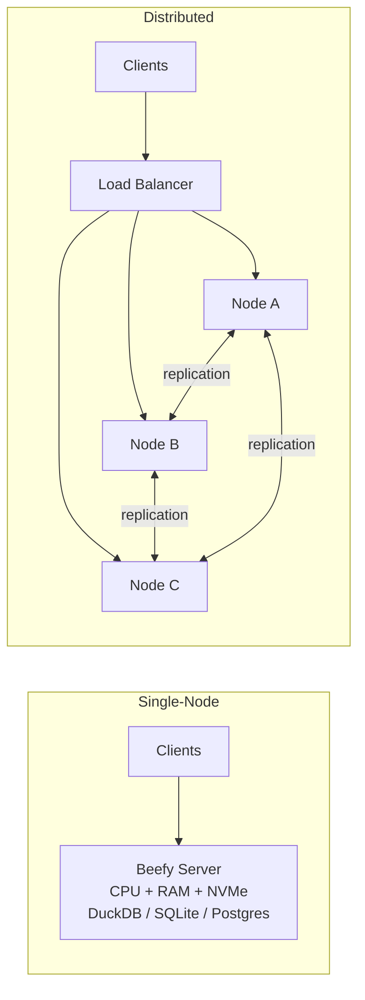

# Distributed vs Single-Node Systems

> **Go distributed only when the walls of a single machine — data volume, availability, latency, or legal geography — force you to; otherwise a beefy single node is simpler, cheaper, and faster.**

## How It Works

A *distributed system* is any system where multiple machines (*nodes*) cooperate over a network. A *single-node system* runs the whole workload — storage, compute, coordination — on one machine. The choice is not ideology; it is whether at least one concrete driver pushes you across the network boundary:

- **Inherent distribution** — Multi-user or multi-device apps (chat, collaboration, IoT) are distributed by definition; devices must talk over a network.
- **Cross-service requests** — Cloud native and microservice architectures split state across services, so every data access is a network hop.
- **Fault tolerance / high availability** — Redundancy across machines, racks, or datacenters lets the system survive node or power failures.
- **Scalability** — When data volume or QPS exceeds what one box can do, work is sharded across nodes.
- **Latency** — Users worldwide are served faster by regional replicas close to them.
- **Elasticity** — Spiky workloads benefit from scaling nodes up and down on demand rather than paying for peak capacity 24/7.
- **Specialized hardware** — Object stores want disks, analytics wants RAM, ML wants GPUs. Splitting workloads onto different machine types matches hardware to job.
- **Legal compliance** — Data residency laws (GDPR, country-specific) require storing or processing data inside a given jurisdiction, which often forces geographic distribution.
- **Sustainability** — Flexibility to run jobs where/when renewable power is cheap and abundant.

Meanwhile, modern single nodes are *much* more capable than most teams assume. A single server with hundreds of GB of RAM, NVMe SSDs, and dozens of cores, paired with an embedded engine like **DuckDB**, **SQLite**, or **KùzuDB**, handles workloads that would have required a cluster a decade ago. A simple single-threaded program can beat a 100-core cluster when the data already lives on that machine.

## When to Use

**Go distributed when:**

- Data will not fit — or will not stay fit — on the largest single machine you can buy.
- Downtime is unacceptable: you need redundancy across machines, racks, or regions.
- Users are geographically spread and latency matters (tens of ms budget).
- Compliance requires data to live in specific jurisdictions.
- Load is spiky and elasticity meaningfully reduces cost.

**Stay single-node when:**

- Working data fits in RAM or on one SSD (increasingly often true at ~TB scale).
- The team is small and operational simplicity is worth more than headroom.
- The workload is an embedded or batch-analytics use case (DuckDB over a parquet dataset, SQLite in a mobile app).
- Predictable performance matters more than horizontal scalability — no tail latency from cross-node calls.

## Trade-offs

| Aspect | Single-Node | Distributed |
|---|---|---|
| Simplicity | One process, one failure domain, easy mental model | Many moving parts, orchestration, discovery |
| Failure modes | Node up or down — binary | Partial failures, split-brain, slow nodes, network partitions |
| Scaling ceiling | Bounded by largest available hardware | Effectively unbounded with right sharding |
| Cost | Low at small scale; large boxes get expensive fast | Low *per-node* but pays for redundancy and network |
| Ops overhead | Backups and a monitoring dashboard | Coordination, rolling deploys, config management, capacity planning |
| Consistency | Trivial — one copy of the truth | Requires replication protocols, transactions, or app-level reconciliation |
| Debugging | Local logs, single process | Distributed tracing required; causality is hard |
| Latency | Function-call latency within the process | Network latency on every cross-node call, plus tail-latency amplification |

## Real-World Examples

- **DuckDB** — Columnar analytics over GBs–TBs on a single laptop or server; often replaces a Spark cluster for medium data.
- **SQLite** — Embedded database powering phones, browsers, and many production web apps at non-trivial scale.
- **Postgres on a large instance** — Vertical scaling with read replicas handles an enormous fraction of SaaS workloads.
- **Apache Cassandra / ScyllaDB** — Distributed wide-column stores chosen for linear write scale and multi-region availability.
- **Google Spanner / CockroachDB** — Globally distributed SQL with strong consistency via synchronized clocks or consensus.
- **Apache Kafka** — Distributed log for high-throughput event streaming with partition-level parallelism.
- **Elasticsearch** — Distributed search and analytics, sharded indexes across nodes.
- **HPC / Supercomputing** — A different distribution model: tightly-coupled nodes using RDMA and specialized topologies for batch scientific workloads (weather, molecular dynamics). Trusts the network, checkpoints rather than replicates.

## Common Pitfalls

- **Premature distribution** — Starting with microservices or a cluster "for scale" that never arrives, paying all the complexity cost up front while a single Postgres box would have served fine for years.
- **Underestimating partial failure** — In a distributed system "failure" is not binary; slow nodes, dropped packets, and ambiguous request outcomes are the default, not the exception. Retries must be idempotent.
- **Ignoring network latency and bandwidth** — A function call is sub-microsecond; a cross-AZ RPC is roughly a million times slower. Chatty service meshes turn one user request into hundreds of serial hops.
- **Cross-service consistency** — Once each microservice owns its own database, atomic writes across services become the application's problem. Distributed transactions are rare and expensive; sagas and eventual consistency are the usual answers.
- **Observability gaps** — You cannot ssh into "the system." Invest early in distributed tracing (**OpenTelemetry**, **Jaeger**, **Zipkin**) and structured logs with correlation IDs — retrofitting these under an outage is painful.

## See Also

- [[05-separation-of-storage-and-compute]] — disaggregation is a specific form of distribution and makes single-node compute over remote data viable.
- [[07-microservices-and-serverless]] — the most common reason apps become distributed: organizational decomposition.
