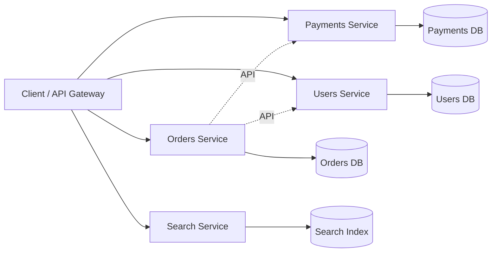

# Microservices and Serverless

> **Microservices decompose a system so teams can ship independently; serverless decomposes deployment so you pay only for the compute you actually use — both are organizational and economic patterns dressed in technical clothes.**

## How It Works

A service-oriented architecture (SOA) splits a system into processes that communicate over the network, usually via HTTP. A **microservices architecture** refines this idea: each service has one well-defined purpose (e.g., file storage, payments, search), exposes an API, owns its own data store, and is maintained by a single team. A complex application becomes a mesh of such services, each independently deployable.

The critical insight is that microservices are **primarily a technical solution to a people problem**: they let different teams make progress without coordinating every release. The decomposition buys *team autonomy*, not raw performance. Each service can be updated, scaled, and re-implemented behind its API without asking permission from anyone else. Giving each service its own database is essential — a shared database would leak internal schema into the public contract, coupling teams right back together.

**Serverless** (or Function-as-a-Service, FaaS) is the next step: instead of running VMs or containers you manage, you hand individual functions to a cloud provider, which allocates and frees hardware automatically in response to incoming requests. Just as cloud storage replaced capacity planning with metered billing, FaaS brings metered billing to compute — you pay only for the milliseconds your code actually runs. Data-plane services like BigQuery and hosted Kafka now also wear the "serverless" label, signalling autoscaling and usage-based pricing even when the unit is a query rather than a function.

## When to Use

- **Microservices** pay off when you have *many teams* that need to deploy independently, when domains have clear bounded contexts, and when different services have genuinely different scaling or reliability profiles (e.g., a read-heavy catalog vs. a transactional checkout).
- **Serverless** shines for bursty or event-driven workloads, quick prototypes, glue code between services, and small ops teams that cannot afford to run a cluster 24/7. It also fits spiky data pipelines and webhook handlers.
- **A monolith is often the right answer** for small teams, tight domains, or early-stage products. Decomposition costs real money in infrastructure, observability, and cognitive load; don't pay it until the coordination cost of a monolith is higher.

## Trade-offs

| Aspect | Monolith | Microservices | Serverless / FaaS |
|--------|----------|---------------|-------------------|
| Team autonomy | Low — everyone shares one codebase | High — one team per service | High per-function, but cloud provider owns the platform |
| Deploy independence | One deploy affects everyone | Each service ships on its own cadence | Each function ships on its own cadence |
| Cross-service consistency | Easy — one DB, ACID transactions | Hard — no distributed transactions by default | Hard — plus ephemeral runtime state |
| Testing complexity | Low — run the app locally | High — must stub or spin up many collaborators | Medium — but hard to reproduce cloud wiring locally |
| Infra overhead | One runtime, one DB | N runtimes, N DBs, orchestration (e.g. Kubernetes), service mesh | None for servers; high for observability/glue |
| Observability | Stack trace tells the whole story | Needs distributed tracing, structured logs, metrics per service | Same as microservices, plus short-lived processes |
| Cost model | Pay for always-on capacity | Pay for always-on capacity per service | Metered: pay per invocation / GB-second |
| Cold-start | N/A | N/A (long-lived processes) | Real — first invocation after idle can be slow |

## Real-World Examples

- **S3**: A microservice whose purpose is file storage. Other AWS services and external users call its API; its internals are free to evolve.
- **Stripe**: A platform built as a mesh of services (payments, billing, Radar, Connect, Issuing), each with its own data store and API surface.
- **AWS Lambda + API Gateway + DynamoDB**: The canonical serverless web backend — HTTP requests invoke functions, which read/write a managed NoSQL store, with no VMs to manage.
- **BigQuery / serverless Kafka**: Data-plane services that autoscale and bill per query or per byte, inheriting the serverless pricing model without exposing FaaS semantics.
- **Kubernetes**: The orchestration backbone that makes microservices practical on-premises and in the cloud — it provides the deployment, scheduling, and service-discovery primitives that microservices assume.

## Common Pitfalls

- **Distributed monolith**: services that must be deployed together because their APIs are tightly coupled. You pay every microservices cost and get none of the benefits.
- **Shared database across services**: turns the schema into a de-facto public API. Any migration requires cross-team coordination, and one service's heavy query can degrade everyone else.
- **Skipping observability**: without distributed tracing, structured logs, and per-service metrics, debugging a failed request across five hops is guesswork.
- **Cold-start surprises in serverless**: a dormant function can take hundreds of milliseconds to a few seconds on first invocation — fatal for latency-sensitive user paths.
- **Distributed transactions to paper over poor boundaries**: if you need two-phase commit between services, the seam is probably in the wrong place. Redraw the boundary instead.
- **Premature decomposition**: a three-engineer startup does not need seven services. Microservices exist to reduce coordination cost between *teams*; if you have one team, start with a monolith and split later when the seams are obvious.

## See Also

- [[04-cloud-vs-self-hosting]] — serverless is the extreme end of the "let the vendor run it" spectrum
- [[06-distributed-vs-single-node-systems]] — microservices make your architecture distributed whether you wanted it or not
