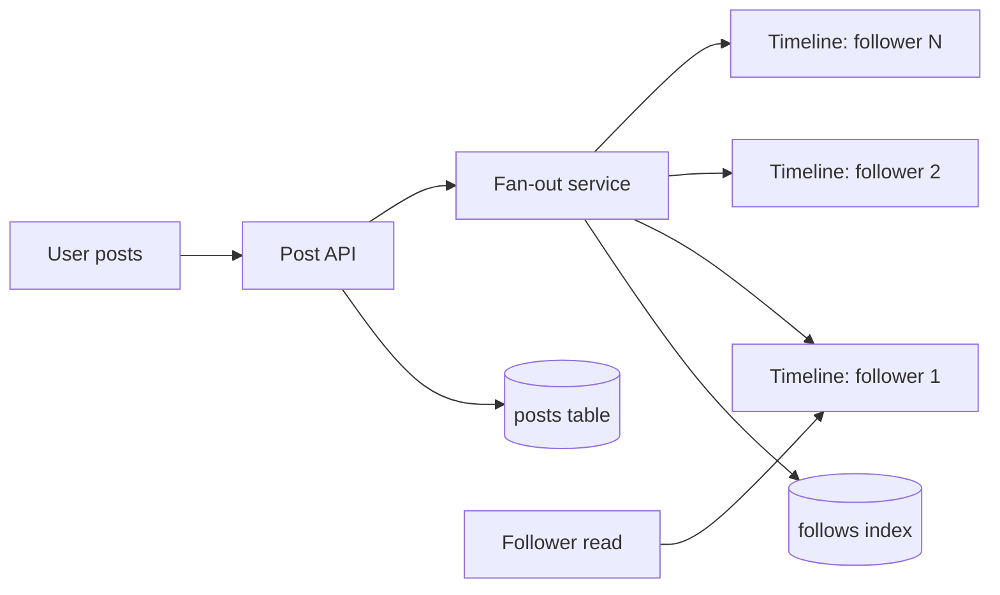

# Social Network Home Timelines: Fan-Out Trade-Off

> **One-sentence summary.** Serving a Twitter-style home timeline forces a choice between querying on read (cheap writes, expensive reads) and fanning out to precomputed per-follower timelines on write (cheap reads, expensive writes) — with celebrities breaking the model and demanding a hybrid.

## The Workload

A simplified X/Twitter-scale service:

- **500M posts/day** → 5,800 posts/s average, spiking to **150,000 posts/s** during special events.
- **10M concurrently online users**, each wanting new posts within 5 seconds.
- **Fan-out factor ~200**: the average user follows 200 accounts and has 200 followers (power-law distribution — most users have a handful; celebrities have >100M).

Two metrics dominate: **read volume** (timeline loads per second) and **write fan-out** (per-post downstream work). Different designs shift cost between them.

## How It Works

### Approach 1 — Pull model (query on read)

Store `users`, `posts`, and `follows` in a relational schema and compute the timeline at request time:

```sql
SELECT posts.*, users.*
FROM posts
JOIN follows ON posts.sender_id = follows.followee_id
JOIN users   ON posts.sender_id = users.id
WHERE follows.follower_id = current_user
ORDER BY posts.timestamp DESC
LIMIT 1000;
```

Writes are trivial (insert one post row). Reads are brutal. With 10M online users polling every 5s → **2M queries/s**, and each query touches ~200 followed accounts → **~400M lookups/s**. Users following tens of thousands of accounts blow past the average by orders of magnitude.

### Approach 2 — Push model (materialized timelines, fan-out on write)

Maintain a per-user **home-timeline cache**. On each post, look up the author's followers and append the post into every follower's timeline — "delivering a mailbox." Reads become a single lookup into the materialized view; a client can subscribe to its own timeline stream for push notifications.

Writes now cost: 5,800 posts/s × 200 followers = **~1.16M timeline writes/s**. That's ~345x cheaper than 400M lookups/s, and during 150K/s post spikes the deliveries can be enqueued — readers still see instant timelines served from cache while the queue drains.



### Approach 3 — Hybrid (celebrity merge-at-read)

A post by a 100M-follower celebrity would trigger 100M timeline writes. Two outlier classes break the pure push model:

- **High-follow inactive users**: a user who follows 50K noisy accounts racks up a huge timeline-write rate but barely reads. *Drop some of their timeline writes* — show a sampled feed. Acceptable.
- **Celebrity authors**: dropping their writes is *not* acceptable (followers expect them). Instead, store celebrity posts in a separate table and **merge them with the materialized timeline at read time**. The hot-but-small celebrity set stays in memory; the cold long tail stays pre-materialized.

## Trade-offs

| Approach | Read cost | Write cost | Freshness | Celebrity handling |
|----------|-----------|------------|-----------|--------------------|
| **Pull** (query on read) | ~400M lookups/s — crushing | Trivial (1 insert) | Bounded by poll interval (e.g., 5s) | No special case — but reads for users following celebs are slow |
| **Push** (fan-out on write) | O(1) cache read — fast | ~1.16M writes/s avg; fan-out × post rate | Bounded by fan-out queue lag; can defer under spikes | Explodes: 100M writes per celebrity post |
| **Hybrid** (push + merge) | O(1) + small merge of K celebs followed | ~1M writes/s + separate celeb store | Same as push for regulars; read-time merge adds latency | Celebrities bypass fan-out; merged at read |

The core insight: **materialization trades write amplification for read latency**. The timeline cache is a *materialized view*, and picking the right approach means knowing your read:write ratio and the tail of your fan-out distribution.

## When to Use

- **Pull** when writes are frequent, reads are rare, or fan-out is small and bounded (small group chats, team feeds).
- **Push / fan-out** when reads vastly outnumber writes, timelines are latency-sensitive, and fan-out is bounded in the common case (consumer social feeds).
- **Hybrid** whenever the fan-out distribution has a heavy tail — a few producers with many consumers. Social, pub/sub, notifications.

## Real-World Examples

- **Twitter/X** famously switched from pull to a push-based fan-out with a celebrity-merge hybrid. Sources [1, 2, 4] in the chapter are Twitter engineering talks describing this evolution; [6] notes that at one point ~3% of Twitter's servers were dedicated to handling a single celebrity's fan-out.
- **Bluesky** uses **lossy timelines** [5] — deliberately dropping writes for users with pathological follow graphs rather than paying the full cost.
- **Instagram / Facebook News Feed** use similar materialization with ranking layered on top; celebrity/page content is merged at read time.

## Common Pitfalls

- **Planning for averages, ignoring the tail.** Fan-out = 200 is the mean; the p99 follower user drives infrastructure sizing. Design for the distribution, not the headline.
- **Synchronous fan-out on the write path.** Doing 200 timeline writes inside the post API call couples post latency to the slowest follower shard. Enqueue and deliver asynchronously — a 150K/s spike should queue, not page.
- **No backpressure on fan-out.** Spikes cascade into retry storms and queue blowup; see [[03-metastable-failure-and-overload-control]] for why unbounded queues become metastable failure modes.
- **Forgetting the exactly-once requirement.** If a fan-out worker crashes mid-delivery, posts must not be lost or duplicated — idempotent deliveries with offset tracking are non-negotiable.
- **Using an average response time to declare success.** The home-timeline fan-out has a long tail; means hide it. See [[02-response-time-percentiles-and-tail-latency]].

## See Also

- [[02-response-time-percentiles-and-tail-latency]] — the case study's load numbers (2M queries/s, 150K/s spikes) motivate why we measure p95/p99/p999 instead of averages.
- [[03-metastable-failure-and-overload-control]] — 150K/s post spikes and 1M+ writes/s fan-out need queueing, backpressure, and load shedding to avoid vicious-cycle collapse.
- [[05-scaling-architectures-shared-nothing]] — materialized timelines are naturally sharded per user, a canonical shared-nothing workload.
