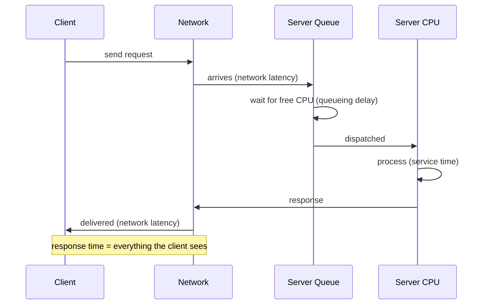
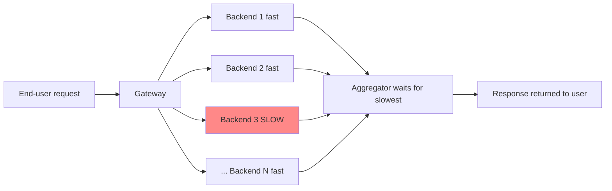

# Response Time, Percentiles, and Tail Latency

> **One-sentence summary.** Response time is a *distribution*, not a number; measure it with percentiles (p50/p95/p99/p999) because means hide the tail, and a single slow backend can drag an entire fan-out request down with it.

## How It Works

When a client issues a request, several distinct clocks are ticking. The **response time** is the total wall-clock duration the client observes — it includes everything that happens between "send" and "receive." Inside that number sit **network latency** (bytes traveling the wire), **queueing delay** (waiting for a CPU core, a buffer, or an I/O slot), and **service time** (the server actively computing the answer). Only service time is doing useful work; the rest is latent waiting, and it is usually the dominant source of variability. Queueing delay in particular is *not* part of service time, which is why response time must be measured on the client side to catch it.

Run the same request a thousand times and you will not get the same number back. Context switches, TCP retransmits, garbage-collection pauses, page faults forcing a disk read, even mechanical vibrations in the server rack — any of these can inject a random delay. The resulting response-time distribution is roughly log-normal with a long right tail: most requests are fast, a handful are very slow. That is why summarizing it with a single mean is misleading — the arithmetic mean tells you nothing about how many users actually experienced that delay, and a few slow outliers can skew it upward or leave it deceptively low.

**Percentiles** summarize the distribution honestly. Sort all response times from fastest to slowest; the value at position *k%* is the *k*-th percentile. The median (p50) is the halfway point — half your users waited less, half waited more. The high percentiles (p95, p99, p999) are the **tail latencies**: the experience of your unluckiest few. When p95 = 1.5s, five out of every hundred requests took *at least* 1.5 seconds.

## When to Use

- **Setting performance targets.** Define service-level objectives (SLOs) in terms of percentiles: "p50 < 200 ms AND p99 < 1 s AND ≥ 99.9% non-error." The SLA is the contract — miss the SLO and customers get a refund.
- **Monitoring a live service.** Emit p50/p95/p99 per minute to dashboards so you can see the tail moving even when the mean looks fine.
- **Capacity planning under fan-out.** Any request that contacts many backends in parallel is gated by the *slowest* child, so the tail of the children becomes the body of the parent.

## The Amazon p999 Anecdote

Amazon specifies internal service response-time requirements at the **99.9th percentile** — one in a thousand requests. Why care about such a rare event? Because the customers whose requests are slowest are often the ones with the most data — they have been buying from Amazon for years and have the biggest order histories and richest accounts. In other words, the tail is disproportionately populated by the *most valuable* customers. Keeping the website fast for them is worth the engineering cost.

Amazon deliberately stops at p999 and does not chase p9999. The 1-in-10,000 percentile is dominated by random events no application can control (kernel scheduling jitter, rare hardware stalls) and the signal-to-noise ratio is too poor to optimize against. The benefits are diminishing; the cost is not.

## Tail-Latency Amplification

If serving one end-user request requires *N* parallel calls to backends and each call independently has a probability *p* of being slow, the probability that the whole request is slow is:

> **P(slow request) = 1 − (1 − p)^N**

Concrete numbers: if each backend has p99 = 1% (so *p* = 0.01) and the gateway fans out to N = 100 backends, the chance the user sees a slow response is **1 − 0.99^100 ≈ 63%**. What was a rare event at one backend is now the *common case* end-to-end. This is **tail-latency amplification**, and it is why high percentiles at the leaves dominate the perceived performance of any system with significant fan-out — see [[01-social-network-timeline-case-study]], where loading a home timeline can touch hundreds of servers.

## Percentile Cheat Sheet

| Percentile | Meaning | Typical Use |
|------------|---------|-------------|
| p50 (median) | Half of requests are faster, half slower | "Typical" user experience |
| p95 | 5 in 100 requests are at or above this | SLO floor for user-facing latency |
| p99 | 1 in 100 requests | Common SLO target; exposes queueing |
| p999 | 1 in 1,000 requests | Amazon-style target; catches your most loyal users |
| p9999 | 1 in 10,000 requests | Usually too noisy/expensive to optimize |
| mean | Arithmetic average | Estimating throughput limits only — never "typical latency" |

## Trade-offs

| Aspect | Advantage | Disadvantage |
|--------|-----------|--------------|
| Percentiles over mean | Reveals tail users and outliers | Harder to compute incrementally; cannot be averaged |
| Higher percentile targets (p999 vs p99) | Protects most valuable, heaviest users | Each extra 9 is exponentially harder and noisier to move |
| Client-side measurement | Captures queueing and network delay | Harder to attribute to a specific server |
| Approximate sketches (HdrHistogram, t-digest) | O(1) memory, mergeable | Bounded relative error; pick one that matches your range |

## Computing Percentiles Cheaply

Keeping every raw response time and sorting once a minute works for tiny services and falls over at scale. Streaming percentile-estimation libraries give bounded memory and mergeable state:

- **HdrHistogram** — fixed-precision logarithmic buckets; fast, tiny, ideal for latency ranges.
- **t-digest** — relative-error quantile sketch; excellent tail accuracy.
- **DDSketch** — relative-error guarantees and fully mergeable across shards.
- **OpenHistogram** — log-linear histograms used at scale in observability pipelines.

**Critical rule:** **averaging percentiles is mathematically meaningless.** The mean of "the p99 of host A" and "the p99 of host B" is *not* the p99 across both hosts — it is a number with no statistical interpretation. To combine percentiles across machines or time buckets, **add the underlying histograms and recompute** the percentile from the merged distribution. This is exactly why sketches like t-digest and DDSketch are designed to be mergeable.

## Common Pitfalls

- **Reporting only the mean.** Hides the tail entirely; a healthy-looking 120 ms mean can sit on top of a 4 s p99.
- **Measuring response time on the server.** Misses queueing before the request ever reached the handler, and misses head-of-line blocking behind earlier slow requests.
- **Averaging p99s across shards or minutes.** Silently wrong. Store histograms, aggregate histograms, then extract percentiles.
- **Setting an SLO at p9999.** Noise dominates signal; you will spend engineering budget chasing random-event jitter.
- **Ignoring fan-out amplification.** Optimizing a single backend's p99 to 1% feels great until you remember the gateway talks to 100 of them.

## See Also

- [[01-social-network-timeline-case-study]] — timelines have concrete response-time budgets ("within 5 seconds" of a post) that translate directly into percentile SLOs.
- [[03-metastable-failure-and-overload-control]] — queueing is where the tail comes from, and unbounded queues + retries produce the retry storms that keep systems wedged in a bad state.
- [[04-reliability-and-fault-tolerance]] — availability SLOs ("99.9% of requests succeed") are the reliability counterpart to latency SLOs; together they define "working correctly."
