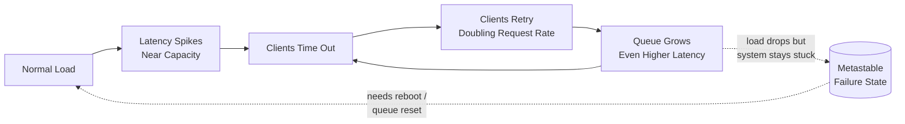

# Metastable Failure and Overload Control

> **One-sentence summary.** When a system is pushed near its capacity, clients timing out and retrying can create a self-sustaining retry storm that keeps the system broken even after the original load subsides — defenses must blunt the feedback loop on both sides of the wire.

## How It Works

Every queueing system has a *knee* in its throughput-vs-response-time curve. While utilization is moderate, latency is roughly flat: a request arrives, finds a free worker, gets served. As arrival rate approaches service rate, queues build up, and (by Little's Law and M/M/1 intuition) response time grows non-linearly — a small bump in traffic produces a huge bump in latency. This queueing delay is the dominant source of the tail latency discussed in [[02-response-time-percentiles-and-tail-latency]].

The dangerous part is what happens next. When latency spikes above the client timeout, clients assume the request failed and *retry*. Each retry adds to the arrival rate, which makes the queue longer, which makes latency worse, which causes more timeouts. The system has now crossed from "overloaded" into a second stable state: even if real user traffic drops back to normal, the pipeline is full of retries keeping it saturated. This is a **metastable failure** — recovery typically requires rebooting, resetting queues, or dropping every in-flight request, not just waiting for load to fall.

The escape requires cutting the loop in at least one place: either clients stop retrying so aggressively, or the server stops accepting work it can't finish in time.

## When to Use

Apply overload-control patterns whenever a service:

- **Has a bounded resource** (CPU cores, DB connections, thread pool) and clients that retry on failure — which is essentially every RPC-based system.
- **Fans out to downstream dependencies**, so one slow backend can poison many upstream callers who then retry (amplifying the storm).
- **Has bursty or unpredictable traffic** — launch events, viral content, cron jobs firing on the hour, or cascading retries from another system.

## Defenses: Client-Side vs Server-Side

| Defense | Where it lives | What it prevents | Downside |
|---|---|---|---|
| **Exponential backoff + jitter** | Client | Synchronized retry bursts; doubles wait between attempts, randomizes to avoid thundering herd | Worst-case latency grows; poorly tuned jitter still leaves correlation |
| **Circuit breaker** | Client | Pounding a service that is already failing — flips "open" after N failures, stops sending traffic for a cooldown window | Can over-trip on transient blips; needs probing/half-open state to recover |
| **Token bucket (rate limit)** | Client | Hard ceiling on request rate even under panic; smooths bursts into steady flow | Must be tuned; legitimate spikes get throttled alongside runaway code |
| **Load shedding** | Server | Overload itself — server proactively 503s requests it predicts it can't finish in SLO | Users see errors instead of slowness; need shedding priority (drop low-value first) |
| **Backpressure** | Server | Upstream flooding the queue — signals "slow down" via TCP window, gRPC flow control, or explicit 429 | Requires cooperative clients; async clients may keep enqueueing locally |
| **Queue discipline / LB choice** | Server + LB | Head-of-line blocking and poor fairness — LIFO, CoDel, or join-shortest-queue instead of FIFO | More complex; some policies (LIFO) starve old requests |

The key insight: **client-side defenses reduce the *cause* of the storm (retries), server-side defenses reduce the *effect* (queue buildup)**. You want both. A circuit breaker alone won't save you if a poorly-written client ignores it; load shedding alone won't help if the server politely returns errors and the client immediately retries 10 more times.

## Real-World Examples

- **Linux kernel leap-second bug (June 30, 2012)**: Adding a leap second triggered a kernel bug that caused many Java applications to hang simultaneously. The correlated hang of thousands of services across the internet generated massive retry traffic to dependent services — a textbook metastable scenario rooted in a software fault that violates the usual independence assumption of hardware failures.
- **Halo 4 launch ("Clients Are Jerks")**: When Halo 4 launched, the game client aggressively retried on any backend error, and the services nearly DoS'd themselves because each user-visible failure translated into a burst of client-side retries. The fix involved making clients less jerky (backoff, circuit breakers) and making servers shed load earlier.
- **AWS 2015 DynamoDB outage**: Metadata service slowed, storage nodes retried health checks, retries overloaded metadata further — classic metastable loop that only broke when engineers manually throttled clients.

## Common Pitfalls

- **Naive retry = DoSing yourself.** "Retry 3 times on failure" sounds harmless until every one of 100k clients does it against a struggling backend simultaneously. Always pair retries with backoff, jitter, and a global rate cap.
- **Retries at every layer of the stack.** If the load balancer retries, the RPC library retries, and the application retries, a single slow request can generate 27 retries. Pick *one* layer to own retries.
- **Long timeouts hide the problem.** Very long timeouts let queues grow unboundedly, turning transient overload into metastable failure. Set timeouts based on the P99 SLO, not the worst case.
- **No distinction between retryable and non-retryable errors.** Retrying a 400 Bad Request is pure waste. Only retry on signals that suggest transient overload (503, connection refused, timeout).
- **Forgetting that load shedding needs priority.** If you shed randomly you drop paying customers' requests. Shed by tier: health checks > paid users > free users > background jobs.

## See Also

- [[02-response-time-percentiles-and-tail-latency]] — queueing near capacity is the engine that generates tail latency; overload control is the mitigation.
- [[04-reliability-and-fault-tolerance]] — a retry storm is a kind of systemic, correlated software fault; reliability engineering must assume overload happens and design for it.
- [[05-scaling-architectures-shared-nothing]] — horizontal scaling moves the knee of the curve further out, but does not eliminate metastable behavior; each node still needs its own overload controls.
