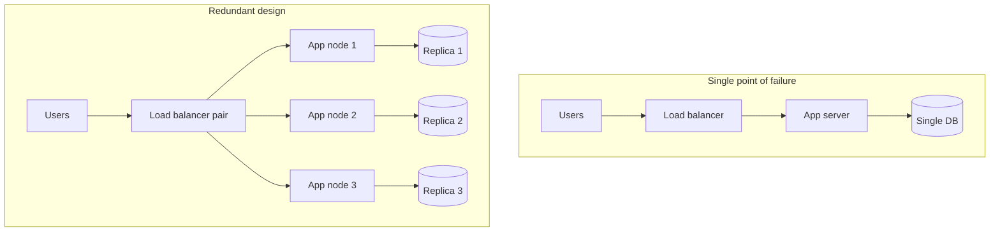
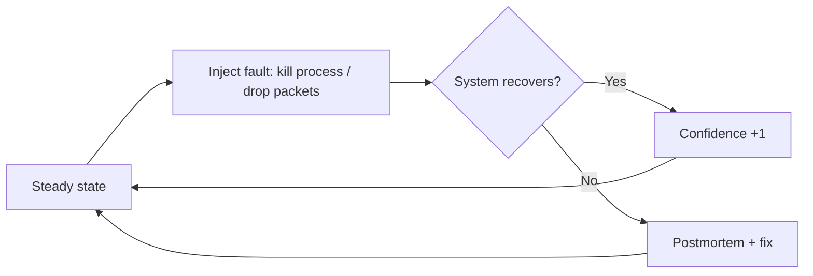

# Reliability: Faults, Failures, and Fault Tolerance

> **One-sentence summary.** Reliability is "continuing to work correctly, even when things go wrong" — achieved by distinguishing component *faults* from system *failures*, eliminating single points of failure, and budgeting tolerance for hardware, correlated software, and human faults.

## How It Works

A system is **reliable** when it keeps meeting its service-level objective despite parts breaking, users doing unexpected things, and operators making mistakes. The key vocabulary separates two levels of "something went wrong":

- **Fault** — a *part* stops working correctly (a hard drive dies, a pod crashes, an upstream API returns 500).
- **Failure** — the system *as a whole* stops providing the required service to users (i.e., misses its SLO).

The same event can be a fault at one level and a failure at another. A dead hard drive is a *failure* of the drive; if it's one of three mirrored drives, the system treats it as a mere *fault* and keeps serving. A component without redundancy whose fault automatically becomes a system failure is a **single point of failure (SPOF)**.

A system is **fault-tolerant** when it continues serving users despite *certain* faults — note the "certain". Fault tolerance is always bounded: "up to two disks failing" or "one of three nodes crashing". No system can tolerate arbitrarily many faults; if the planet Earth (and every server on it) were swallowed by a black hole, surviving would require hosting in space — good luck getting that line item approved. Designing for reliability therefore means choosing a fault budget and engineering against it.

Counter-intuitively, the best way to *verify* fault tolerance is to *increase* the fault rate on purpose — **fault injection** and **chaos engineering** deliberately kill processes, sever network links, and throttle disks so the recovery paths are exercised in production before a real outage triggers them for the first time.

## When to Use

- **Large-scale systems** where hardware faults are no longer rare events but part of normal operation — a 10,000-disk cluster sees roughly one disk failure per day.
- **Services with a tight SLO** where downtime or data loss has direct financial, reputational, or legal consequences (e-commerce, payments, health records, accounting).
- **Multi-tenant platforms** where one noisy bug or runaway process can cascade across customers unless isolation and backpressure are explicit.

## The Three Classes of Fault

| Class | Typical frequency | Correlation | Primary mitigation |
|---|---|---|---|
| **Hardware** | HDD 2–5%/yr, SSD 0.5–1%/yr, 1/1000 CPUs silently wrong, >1% machines/yr hit uncorrectable ECC, datacenter loss rare but catastrophic | Mostly independent (but rack/datacenter-level correlation exists) | Component redundancy (RAID, dual PSUs, hot-swap, batteries, generators) + geographic distribution across availability zones |
| **Software** | Rare triggers, huge blast radius when they fire | **Highly correlated** — every node runs the same buggy code | Process isolation, crash-restart, property testing, staged rollouts, avoiding retry storms, observability |
| **Human** | Configuration changes are the *leading* cause of outages in one study (hardware was only 10–25%) | Correlated with deploys, on-call handoffs, time pressure | Good interfaces, sandboxes, rollback buttons, gradual rollouts, blameless postmortems |

### Hardware faults

Individual components fail at knowable rates. Magnetic disks fail 2–5% per year; SSDs 0.5–1% per year but suffer an uncorrectable bit error roughly once per drive per year. About 1 in 1,000 machines has a CPU core that silently computes wrong answers. Even with ECC memory, more than 1% of machines hit an uncorrectable error in a given year, and pathological access patterns (**rowhammer**) can flip neighbouring bits on purpose. Entire datacenters can vanish from fire, flood, earthquake, or a solar storm inducing currents in long-distance cables. The classic response is **redundancy**: RAID arrays, dual power supplies, hot-swappable CPUs, on-site batteries and diesel generators. Redundancy works best when faults are independent — but experience shows more correlation than we'd like (whole-rack and whole-datacenter failures do happen), which is why modern cloud systems *also* tolerate the loss of an entire availability zone at the software layer.

### Software faults

Because every node tends to run the same code, a software bug fires on every node at once. Canonical examples:

- **Linux kernel leap-second bug (June 30, 2012)** — a leap second caused many Java applications to hang simultaneously, taking down several internet services.
- **SSD 32,768-hour firmware bug** — certain SSD models fail after exactly 32,768 hours (~3.7 years), rendering data unrecoverable, on *every* drive of that model at roughly the same wall-clock time.
- **Runaway processes** consuming shared resources (CPU, memory, threads, file descriptors).
- **Emergent interactions** between services that pass isolated tests but misbehave when composed.
- **Cascading failures**, where one slow component overloads its upstream, which overloads *its* upstream — tightly related to [[03-metastable-failure-and-overload-control]].

These bugs tend to lie dormant until an unusual circumstance invalidates an assumption the code was silently making about its environment. No quick fix — just many small disciplines: thorough testing, process isolation, crash-restart, avoiding retry storms, and relentless monitoring.

### Human faults

Configuration changes by operators were the leading cause of outages in one large study, while hardware played a role in only 10–25% of cases. The productive response is not to scapegoat the human — "human error" is a symptom of a sociotechnical system, not a root cause — but to layer in defences: property testing on random inputs, rollback mechanisms, gradual rollouts and canaries, clear monitoring and observability, and interfaces that make the right thing easy and the wrong thing hard. Crucially, organisations should adopt **blameless postmortems** so that the people closest to an incident can share full details without fear, letting the whole organisation learn.

## Trade-offs

| Aspect | Advantage | Disadvantage |
|---|---|---|
| **Prevention vs tolerance** | Prevention (e.g., for security breaches) avoids irreversible damage | Most faults can't be prevented; investing only in prevention leaves you brittle when the inevitable happens |
| **Redundancy** | Masks independent component faults, enables rolling upgrades without downtime | Costs 2×–3× hardware; doesn't help against correlated software bugs or datacenter-wide events |
| **Fault injection / chaos engineering** | Recovery paths stay exercised; real outages reveal fewer surprises | Requires organisational maturity; injecting faults in production feels scary until it's normal |
| **Automation of operator tasks** | Removes error-prone manual steps | Misconfigured automation can fail *faster and wider* than a human ever could |
| **Blameless postmortem culture** | Generates honest learning and systemic fixes | Requires sustained management commitment; easy to backslide under pressure |

## Real-World Examples

- **Post Office Horizon scandal (UK, 1999–2019)** — bugs in the Post Office's accounting software reported phantom shortfalls in branch accounts. Hundreds of sub-postmasters were convicted of theft or fraud; the sociotechnical failure included an English legal presumption that computers operate correctly unless proven otherwise. Many convictions were later overturned. A stark reminder that "unreliable software" isn't an abstract concern — it ruins lives.
- **Netflix Chaos Monkey** — pioneered chaos engineering by randomly terminating EC2 instances in production, forcing every service to be built to survive instance loss from day one.
- **Cloud availability zones** — providers explicitly label which resources are physically co-located so that users can spread replicas across independent failure domains, trading a bit of latency for tolerance of whole-datacenter loss (see [[05-scaling-architectures-shared-nothing]]).
- **Rolling upgrades** — multi-node fault-tolerant systems let operators reboot one node at a time for OS patches without user-visible downtime, an operational dividend of designing for tolerance.

## Common Pitfalls

- **Treating fault tolerance as unbounded.** Every design tolerates *N* faults, not *N+1*. Be explicit about which faults are in scope (one disk, one AZ) and which aren't (all of Earth, all copies of the same firmware bug).
- **Assuming hardware faults are independent.** Whole racks share power and top-of-rack switches; whole datacenters share a city's grid. Correlated failures happen more than naive math suggests.
- **Ignoring correlated software faults.** Buying more replicas doesn't help if they all run the same buggy build. Staged rollouts and canaries matter because they *create* independence in time.
- **Punishing "human error".** Blaming the operator who ran the bad command skips the actual fix — the interface, the missing guardrail, the organisational priority that traded tests for features.
- **Skipping fault-injection drills.** Code paths that only run during rare failures rot. If you haven't exercised failover this quarter, you don't have failover — you have a plan.
- **Conflating reliability with reliability of a single machine.** Very-high-uptime individual machines still add up to a system-level SPOF if that machine is the only one.

## See Also

- [[03-metastable-failure-and-overload-control]] — how overload and retry storms turn a transient fault into a sustained system failure.
- [[05-scaling-architectures-shared-nothing]] — distributed shared-nothing architectures are the structural answer to tolerating whole-machine, whole-rack, and whole-datacenter faults.
- [[06-maintainability-operability-simplicity-evolvability]] — reliability isn't a one-time property; operability, simplicity, and evolvability keep it alive as the system changes.
