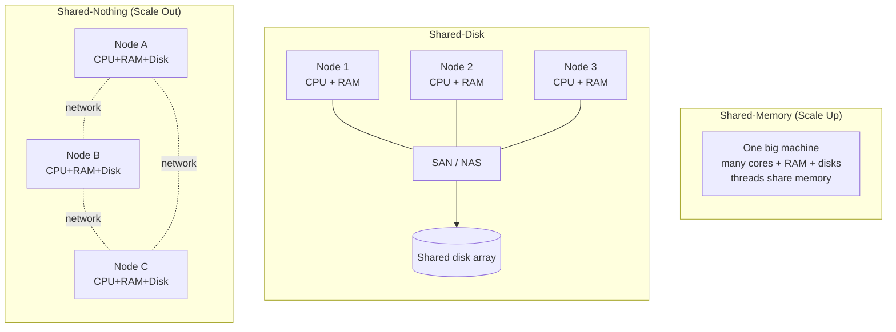
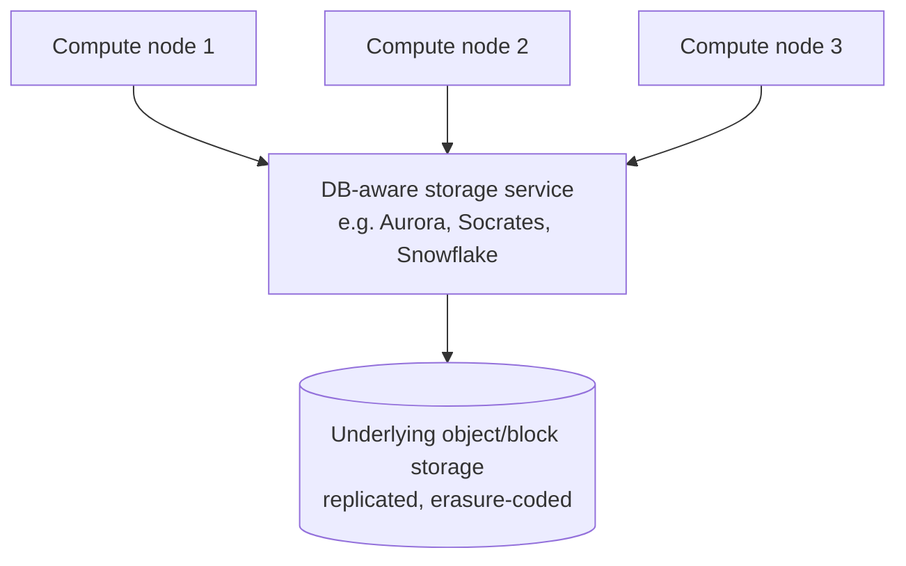

# Shared-Memory, Shared-Disk, and Shared-Nothing Architectures

> **One-sentence summary.** There are three fundamental ways to add capacity — scale up on one big box (shared-memory), cluster several boxes over a shared storage array (shared-disk), or scale out with independent nodes coordinating over the network (shared-nothing) — and each makes a different bet on cost, fault tolerance, and complexity.

## Scalability Is Not a Label

Scalability is a system's ability to cope with **increased load**. It is *not* a one-dimensional property — saying "X is scalable" means nothing on its own. The useful question is always: *"if load dimension Y grows by Z, what are our options?"*

**Understanding load** comes first. For the social-network workload (see [[01-social-network-timeline-case-study]]) the relevant metrics are:

- **Throughput**: posts/s, timeline loads/s, GB/day ingested.
- **Peak vs average**: a 150,000 posts/s spike is a very different system than the 5,800 posts/s average.
- **Read/write ratio**: dictates whether to optimize the write path or the read path.
- **Cache hit rate**: changes the effective database load by an order of magnitude.
- **Data-per-user distribution**: the *followers* count in the case study — a power-law input that breaks naive designs at the tail.

Only once load is quantified does "2× the load" have a defined meaning. **Linear scalability** means 2× the resources absorbs 2× the load at the same performance; in practice most systems are worse than linear because of coordination overhead, queueing, and skew.

## The Three Architectures

### Shared-memory (vertical scaling / scaling up)

A single machine with more cores, more RAM, more disks. All threads in a process share the same address space, so coordination is cheap and programming is familiar.

- **Cost grows super-linearly.** A box with 2× the specs costs much more than 2× a commodity box; a 4-socket server is dramatically pricier than four 1-socket servers.
- **Hard ceiling.** Single-machine bottlenecks — memory bandwidth, NUMA effects, a single NIC, one power supply, one failure domain — cap what you can ever do, no matter the budget.
- **Single point of failure.** If the machine goes, the service goes.

### Shared-disk

Multiple compute nodes, each with independent CPU and RAM, but all talking to a **shared storage array** over a fast network — typically NAS (file semantics) or SAN (block semantics).

- Traditional home of **on-premises data warehouses**.
- Lets you add compute without re-sharding data — every node sees every row.
- **Lock contention and cache-coherence traffic** between nodes limit scalability; the storage fabric itself becomes the bottleneck.

### Shared-nothing (horizontal scaling / scaling out)

A distributed system of independent nodes, each with its own CPU, RAM, and disks. Coordination happens **at the software level**, over a conventional network.

- **Can scale close to linearly**, because adding a node adds all three resources.
- Uses **commodity hardware** — whatever has the best price/performance.
- **Elastic**: add and remove nodes as load changes, especially easy in the cloud.
- **Cross-datacenter fault tolerance**: spread the cluster across regions so no single site failure takes you down (links to [[04-reliability-and-fault-tolerance]]).
- **Downsides**: explicit **sharding** is required (Chapter 7), and you inherit the full complexity of distributed systems — partial failures, network partitions, consensus (Chapter 9).

### Cloud-native variant: separation of storage and compute

A modern hybrid. Multiple compute nodes share a **specialized, database-aware storage service** instead of a generic NAS/SAN volume.

It *looks* like shared-disk, but the storage tier exposes a DB-specific API (log shipping, page servers, remote redo), which sidesteps the lock-contention and coherence problems that held classic shared-disk back. Compute and storage scale independently.

## Comparison

| Aspect              | Shared-memory (scale up)    | Shared-disk                         | Shared-nothing (scale out)          |
|---------------------|-----------------------------|-------------------------------------|-------------------------------------|
| Cost curve          | Super-linear                | Super-linear beyond small clusters  | Near-linear on commodity HW         |
| Fault tolerance     | Single point of failure     | Storage is usually replicated; compute nodes can fail over | Nodes + datacenters independent; designed for partial failure |
| Coordination overhead | None (shared RAM)         | High (locks, cache coherence across SAN) | Explicit, in application/DB layer (sharding, replication) |
| Elasticity          | Poor — fixed machine size   | Limited — bounded by storage fabric | High — add/remove nodes dynamically |
| Programming model   | Simplest (threads)          | Moderate (clustered DB)             | Hardest (distributed systems)       |
| Typical examples    | Single Postgres/MySQL server on a big box | Oracle RAC, classic data warehouses | Cassandra, Spanner, Kafka, HDFS     |

## Principles for Scalability

DDIA distills these from a chapter's worth of caveats:

- **No magic scaling sauce.** Architecture is problem-specific. A system for 100,000 req/s × 1 kB is fundamentally different from 3 req/min × 2 GB, even at the same aggregate throughput.
- **Rethink at every order of magnitude.** An architecture that works at 10× your current load probably breaks at 100×. Don't plan more than one order of magnitude ahead — you'll guess wrong.
- **Decompose into independent pieces.** The unifying idea behind **microservices**, **sharding**, **stream processing**, and shared-nothing itself: break the problem into components that can be operated, scaled, and failed independently. The art is knowing *where* to draw the seams.
- **Simpler is better when it fits.** A single-machine Postgres that handles your load is preferable to a complicated distributed setup. Five services is simpler to run than fifty.
- **Autoscaling vs manual.** Autoscaling is great for bursty or unpredictable load. For **predictable** load, a manually scaled system often has fewer operational surprises — no autoscaler mis-reacting to a degenerate workload at 3 a.m. Good architectures are pragmatic mixtures.

## Real-World Examples

- **Amazon S3** — the canonical shared-nothing service. Partitioned across thousands of nodes; the "Surprising Scalability of Multitenancy" (Brooker, 2023) argument is that pooling many tenants actually smooths peak demand and makes scaling *easier*, not harder.
- **Amazon Aurora, Microsoft Socrates, Snowflake** — cloud-native storage/compute separation. DB-aware storage services let compute nodes scale elastically while keeping a single logical database.
- **Cassandra, DynamoDB, Kafka, HDFS** — classic shared-nothing systems where sharding is explicit and linear-ish scaling is the whole point.
- **Oracle RAC** — the best-known shared-disk relational database; still effective for moderate clusters, but rarely chosen for new internet-scale workloads.
- **A single beefy Postgres** — shared-memory, and still the right answer for the overwhelming majority of applications. Don't reach for a distributed system until you must.

## Common Pitfalls

- **Premature sharding.** Reaching for shared-nothing before you've measured your load often traps you in a design that is harder to change than a single-box DB would have been.
- **Confusing "add a replica" with "scale writes".** Read replicas help read throughput; write scaling needs actual partitioning.
- **Ignoring skew.** The power-law follower distribution from [[01-social-network-timeline-case-study]] is a great example — uniform sharding is useless if one shard holds a celebrity.
- **Betting that autoscaling will save you.** Autoscalers react to load, not to retry storms (see [[03-metastable-failure-and-overload-control]]). They can amplify failures as easily as absorb them.
- **Treating scale-up as "legacy".** A modern server with hundreds of cores and terabytes of RAM can outpace a small shared-nothing cluster — and is vastly simpler to reason about.

## See Also

- [[01-social-network-timeline-case-study]] — timeline fan-out is exactly a shared-nothing sharding problem in the wild.
- [[02-response-time-percentiles-and-tail-latency]] — the performance vocabulary any scaling discussion depends on.
- [[03-metastable-failure-and-overload-control]] — scaling out doesn't exempt you from overload dynamics; it changes the failure modes.
- [[04-reliability-and-fault-tolerance]] — shared-nothing is what makes cross-datacenter fault tolerance practical.
- [[06-maintainability-operability-simplicity-evolvability]] — the architecture you pick directly shapes how operable the system will be for years after launch.
