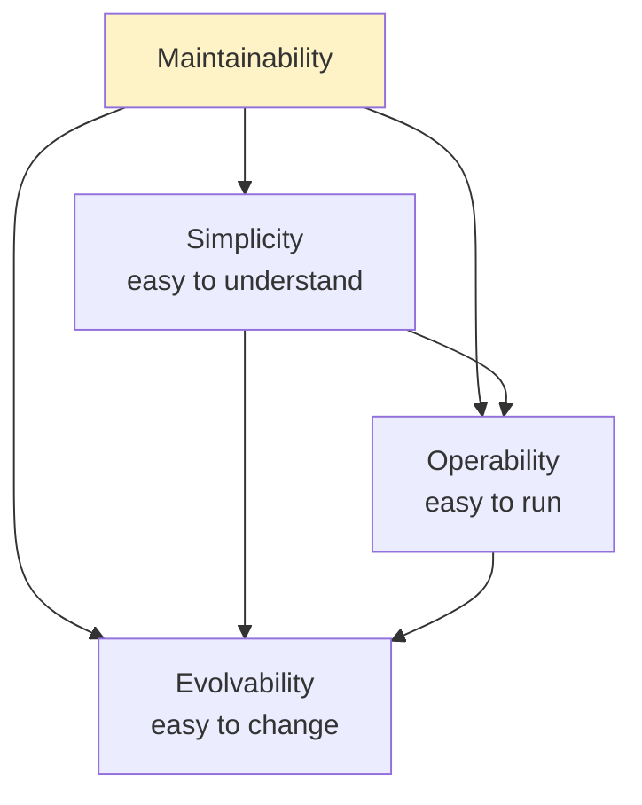

# Maintainability: Operability, Simplicity, Evolvability

> **One-sentence summary.** The majority of software cost is paid after launch, so design for three pillars — operability (easy to run), simplicity (easy to understand), and evolvability (easy to change) — because every valuable system eventually becomes someone else's legacy system.

## How It Works

Software doesn't wear out like metal, but its environment does. Dependencies shift, platforms change, laws change, bugs surface, and new use cases appear. The overwhelming majority of lifetime software cost is not the initial build — it's fixing bugs, keeping things running, investigating failures, adapting to new platforms, paying down technical debt, and shipping new features on top of aging foundations. Legacy systems compound this: original authors leave, outdated stacks (mainframes, COBOL) become rare skills, and institutional knowledge evaporates. Maintenance is as much a people problem as a technical one, because systems are intertwined with the organizations that run them.

DDIA frames maintainability as three reinforcing design principles:

Simplicity feeds evolvability (loosely coupled code is easier to modify) and operability (fewer surprises at 3 a.m.). Operability feeds evolvability too: strong monitoring and observability catch regressions from changes early, so teams can iterate without fear. Treat the three as a system, not a checklist — neglecting any one undermines the others.

**Key principle:** *Every system we create today will one day become a legacy system if it is valuable enough to survive for a long time.* Design with that inevitability in mind.

## The Three Pillars

### Operability — making life easy for operations

Human processes matter at least as much as tooling. The industry maxim: *"good operations can often work around the limitations of bad (or incomplete) software, but good software cannot run reliably with bad operations."* At the scale of thousands of machines, manual maintenance is infeasible, so automation is essential — but automation is a double-edged sword. Edge cases (rare failures) still demand human intervention, and the *residual* cases not handled automatically tend to be the hardest ones, so more automation actually requires a *more* skilled ops team. Automated systems that misbehave are also harder to troubleshoot than systems where an operator performs the action manually.

Data systems earn operability by:

- Exposing **monitoring and observability hooks** for runtime insight.
- **Avoiding per-machine dependencies** so any node can be drained for maintenance.
- Providing **good defaults with explicit overrides** for administrators.
- **Self-healing with manual escape hatches** — the operator can always take control.
- Good documentation and an intuitive operational model (*"if I do X, Y will happen"*).
- **Predictable behavior**, minimizing surprises.

See [[04-reliability-and-fault-tolerance]] — blameless postmortems and chaos engineering live at this operability/organizational layer.

### Simplicity — managing complexity

Small projects can be delightfully simple; as they grow they become a *big ball of mud*, and complexity slows everyone down and multiplies the risk of bugs when changes are made. A common framing splits complexity into **essential** (inherent to the problem domain) and **accidental** (caused by tooling limitations) — Brooks' *No Silver Bullet* distinction. The line between the two blurs as tools evolve: yesterday's essential complexity becomes accidental once someone builds a better abstraction.

**Abstraction** is the main lever. A good abstraction hides implementation detail behind a clean façade, is reusable across applications, and concentrates quality improvements where everyone benefits. Examples:

- **High-level languages** hide machine code, CPU registers, and system calls.
- **SQL** hides on-disk data structures, concurrency, and crash-recovery inconsistencies.

Methodologies like **design patterns** and **domain-driven design (DDD)** build application-specific abstractions on top of these. DDIA focuses on the layer below — general-purpose building blocks (transactions, indexes, event logs) that you can assemble into whatever DDD model your domain requires.

### Evolvability — making change easy

Requirements never stop moving: new use cases emerge, business priorities shift, platforms get replaced, laws change, growth forces re-architecture. Agile practices (TDD, refactoring) handle this at the team and codebase level; DDIA uses the word **evolvability** to describe the same property at the *system* level — across services with different characteristics and data stores. Evolvability is tightly coupled to simplicity and to the quality of your abstractions: loosely coupled, simple systems are easier to modify than tightly coupled complex ones.

**Irreversibility is the enemy of change.** Migrating databases where you can't roll back, schema changes you can't undo, or protocol breaks with deployed clients all raise the stakes of every decision. Minimize irreversibility — feature flags, dual writes, reversible migrations — and you buy back flexibility.

## Three Pillars at a Glance

| Pillar | Definition | Typical failure mode | Mitigations |
|---|---|---|---|
| **Operability** | Make it easy for the org to keep the system running | 3 a.m. pages no one knows how to debug; hidden per-machine state; automated magic that fails opaquely | Monitoring/observability hooks, predictable behavior, good defaults with overrides, runbooks, self-healing with manual override |
| **Simplicity** | Make it easy for new engineers to understand | Big ball of mud; hidden assumptions; bugs from unintended interactions | Good abstractions, small interfaces, consistent patterns, separating essential from accidental complexity |
| **Evolvability** | Make it easy to adapt to new requirements | Irreversible decisions; tightly coupled modules; every change risks breakage | Loose coupling, refactoring, TDD, feature flags, reversible migrations, dual writes during cutovers |

## Trade-offs

| Axis | Advantage | Disadvantage |
|---|---|---|
| **Short-term velocity vs long-term maintenance** | Shipping features fast wins market share now | Shortcuts become the legacy that slows every future team |
| **Automation vs manual control** | Automation scales ops to thousands of nodes | Rare edge cases require skilled humans; automated failures are harder to debug |
| **Essential vs accidental complexity** | Solving the real problem creates lasting value | Tool-driven accidental complexity silently compounds; yesterday's essential becomes today's accidental |
| **Autoscaling ergonomics vs operational predictability** | Elastic autoscaling hides capacity concerns from developers | Fewer knobs to tune means fewer places to intervene when behavior is surprising |
| **Flexibility vs commitment** | Reversible choices let you learn and adapt | Keeping everything reversible has real design cost (migrations, compatibility layers) |

## Real-World Examples

- **Mainframes running COBOL** — still processing trillions of dollars of transactions because they were reliable, but now maintainable only by a shrinking pool of specialists; a cautionary tale on evolvability.
- **PostgreSQL** — stable SQL abstraction for decades; applications built on it survive schema migrations, hardware replacements, and major-version upgrades largely intact (simplicity via abstraction).
- **Kubernetes** — operability-focused: declarative state, health probes, rolling updates, and self-healing controllers with `kubectl` escape hatches; the trade-off is the operator learning curve.
- **Feature-flag platforms (LaunchDarkly, Unleash)** — directly address irreversibility by making deployment and release separate, decoupled events.

## Common Pitfalls

- **Deferring maintainability as "we'll fix it later"** — later never comes, and the team that inherits the system pays compound interest on every shortcut.
- **Over-automating without observability** — an automated system that goes wrong is harder to debug than a manual one; always preserve visibility and manual override.
- **Confusing "simple to write" with "simple to understand"** — clever one-liners and elaborate frameworks both violate simplicity in different ways.
- **One-way database migrations** — running them without a rollback plan or dual-write window is the textbook irreversibility trap.
- **Treating the three pillars in isolation** — they reinforce each other; cutting simplicity corners will eventually degrade both operability and evolvability.

## Tying the Chapter Together

This closes Chapter 2. Nonfunctional requirements form a stack:

- **Performance** — measured as distributions, with percentiles and tail-latency awareness ([[02-response-time-percentiles-and-tail-latency]], [[03-metastable-failure-and-overload-control]]).
- **Reliability** — continuing to work correctly when things go wrong ([[04-reliability-and-fault-tolerance]]).
- **Scalability** — sustaining performance as load grows ([[05-scaling-architectures-shared-nothing]]).
- **Maintainability** — operability, simplicity, evolvability over the decades the system will live.

Functional requirements say *what* a system must do; nonfunctional requirements decide *whether it survives* long enough to matter. The rest of DDIA supplies the building blocks — storage engines, indexes, replication, consensus, stream processing — that let you make these trade-offs explicitly instead of accidentally.

## See Also

- [[04-reliability-and-fault-tolerance]] — blameless postmortems and chaos engineering sit at the operability/organizational layer.
- [[05-scaling-architectures-shared-nothing]] — architecture choice (shared-memory vs shared-disk vs shared-nothing) directly shapes operability and evolvability.
- [[03-metastable-failure-and-overload-control]] — predictable overload behavior is an operability concern.
- [[02-response-time-percentiles-and-tail-latency]] — the observability metrics that make operability possible.
- [[01-social-network-timeline-case-study]] — why designs must evolve (pull vs push vs hybrid Twitter timelines).
